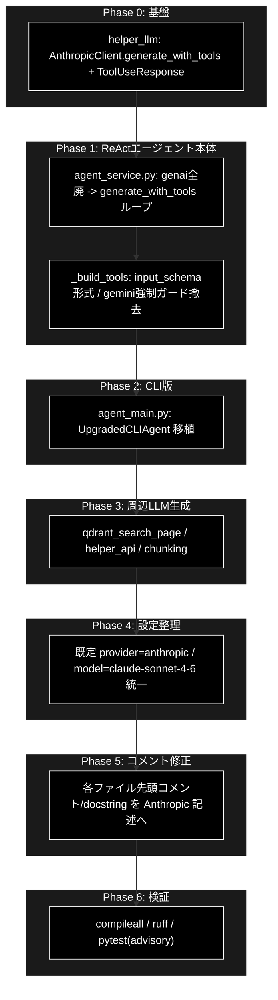

# Anthropic 移行 TODO（anthropic_grace_agent_v2）

**Version 1.0** | 最終更新: 2026-06-19 | 対象: `anthropic_grace_agent_v2`

実装そのものを **Gemini（google.genai）→ Anthropic（Claude）** へ移行するための作業計画。
方針: **LLM 生成は Anthropic、Embedding は Gemini 維持**（CLAUDE.md §9.1）。Qdrant/コスト/インフラは不変。

---

## 0. 現状サマリ（調査結果）

| 区分 | 状態 | 該当 |
|---|---|---|
| ✅ 移行済み | `create_chat_client`（`grace/llm_compat.py`）経由で Anthropic 切替可能 | `grace/planner.py` `grace/executor.py` `grace/confidence.py`(LLM部) `grace/tools.py` |
| ✅ 移行済み | `create_llm_client(provider="anthropic")` を直接使用 | `helper/helper_rag_qa.py` `qa_generation/smart_qa_generator.py` `qa_generation/semantic.py` |
| ✅ 維持 | Embedding は Gemini（`gemini-embedding-001`/3072次元） | `helper/helper_embedding.py` `grace/confidence.py`(embed部) `services/qdrant_service.py` |
| ❌ 未移行 | `genai` を**直接**使用（`chats.create`/`send_message`/`function_call`/`models.generate_content`） | `services/agent_service.py` `agent_main.py` `helper/helper_llm.py`(AnthropicClient に tool-use 欠落) `ui/pages/qdrant_search_page.py` `helper/helper_api.py` `chunking/*` |
| ⚠️ 設定不整合 | 既定 provider/model が Gemini に倒れる箇所あり | `services/agent_service.py`(legacy_default=gemini) `config.py`(L422 DEFAULT_MODEL=gemini) |

移行先の正解形は **無印 `anthropic_grace_agent`**（移行済みツイン）。`generate_with_tools()` + `ToolUseResponse` パターンを踏襲する。

---

## 1. TODO 一覧表

| # | フェーズ | 対象ファイル | 作業内容 | 依存 | リスク |
|---|---|---|---|---|---|
| 0-1 | Phase 0: 基盤 | `helper/helper_llm.py` | `AnthropicClient` に `generate_with_tools()` と `ToolUseResponse`(NamedTuple) を移植（無印準拠）。`stop_reason=="tool_use"` 検出・`tool_result` 整形を実装 | - | 中 |
| 1-1 | Phase 1: Agent本体 | `services/agent_service.py` | `genai` 全廃 → `create_llm_client("anthropic")`。`chats.create/send_message/function_call` → `generate_with_tools()` ループ。Reflection は `generate_with_tools(tools=[])` | 0-1 | 高 |
| 1-2 | Phase 1 | `services/agent_service.py` | `_build_tools()` を Anthropic Tool Use 形式（`input_schema`）へ。`gemini` 強制ガード削除、既定 `claude-sonnet-4-6` | 1-1 | 中 |
| 2-1 | Phase 2: CLI | `agent_main.py` (`UpgradedCLIAgent`) | 同上パターンで `genai`→Anthropic 移植 | 0-1 | 中 |
| 3-1 | Phase 3: 周辺生成 | `ui/pages/qdrant_search_page.py` | 回答生成 `generate_content` を `create_llm_client("anthropic")` 経由に統一 | 0-1 | 低 |
| 3-2 | Phase 3 | `helper/helper_api.py` | `generate_content` 呼び出しの provider を Anthropic に（Embedding/コストは現状維持） | - | 低 |
| 3-3 | Phase 3 | `chunking/async_api_client.py` `chunking/csv_text_to_chunks_text_csv.py` | チャンク用 LLM 生成を Anthropic 経由へ（バッチ系・非同期 client 抽象） | 0-1 | 中 |
| 4-1 | Phase 4: 設定 | `services/agent_service.py` `config.py` `grace/config.py` `services/config_service.py` | 既定 `provider=anthropic` / `model=claude-sonnet-4-6` に統一。`legacy_default=gemini` 等の Gemini 既定を撤去/整理 | 1-1 | 中 |
| 5-1 | Phase 5: コメント | 全移行対象ファイル**先頭付近のコメント/docstring** | 「google.genai 対応」「Gemini Function Calling」等の説明を Anthropic 記述へ修正（§9.1 表記統一） | 各実装後 | 低 |
| 6-1 | Phase 6: 検証 | `compileall` / `ruff check .` | 構文・lint ゲート（CI 必須ゲート相当）を緑化 | 全て | 低 |
| 6-2 | Phase 6 | `tests/`（advisory） | `genai` を patch しているテストの patch target を Anthropic 系へ更新。実 API 統合テストは skipif 維持 | 6-1 | 中 |

---

## 2. Phase 構成と実行順序

### Phase 説明

- **Phase 0（基盤）**: 最優先。`helper/helper_llm.py` の `AnthropicClient` に Tool Use（`generate_with_tools` / `ToolUseResponse`）が無いと Phase 1/2 が成立しない。無印実装をそのまま移植する。
- **Phase 1（Agent本体）**: 本移行の中核。`services/agent_service.py` の `genai` チャットセッション方式を、無印同様の `generate_with_tools()` 反復ループ（`stop_reason=="tool_use"` 判定・`tool_result` まとめ追記）へ全面置換。Reflection も `generate_with_tools(tools=[])` に統一。
- **Phase 2（CLI）**: `agent_main.py` の CLI エージェントも同方式へ。Phase 1 の実装を流用。
- **Phase 3（周辺生成）**: UI 回答生成・helper_api・チャンク生成の LLM 呼び出しを Anthropic 経由へ。**Embedding は Gemini 維持**。
- **Phase 4（設定整理）**: Gemini に倒れる既定値（`legacy_default="gemini-2.5-flash"`、`config.py` 2つ目の `DEFAULT_MODEL`）を整理し、provider/model を Anthropic に統一。
- **Phase 5（コメント修正）**: 各ファイル**先頭付近のコメント/docstring**を Anthropic 記述へ修正（ユーザー要望）。実装変更と整合させるため各実装フェーズ直後に行う。
- **Phase 6（検証）**: `compileall`/`ruff`（CI 必須ゲート）を緑化。`tests/` は advisory だが patch target を更新。

---

## 3. 非対象（変更しない）

- Embedding（`gemini-embedding-001` / `helper_embedding.py` / `qdrant_service` の次元定義）
- Qdrant 登録・検索ロジック、コレクション名、3072次元前提
- Celery / Redis / Streamlit インフラ
- `old_code/` 配下

---

## 4. 実施結果（Phase 0〜6 完了）

| Phase | 実施内容 | 結果 |
|---|---|---|
| 0 | `helper/helper_llm.py`: `AnthropicClient` に `generate_with_tools()` / `build_tool_result_message()` / `ToolUseResponse` を移植 | ✅ |
| 1 | `services/agent_service.py`: genai 全廃 → `create_llm_client("anthropic")` + Tool Use ループ。`_build_tools()` を input_schema 形式に | ✅ |
| 2 | `agent_main.py`: `UpgradedCLIAgent` を同方式へ移植 | ✅ |
| 3 | `chunking/async_api_client.py` を `generate_structured`(to_thread) へ移行。`csv_text_to_chunks_text_csv.py` の鍵を ANTHROPIC へ。`qdrant_search_page.py`/`helper_api.py` は既に anthropic（docstring修正） | ✅ |
| 4 | `config.py`(AgentConfig.MODEL_NAME / LLMProviderConfig.DEFAULT_LLM_PROVIDER) を Anthropic に統一。Embedding は Gemini 維持 | ✅ |
| 5 | 各ファイル先頭コメント/docstring を Anthropic 記述へ修正 | ✅ |
| 6 | `ruff check .` / `compileall`（CI 必須ゲート）緑。`tests/services/test_agent_service.py` を Anthropic 方式へ更新、legacy はモジュール skip、integration は ANTHROPIC ガードへ | ✅ |

## 5. 変更履歴

| バージョン | 変更内容 |
|---|---|
| 1.0 | 初版作成（調査結果・TODO一覧・Phase構成・実行順序を記述） |
| 1.1 | Phase 0〜6 を実施し移行完了。実施結果を追記 |
