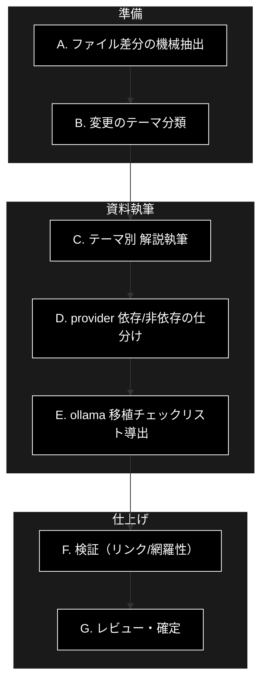

# anthropic_grace_agent v1→v2 リファクタリング資料 作成 TODO

**Version 0.1（計画書）** | 最終更新: 2026-06-18

> 本ドキュメントは「**`anthropic_grace_agent`（v1）→ `anthropic_grace_agent_v2`（v2）のリファクタリング資料**」を
> 作成するための **TODO（作業計画）** です。完成した資料は、同型の移行
> `ollama_grace_agent` → `ollama_grace_agent_v2` を行う際の**参照資料**として使います。
> まず本 TODO をレビューし、合意の上で資料本体（`docs/anthropic_v1_to_v2_refactoring.md`）を作成します。

---

## 0. 目的・成果物・前提

### 0.1 目的
- v1→v2 で「**何が・なぜ・どう変わったか**」を、再現可能な粒度で文書化する。
- 変更を **provider 非依存（横展開可能）** と **provider 依存（要置換）** に分類し、
  ollama 版へそのまま適用できる「移植チェックリスト」を導出する。

### 0.2 成果物（このTODOの完了時に出すもの）
| ファイル | 内容 |
|---|---|
| `docs/anthropic_v1_to_v2_refactoring.md` | リファクタリング資料 本体（比較・テーマ別解説・移植チェックリスト） |
| `docs/anthropic_v1_to_v2_file_diff.md`（付録） | ファイル単位の差分一覧（追加/削除/変更、機械生成ベース） |

### 0.3 比較対象（実測済みの差分規模 / 2026-06-18 時点）
- 共通 `.py`：**126 ファイル中 77 が内容差分**。
- v2 新規モジュール：`grace/llm_compat.py`・`grace/calibration.py`・`grace/memory.py`・
  `eval/{run_eval,metrics,build_dataset,calibrate,ab_compare}.py`。
- 配置変更：`a_*_md_format.md` → `.claude/skills/` 配下、`static/` 削除、`*/doc/*.md` 整備。

### 0.4 前提・ルール
- 両リポジトリはローカルに clone 済み（`/home/user/anthropic_grace_agent`, `.../anthropic_grace_agent_v2`）。
- 資料のドキュメント書式は `.claude/skills/grace-agent-docs`（IPO/ページ/テストの各フォーマット）に準拠。
- 生成物・データ（`OUTPUT/`・`qa_output/`・`output_chunked/`・`datasets/`・`assets/`・`logs/`・`.git/`）は比較対象外。

---

## 1. TODO 全体フロー

---

## 2. フェーズ別 TODO（チェックリスト）

### フェーズA：ファイル差分の機械抽出（付録の素材作り）
- [ ] A-1. `git ls-files` ベースで v1/v2 のファイル一覧を取得し、生成物を除外する。
- [ ] A-2. 「v2のみ（追加）」「v1のみ（削除/移動）」「共通で内容差分」を一覧化する。
- [ ] A-3. 共通 `.py` の差分を `diff --stat` 規模で計測（行数・関数増減の概観）。
- [ ] A-4. 結果を `docs/anthropic_v1_to_v2_file_diff.md`（付録）に表形式で出力する。

### フェーズB：変更のテーマ分類（資料の骨子）
- [ ] B-1. 差分ファイルを下表の **9 テーマ**へ割り当てる（1ファイルが複数テーマ可）。
- [ ] B-2. 各テーマに「目的 / 主な変更ファイル / 代表コミット or PR」を紐づける。

> v2 で実施済みの主テーマ（本セッションの PR 群が根拠）:

| # | テーマ | 主な変更/新規ファイル | provider 依存性 |
|---|---|---|---|
| T1 | **LLM プロバイダ移行**（Gemini→Anthropic） | `helper/helper_llm.py`(AnthropicClient), `grace/llm_compat.py`(create_chat_client), `config.py`/`config.yml`/`grace/config.py`(既定 `claude-sonnet-4-6`) | **依存**（ollama では Ollama クライアント/既定モデルへ） |
| T2 | **Embedding 方針の明確化** | `helper/helper_embedding.py`, `services/qdrant_service.py`, `grace/confidence.py`（embedding のみ google-genai 温存） | **依存**（ollama は `nomic-embed-text` 768次元） |
| T3 | **google-genai の用途限定**（LLM 経路から除去） | `grace/{planner,tools,executor,confidence}.py`（`types.GenerateContentConfig`→dict）, `helper_llm`(遅延import) | 半依存（パターンは横展開可） |
| T4 | **評価ハーネス S0** | `eval/{run_eval,metrics,build_dataset}.py` | **非依存**（横展開可） |
| T5 | **信頼度の較正 S1** | `grace/calibration.py`, `grace/confidence.py`(groundedness), `eval/calibrate.py` | **非依存** |
| T6 | **ハイブリッド ReAct S3** | `grace/executor.py`(`_dispatch_generator`/`react_enabled`/`execute_react_generator`), `grace/schemas.py` | **非依存** |
| T7 | **実行メモリ層 P4** | `grace/memory.py`, `grace/executor.py`(記録), `grace/planner.py`(反映) | **非依存** |
| T8 | **code_execute サンドボックス P2 ＋ A/B 測定** | `grace/tools.py`(CodeExecuteTool), `grace/config.py`, `eval/ab_compare.py` | **非依存** |
| T9 | **インフラ/規約**（CI・依存・skills・docs・バグ修正） | `.github/workflows/ci.yml`, `pyproject.toml`, `.claude/skills/*`, `*/doc/*.md`, macOS/sparse/intervention 修正 | 半依存 |

### フェーズC：テーマ別 解説執筆（資料本体）
各テーマについて、資料本体に以下を記述する：
- [ ] C-1. **Before（v1）/ After（v2）** の要点（コード断片・シグネチャ・既定値）。
- [ ] C-2. **変更理由**（なぜそうしたか。例：Anthropic は embedding API 無し→embedding のみ Gemini）。
- [ ] C-3. **影響範囲**（依存モジュール・テスト・設定・CI）。
- [ ] C-4. **検証方法**（該当テスト、`uv run pytest ...`、eval ハーネス等）。
- [ ] C-5. 図（必要に応じ Mermaid・黒背景規約）。

### フェーズD：provider 依存/非依存の仕分け
- [ ] D-1. 各変更点を「**そのまま移植可**／**置換が必要**／**新規実装が必要**」に三分類。
- [ ] D-2. 置換が必要な箇所に「v1 値 → v2(anthropic) 値 → ollama 目標値」の対応表を付す。

> 置換対応表の雛形（ollama 目標値は `ollama_grace_agent` の CLAUDE.md 規約準拠）:

| 項目 | v1(anthropicの旧) | v2(anthropic) | ollama_v2 目標 |
|---|---|---|---|
| LLM 既定モデル | gemini-2.x | `claude-sonnet-4-6` | `gemma4:e4b`（または `llama3.2`） |
| LLM クライアント | genai 直 | `create_chat_client`/AnthropicClient | `create_llm_client("ollama")` |
| LLM APIキー | GOOGLE_API_KEY | ANTHROPIC_API_KEY | 不要（ローカル） |
| Embedding | gemini-embedding-001(3072) | gemini-embedding-001(3072) 温存 | `nomic-embed-text`(768) |
| Qdrant コレクション | *_gemini | *_anthropic | *_ollama |
| コスト計算 | あり | あり | なし（ローカル・トークン集計のみ） |

### フェーズE：ollama 移植チェックリスト導出
- [ ] E-1. テーマ T4〜T8（非依存）は「**ほぼコピー＋import 調整**」として移植手順を列挙。
- [ ] E-2. テーマ T1〜T3・T9（依存）は「**置換手順＋確認項目**」を列挙。
- [ ] E-3. ollama 固有の注意（768次元コレクション再作成、Q/A 出力はオブジェクト形 `{"qa_pairs":[...]}`、API キー不要、`RUN_OLLAMA_INTEGRATION=1` の統合テスト）を明記。
- [ ] E-4. 移植順序（依存関係順）を提案：config/helper → grace 基盤 → eval → docs/CI。

### フェーズF：検証
- [ ] F-1. 資料内の参照ファイルパス・行が実在するか grep で確認。
- [ ] F-2. Mermaid 黒背景規約（`flowchart` 数 == `classDef default` 数）を満たすか確認。
- [ ] F-3. 付録の差分一覧が最新 `git ls-files` と一致するか再生成して照合。

### フェーズG：レビュー・確定
- [ ] G-1. 本資料をドラフト PR で提出（`claude/*` ブランチ）。
- [ ] G-2. レビュー反映後、ollama 移植の着手可否を確認。

---

## 3. 資料本体（`docs/anthropic_v1_to_v2_refactoring.md`）の想定目次
1. 概要（v1→v2 の狙い・サマリ表）
2. ファイル差分サマリ（追加/削除/変更の件数と一覧＝付録へリンク）
3. テーマ別リファクタリング詳細（T1〜T9、Before/After・理由・影響・検証）
4. provider 依存/非依存マトリクス
5. ollama 移植チェックリスト（置換対応表＋手順＋順序）
6. リスクと注意点（埋め込み次元・コレクション再作成・統合テスト前提）
7. 付録：ファイル差分一覧（機械生成）

---

## 4. 進め方（実行時の方針）
- フェーズ A・B は機械抽出＋分類で**事実ベース**を固め、C 以降の主観を最小化する。
- C〜E は **テーマ単位でサブエージェント並列**可（各に「対象テーマの変更ファイル群＋本TODO＋docs フォーマット」を渡す）。
- 大きすぎる場合は「資料本体（解説）」と「付録（差分一覧）」を別 PR に分割する。

---

## 5. 変更履歴
| バージョン | 変更内容 |
|---|---|
| 0.1 | 初版（TODO 計画書）作成（2026-06-18） |
