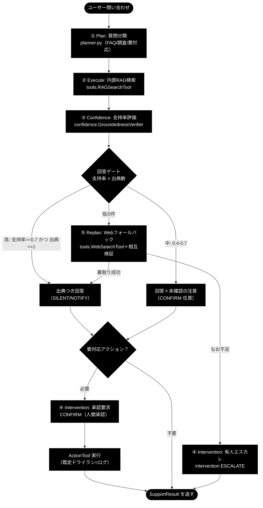
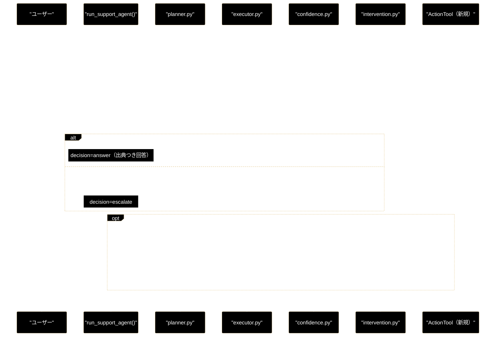

# agent_support_example.py - 日本語ナレッジ駆動サポート・コパイロット（GRACE-Support）設計書

**Version 1.0（v1〜v3 実装済み）** | 最終更新: 2026-06-28

> **参考ドキュメント**
> - [`docs/migration_and_update.md`](../../docs/migration_and_update.md) — 需要分析と GRACE-Support 採用方針（本設計の上位資料）
> - [`grace/doc/agent_support_verticals.md`](./agent_support_verticals.md) — 業界特化（自治体/SaaS/EC）設計
> - [`grace/doc/grace_core_flow.md`](./grace_core_flow.md) — 5 段階設計・8 コアモジュール・プロンプト/API 発行部
> - [`grace/doc/agent_example_core8.md`](./agent_example_core8.md) — コア 8 モジュール明示利用サンプルの設計書
> - [`grace/doc/grace_core.md`](./grace_core.md) — コアモジュール群の横断アーキテクチャ

> ✅ **実装状況**: `agent_support_example.py` は **v1〜v3 を実装済み**（内部RAG＋出典／Webフォールバック＋相互検証／アクション＋HITL・既定ドライラン）。本書は実装に合わせて更新済み。

---

## 目次

- [概要](#概要)
- [1. アーキテクチャ構成図（回答判定フロー）](#1-アーキテクチャ構成図回答判定フロー)
- [2. 回答ポリシー（groundedness ゲート）](#2-回答ポリシーgroundedness-ゲート)
- [3. データ契約（schemas 追加案）](#3-データ契約schemas-追加案)
- [4. 新規ツール ActionTool 仕様](#4-新規ツール-actiontool-仕様)
- [5. HITL ポリシー](#5-hitl-ポリシー)
- [6. 処理シーケンス](#6-処理シーケンス)
- [7. 想定プログラム構成（関数）](#7-想定プログラム構成関数)
- [8. CLI 仕様](#8-cli-仕様)
- [9. 評価指標（KPI）](#9-評価指標kpi)
- [10. 実装ロードマップ](#10-実装ロードマップ)
- [11. 変更履歴](#11-変更履歴)

---

## 概要

`agent_support_example.py`（仮称 **GRACE-Support**）は、既存の日本語 RAG 自律エージェント（GRACE）を土台に、**カスタマーサポート／社内ナレッジ・コパイロット**へ拡張する応用サンプルの設計書である。

一言でいうと——**「社内ナレッジで答え、足りなければ Web で裏取りし、出典を必ず示し、“わからない/行動が要る”ときは人間に渡す、日本語サポート AI」**。

> 📝 本書は当初**設計フェーズ**の仕様書として作成し、**v1〜v3 の実装完了に合わせて更新した**。既存モジュール（planner/executor/confidence/calibration/memory/intervention/replan/tools）を流用し、**新規追加は「回答ゲート」「Web フォールバックの明示化」「アクション＋HITL」の 3 点**に限定した。ActionTool は本サンプル内の**擬似実装（既定ドライラン）**として実現している（コア `grace/tools.py` への正式追加は将来）。

### 主な責務

- 質問を 3 分類（FAQ 即答／要調査／要対応アクション）して計画を立てる
- 内部 RAG で回答し、**出典（citation）を必ず提示**する
- 根拠不足なら**「わかりません」と誠実に答える**（ハルシネーション抑制）
- 内部知識が不足するときのみ **Web 調査へフォールバック**し、複数ソースを相互検証する
- 副作用のある操作（チケット起票・返信・エスカレーション）は **HITL 承認（CONFIRM）を必須**とする
- 解決履歴・エスカレーション履歴を memory に蓄積し、次回の計画へ反映する

### 使用するモジュール対応

| 分類 | モジュール | この用途での役割 |
|------|-----------|----------------|
| 既存 | `planner.py` | 質問 3 分類 → 計画生成 |
| 既存 | `executor.py` | ステップ実行・動的フォールバック統括 |
| 既存 | `tools.py` | `RAGSearchTool` / `WebSearchTool` / `ReasoningTool` / `AskUserTool` |
| 既存 | `confidence.py` | `GroundednessVerifier`（支持率）/ `SourceAgreementCalculator`（ソース一致） |
| 既存 | `calibration.py` | 信頼度の温度較正 |
| 既存 | `intervention.py` | 出典不足→ESCALATE、行動前→CONFIRM |
| 既存 | `replan.py` | 内部 0 件→Web、矛盾→再検索 |
| 既存 | `memory.py` | 解決/エスカレ履歴の学習 |
| **新規** | `ActionTool`（tools へ追加） | チケット起票・返信・エスカレの**擬似アクション**（既定ドライラン） |
| **新規** | `SupportResult`（schemas へ追加） | 回答・出典・判定・アクションの薄いラッパー |

---

## 1. アーキテクチャ構成図（回答判定フロー）

RAG 回答を **groundedness（支持率）でゲート**し、状態に応じて「回答／Web 調査／確認／エスカレ／アクション」へ分岐する。



---

## 2. 回答ポリシー（groundedness ゲート）

`GroundednessVerifier` の**支持率(support_rate)**と**出典数**で分岐する。しきい値は既存 `config.confidence.thresholds`（`silent=0.9 / notify=0.7 / confirm=0.4`）を流用する。

| 状態 | 条件（例） | decision | 振る舞い |
|------|-----------|----------|---------|
| **自信あり** | 支持率 ≥ 0.7 かつ 出典 ≥ 1 | `answer` | 出典つきで自動回答（SILENT/NOTIFY） |
| **要注意** | 0.4 ≤ 支持率 < 0.7 | `answer`（注意付） | 回答＋「未確認の注意書き」、必要なら CONFIRM |
| **わからない** | 支持率 < 0.4 または 出典 0 | `escalate` 前に Web | 「社内ナレッジには見当たりません」→ Web 調査 → なお不足なら ESCALATE |

> **設計意図**: 「根拠のない断定を構造的に出さない」ことを最優先にする。既存の `GroundednessVerifier`（回答を主張に分解し supported/contradicted/neutral を判定）をそのまま利用し、支持率が低い＝出典で裏付けられない回答は**自動的に“わからない”へ倒す**。

---

## 3. データ契約（実装済み・dataclass）

v1〜v3 では `agent_support_example.py` 内の **dataclass** として実装している（コア `schemas.py` への追加は将来。出典は当面 `list[str]`）。

```text
ActionRequest（v3）
  - action_type: "create_ticket" | "send_reply" | "escalate_to_human"
  - args: dict                     # 起票内容・宛先など
  - requires_confirmation: bool = True   # 副作用は原則 True

SupportResult（v3）
  - answer: Optional[str]          # 最終回答（出典つき）
  - citations: list[str]           # 提示した出典（"[社内] …" / "[Web] …"）
  - groundedness: float            # 支持率 (0.0-1.0)
  - decision: "answer" | "escalate"
  - warning: bool                  # 中信頼（未確認）の注意書きを付けるか
  - used_web: bool                 # Web フォールバックを使ったか（v2）
  - source_agreement: Optional[float]  # 内部×Web の意味的一致度（v2 相互検証）
  - contradiction: bool            # 矛盾の可能性（v2）
  - action: Optional[ActionRequest]    # 実施（予定）のアクション（v3）
  - action_result: Optional[str]       # アクションの結果メッセージ（v3）
  - overall_confidence: float          # executor 由来の較正済み全体信頼度
```

> 📝 現状 `decision` は `answer` / `escalate` の 2 値（設計当初の `ask`/`action` は `warning` フラグ・`action` フィールドに整理）。`Citation` の構造化（kind/collection/score）はコア schemas 化時に導入予定。

---

## 4. 新規ツール ActionTool 仕様

副作用のある操作を担う。**既定はドライラン（実行せずログ出力）**で、学習・検証を安全に行う。

| 項目 | 内容 |
|------|------|
| クラス | `ActionTool(BaseTool)`（`grace/tools.py` へ追加、`ToolRegistry` に opt-in 登録） |
| `name` | `action`（`PlanStep.action` に `"action"` を追加、または `create_ticket` 等の細分） |
| メソッド | `execute(action_type: str, args: dict, dry_run: bool = True) -> ToolResult` |
| 対応アクション | `create_ticket` / `send_reply` / `escalate_to_human` |
| 安全策 | ① 実行前に **CONFIRM 必須**（intervention 経由）② `dry_run=True` ならログのみ ③ 対象・引数を `confidence_factors` に残す |
| 既定 | `config.tools.enabled` には**含めない**（`code_execute` と同様の opt-in） |

> セキュリティ方針は既存 `CodeExecuteTool`（静的チェック＋資源制限＋opt-in）に倣う。実 API 連携（Zendesk / メール等）は将来拡張とし、MVP では擬似実装。

---

## 5. HITL ポリシー

| トリガー | 介入レベル | 挙動 |
|---------|-----------|------|
| 副作用のあるアクション実行前 | **CONFIRM** | 人間承認を得るまで実行しない |
| 出典不足・低信頼（支持率 < 0.4） | **ESCALATE** | 有人対応へ引き継ぎ、AI は回答を断定しない |
| 中信頼（0.4–0.7） | NOTIFY | 回答するが「未確認」を明示 |
| 高信頼（≥ 0.7・出典あり） | SILENT/NOTIFY | 自動回答 |

- 非対話 CLI では、CONFIRM/ESCALATE のコールバックを**自動承認＋ログ**（`--dry-run` 既定）にして安全に検証する。
- UI 連携時は実際の確認ダイアログ（`intervention.ConfirmationFlow`）に差し替える。

---

## 6. 処理シーケンス



---

## 7. プログラム構成（実装済み関数）

`agent_example.py` / `agent_example_core8.py` と同じ CLI 作法（`.env`＋鍵ガード＋`argparse main()`＋`try/except`＋`if __name__`）。

| 関数 | 概要（実装） |
|------|-------------|
| `run_support_agent(query, verbose, use_web, do_action, dry_run)` | 計画 → 実行 → 根拠評価 → 回答ゲート → （不足時）Web＋相互検証 → （必要なら）アクション → `SupportResult` を返す |
| `_answer_gate(support_rate, verified, citation_count, notify_th, confirm_th)` | 支持率・出典数から `(decision, warning)` を決める純関数（answer/escalate） |
| `_decide_action(query, decision)` | 問い合わせ意図＋判定から `ActionRequest` を選ぶ（v3） |
| `_perform_action(action, handler, dry_run)` | intervention CONFIRM を通してから擬似実行（v3・既定ドライラン） |
| `_collect_internal_citations` / `_web_citations` / `_web_source_texts` | 内部/Web の出典・検証用本文の抽出 |
| `_render(support_result)` | 出典つき回答・判定・注意書き・アクション結果を整形表示 |
| `main()` | argparse（`query`・`-v`・`--no-web`・`--no-action`・`--dry-run`）→ `run_support_agent` を例外保護実行 |

---

## 8. CLI 仕様

| 引数 | 既定 | 説明 |
|------|------|------|
| `query`（位置・任意） | サンプル質問 | 問い合わせ内容 |
| `-v`, `--verbose` | off | 支持率の内訳（supported/total/矛盾）など詳細を表示 |
| `--no-web` | off（Web 有効） | Web フォールバックを無効化（内部RAGのみ） |
| `--no-action` | off（アクション有効） | アクション（v3）を無効化 |
| `--dry-run / --no-dry-run` | `dry-run`（安全） | アクションを実行せずログのみ（既定 ON。`--no-dry-run` で擬似実行） |

```bash
python agent_support_example.py "パスワードを忘れました"        # FAQ即答→出典つき
python agent_support_example.py "解約したい"                    # アクション（CONFIRM＋ドライラン）
python agent_support_example.py --no-dry-run "解約したい"        # 擬似実行
python agent_support_example.py -v "最新の料金改定は？"          # 内部不足→Webフォールバック＋相互検証
```

---

## 9. 評価指標（KPI）

需要（サポート業務）に直結する指標をそのまま評価に使う。

| 指標 | 定義 | 目標 |
|------|------|------|
| 自己解決率（deflection） | 有人に回さず解決した割合 | 高いほど良い |
| 出典付与率 | 回答に出典が付いた割合 | ≈ 100% |
| 根拠なし回答率 | 出典/根拠なしで断定した割合 | **0 に近いほど良い** |
| エスカレーション適合率 | ESCALATE が妥当だった割合 | 高いほど良い |
| 平均応答時間 | 問い合わせ→回答 | 低いほど良い |

---

## 10. 実装ロードマップ

| 版 | 機能 | 追加実装 | 状態 |
|----|------|---------|------|
| **v1 (MVP)** | 内部 RAG → 出典つき回答／根拠不足なら「わかりません」 | 回答ゲート（`_answer_gate`）＋ `SupportResult` | ✅ 実装済み（PR #99） |
| **v2** | 内部不足時に Web フォールバック＋相互検証（矛盾提示） | web_search 起動条件・引用統合・`SourceAgreementCalculator` | ✅ 実装済み（PR #100） |
| **v3** | アクション（起票/返信/エスカレ）＋ HITL（ドライラン） | 擬似 ActionTool ＋ CONFIRM 配線（`_decide_action`/`_perform_action`） | ✅ 実装済み（PR #101） |
| 次 | 業界特化（自治体/SaaS/EC） | `VerticalProfile` 差し替え | 設計済み（[`agent_support_verticals.md`](./agent_support_verticals.md)） |

---

## 11. 変更履歴

| バージョン | 変更内容 |
|-----------|---------|
| 0.1 | 初版作成（設計フェーズ）。GRACE-Support の回答判定フロー・groundedness ゲート・データ契約・ActionTool 仕様・HITL ポリシー・処理シーケンス・想定関数構成・CLI 仕様・KPI・実装ロードマップ v1〜v3 を定義 |
| 1.0 | v1〜v3 実装完了に合わせて更新。データ契約を実装済み dataclass（SupportResult/ActionRequest・decision は answer/escalate の 2 値）に、関数構成・CLI 仕様（`--no-web`/`--no-action`/`--dry-run`）を実コードに整合。ロードマップを実装済みに更新し、業界特化設計（`agent_support_verticals.md`）へのリンクを追加 |
