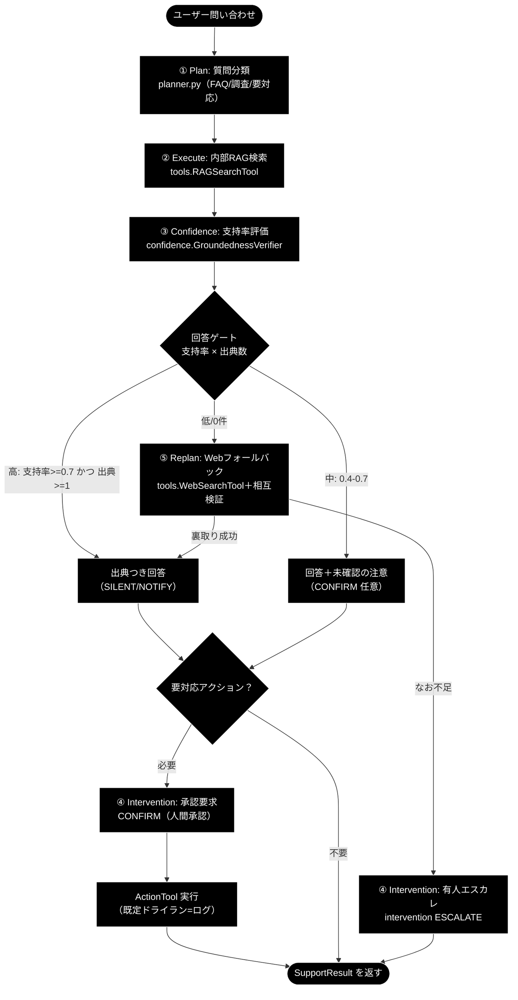
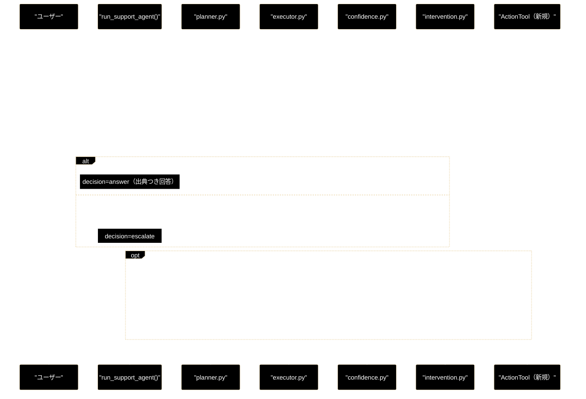

# agent_support_example.py - 日本語ナレッジ駆動サポート・コパイロット（GRACE-Support）設計書

**Version 1.1（v1〜v3 ＋ 業界特化 実装済み）** | 最終更新: 2026-07-07

> **参考ドキュメント**
> - [`grace/doc/agent_support_example_flow.md`](./agent_support_example_flow.md) — **1 コマンドの実行トレース**（`--vertical gov` の IN/OUT データフロー。本書 §1 のフロー図に対応）
> - [`docs/migration_and_update.md`](../../docs/migration_and_update.md) — 需要分析と GRACE-Support 採用方針（本設計の上位資料）
> - [`grace/doc/agent_support_verticals.md`](./agent_support_verticals.md) — 業界特化（自治体/SaaS/EC）設計
> - [`grace/doc/grace_core_flow.md`](./grace_core_flow.md) — 5 段階設計・8 コアモジュール・プロンプト/API 発行部
> - [`grace/doc/agent_example_core8.md`](./agent_example_core8.md) — コア 8 モジュール明示利用サンプルの設計書
> - [`grace/doc/grace_core.md`](./grace_core.md) — コアモジュール群の横断アーキテクチャ

> ✅ **実装状況**: `agent_support_example.py` は **v1〜v3 ＋ 業界特化（`--vertical {gov|saas|ec}`）を実装済み**（内部RAG＋出典／Webフォールバック＋相互検証／アクション＋HITL・既定ドライラン／二段判定・④' 情報なし回答検知）。本書は実装に合わせて更新済み。
>
> 💡 **実行環境**: 本リポジトリは `uv` 管理。以下のコマンド例はすべて `uv run python …` 形式で示す（従来の `python …` でも動くが、依存解決を含む `uv run` を推奨）。

---

## 目次

- [概要](#概要)
- [1. アーキテクチャ構成図（回答判定フロー）](#1-アーキテクチャ構成図回答判定フロー)
- [2. 回答ポリシー（groundedness ゲート）](#2-回答ポリシーgroundedness-ゲート)
- [3. データ契約（schemas 追加案）](#3-データ契約schemas-追加案)
- [4. 新規ツール ActionTool 仕様](#4-新規ツール-actiontool-仕様)
- [5. HITL ポリシー](#5-hitl-ポリシー)
- [6. 処理シーケンス](#6-処理シーケンス)
- [7. プログラム構成（実装済み関数）](#7-プログラム構成実装済み関数)
- [8. CLI 仕様](#8-cli-仕様)
- [9. 評価指標（KPI）](#9-評価指標kpi)
- [10. 実装ロードマップ](#10-実装ロードマップ)
- [11. 変更履歴](#11-変更履歴)

> 📎 **1 コマンドの実行トレースを見たい場合**は、本書の姉妹編
> [`agent_support_example_flow.md`](./agent_support_example_flow.md) を参照。
> `uv run python agent_support_example.py --vertical gov "住民票の写しの取り方は？"` が
> §1 のフロー図（① Plan →②Execute →③Confidence →④ゲート →⑤Web →⑥Action）を
> どう流れるかを、**モジュール・コード・データ（IN/OUT）**で追跡している。

---

## 概要

`agent_support_example.py`（仮称 **GRACE-Support**）は、既存の日本語 RAG 自律エージェント（GRACE）を土台に、**カスタマーサポート／社内ナレッジ・コパイロット**へ拡張する応用サンプルの設計書である。

一言でいうと——**「社内ナレッジで答え、足りなければ Web で裏取りし、出典を必ず示し、“わからない/行動が要る”ときは人間に渡す、日本語サポート AI」**。

> 📝 本書は当初**設計フェーズ**の仕様書として作成し、**v1〜v3 の実装完了に合わせて更新した**。既存モジュール（planner/executor/confidence/calibration/memory/intervention/replan/tools）を流用し、**新規追加は「回答ゲート」「Web フォールバックの明示化」「アクション＋HITL」の 3 点**に限定した。ActionTool は本サンプル内の**擬似実装（既定ドライラン）**として実現している（コア `grace/tools.py` への正式追加は将来）。

### 主な責務

- 質問を 3 分類（FAQ 即答／要調査／要対応アクション）して計画を立てる
- 内部 RAG で回答し、**出典（citation）を必ず提示**する
- 根拠不足なら**「わかりません」と誠実に答える**（ハルシネーション抑制）
- 内部知識が不足するときのみ **Web 調査へフォールバック**し、複数ソースを相互検証する
- 副作用のある操作（チケット起票・返信・エスカレーション）は **HITL 承認（CONFIRM）を必須**とする
- 解決履歴・エスカレーション履歴を memory に蓄積し、次回の計画へ反映する

### 使用するモジュール対応

| 分類 | モジュール | この用途での役割 |
|------|-----------|----------------|
| 既存 | `planner.py` | 質問 3 分類 → 計画生成 |
| 既存 | `executor.py` | ステップ実行・動的フォールバック統括 |
| 既存 | `tools.py` | `RAGSearchTool` / `WebSearchTool` / `ReasoningTool` / `AskUserTool` |
| 既存 | `confidence.py` | `GroundednessVerifier`（支持率）/ `SourceAgreementCalculator`（ソース一致） |
| 既存 | `calibration.py` | 信頼度の温度較正 |
| 既存 | `intervention.py` | 出典不足→ESCALATE、行動前→CONFIRM |
| 既存 | `replan.py` | 内部 0 件→Web、矛盾→再検索 |
| 既存 | `memory.py` | 解決/エスカレ履歴の学習 |
| **新規** | `ActionTool`（tools へ追加） | チケット起票・返信・エスカレの**擬似アクション**（既定ドライラン） |
| **新規** | `SupportResult`（schemas へ追加） | 回答・出典・判定・アクションの薄いラッパー |

---

## 1. アーキテクチャ構成図（回答判定フロー）

RAG 回答を **groundedness（支持率）でゲート**し、状態に応じて「回答／Web 調査／確認／エスカレ／アクション」へ分岐する。


```mermaid
flowchart TB
    Q(["ユーザー問い合わせ"])
    CLS["① Plan: 質問分類<br>planner.py（FAQ/調査/要対応）"]
    RAG["② Execute: 内部RAG検索<br>tools.RAGSearchTool"]
    GND["③ Confidence: 支持率評価<br>confidence.GroundednessVerifier"]
    GATE{"回答ゲート<br>支持率 × 出典数"}

    ANS["出典つき回答<br>（SILENT/NOTIFY）"]
    WARN["回答＋未確認の注意<br>（CONFIRM 任意）"]
    WEB["⑤ Replan: Webフォールバック<br>tools.WebSearchTool＋相互検証"]
    ESC["④ Intervention: 有人エスカレ<br>intervention ESCALATE"]

    ACT{"要対応アクション？"}
    HITL["④ Intervention: 承認要求<br>CONFIRM（人間承認）"]
    DO["ActionTool 実行<br>（既定ドライラン=ログ）"]

    OUT(["SupportResult を返す"])

    Q --> CLS --> RAG --> GND --> GATE
    GATE -->|"高: 支持率>=0.7 かつ 出典>=1"| ANS
    GATE -->|"中: 0.4-0.7"| WARN
    GATE -->|"低/0件"| WEB
    WEB -->|"裏取り成功"| ANS
    WEB -->|"なお不足"| ESC
    ANS --> ACT
    WARN --> ACT
    ACT -->|"必要"| HITL --> DO --> OUT
    ACT -->|"不要"| OUT
    ESC --> OUT
classDef default fill:#000,stroke:#fff,color:#fff
class Q,CLS,RAG,GND,GATE,ANS,WARN,WEB,ESC,ACT,HITL,DO,OUT default
```

---

## 2. 回答ポリシー（groundedness ゲート）

`GroundednessVerifier` の**支持率(support_rate)**と**出典数**で分岐する。しきい値は既存 `config.confidence.thresholds`（`silent=0.9 / notify=0.7 / confirm=0.4`）を流用する。

| 状態 | 条件（例） | decision | 振る舞い |
|------|-----------|----------|---------|
| **自信あり** | 支持率 ≥ 0.7 かつ 出典 ≥ 1 | `answer` | 出典つきで自動回答（SILENT/NOTIFY） |
| **要注意** | 0.4 ≤ 支持率 < 0.7 | `answer`（注意付） | 回答＋「未確認の注意書き」、必要なら CONFIRM |
| **わからない** | 支持率 < 0.4 または 出典 0 | `escalate` 前に Web | 「社内ナレッジには見当たりません」→ Web 調査 → なお不足なら ESCALATE |

> **設計意図**: 「根拠のない断定を構造的に出さない」ことを最優先にする。既存の `GroundednessVerifier`（回答を主張に分解し supported/contradicted/neutral を判定）をそのまま利用し、支持率が低い＝出典で裏付けられない回答は**自動的に“わからない”へ倒す**。

---

## 3. データ契約（実装済み・dataclass）

v1〜v3 ＋業界特化では `agent_support_example.py` 内の **dataclass** として実装している（コア `schemas.py` への追加は将来。出典は当面 `list[str]`）。

```python
@dataclass
class ActionRequest:
    """副作用のある操作の要求（v3・擬似）。"""
    action_type: Literal["create_ticket", "send_reply", "escalate_to_human"]
    args: dict = field(default_factory=dict)      # 起票内容・宛先など
    requires_confirmation: bool = True            # 副作用は原則 True

@dataclass
class SupportResult:
    """サポート回答の結果（回答ゲート／Web／アクション／業界特化を集約）。"""
    answer: Optional[str]                         # 最終回答（出典つき）
    citations: List[str] = field(default_factory=list)   # "[社内] …" / "[Web] …"
    groundedness: float = 0.0                     # 支持率 (0.0-1.0)
    groundedness_decided: int = 0                 # 判定できた主張数(supported+contradicted)。0=判定不能
    decision: Literal["answer", "escalate"] = "escalate"
    warning: bool = False                         # 中信頼（未確認）の注意書きを付けるか
    used_web: bool = False                        # Web（動的検索 or ⑤ フォールバック）を使ったか
    source_agreement: Optional[float] = None      # 内部×Web の意味的一致度（相互検証）
    contradiction: bool = False                   # 矛盾の可能性
    action: Optional[ActionRequest] = None        # 実施（予定）のアクション
    action_result: Optional[str] = None           # アクションの結果メッセージ
    vertical: Optional[str] = None                # 適用した業界プロファイル（gov/saas/ec）
    overall_confidence: float = 0.0               # executor 由来の較正済み全体信頼度
    intent: Optional[Literal["question","request","incident"]] = None  # 二段判定の意図分類結果
    forced_escalate: bool = False                 # エスカレ語による強制エスカレか（KPI 用）
    identity_checked: bool = False                # 本人確認ステップが起動したか（KPI 用）
    no_info_detected: bool = False                # ④' 情報なし回答検知で escalate に倒したか
    web_reused: bool = False                      # ⑤ で executor の Web 結果を再利用したか
```

> 📝 `decision` は `answer` / `escalate` の 2 値（設計当初の `ask`/`action` は `warning` フラグ・`action` フィールドに整理）。
> `groundedness_decided` / `intent` / `forced_escalate` / `identity_checked` / `no_info_detected` / `web_reused` /
> `vertical` は **業界特化・二段判定・④' ゲート・KPI 計測**のために追加したフィールド（`eval/vertical/` が参照）。
> `Citation` の構造化（kind/collection/score）はコア schemas 化時に導入予定。

---

## 4. 新規ツール ActionTool 仕様

副作用のある操作を担う。**既定はドライラン（実行せずログ出力）**で、学習・検証を安全に行う。

| 項目 | 内容 |
|------|------|
| クラス | `ActionTool(BaseTool)`（`grace/tools.py` へ追加、`ToolRegistry` に opt-in 登録） |
| `name` | `action`（`PlanStep.action` に `"action"` を追加、または `create_ticket` 等の細分） |
| メソッド | `execute(action_type: str, args: dict, dry_run: bool = True) -> ToolResult` |
| 対応アクション | `create_ticket` / `send_reply` / `escalate_to_human` |
| 安全策 | ① 実行前に **CONFIRM 必須**（intervention 経由）② `dry_run=True` ならログのみ ③ 対象・引数を `confidence_factors` に残す |
| 既定 | `config.tools.enabled` には**含めない**（`code_execute` と同様の opt-in） |

> セキュリティ方針は既存 `CodeExecuteTool`（静的チェック＋資源制限＋opt-in）に倣う。実 API 連携（Zendesk / メール等）は将来拡張とし、MVP では擬似実装。

---

## 5. HITL ポリシー

| トリガー | 介入レベル | 挙動 |
|---------|-----------|------|
| 副作用のあるアクション実行前 | **CONFIRM** | 人間承認を得るまで実行しない |
| 出典不足・低信頼（支持率 < 0.4） | **ESCALATE** | 有人対応へ引き継ぎ、AI は回答を断定しない |
| 中信頼（0.4–0.7） | NOTIFY | 回答するが「未確認」を明示 |
| 高信頼（≥ 0.7・出典あり） | SILENT/NOTIFY | 自動回答 |

- 非対話 CLI では、CONFIRM/ESCALATE のコールバックを**自動承認＋ログ**（`--dry-run` 既定）にして安全に検証する。
- UI 連携時は実際の確認ダイアログ（`intervention.ConfirmationFlow`）に差し替える。

---

## 6. 処理シーケンス


```mermaid
%%{ init: { "theme": "base", "themeVariables": {
  "background": "#000000", "mainBkg": "#000000",
  "textColor": "#ffffff", "lineColor": "#ffffff",
  "actorBkg": "#000000", "actorTextColor": "#ffffff",
  "actorLineColor": "#ffffff", "noteBkgColor": "#000000",
  "noteTextColor": "#ffffff", "noteBorderColor": "#ffffff" } } }%%
sequenceDiagram
    participant U as "ユーザー"
    participant S as "run_support_agent()"
    participant PL as "planner.py"
    participant EX as "executor.py"
    participant CO as "confidence.py"
    participant IN as "intervention.py"
    participant AC as "ActionTool（新規）"

    U->>S: 問い合わせ
    S->>PL: 分類 + create_plan
    PL-->>S: ExecutionPlan
    S->>EX: execute(plan)（内部RAG→必要ならWeb）
    EX-->>S: ExecutionResult + sources
    S->>CO: GroundednessVerifier.verify(answer, sources)
    CO-->>S: 支持率 / 出典
    alt 支持率>=0.7 かつ 出典>=1
        Note over S: decision=answer（出典つき回答）
    else 支持率<0.4 または 出典0
        S->>IN: ESCALATE（有人へ）
        Note over S: decision=escalate
    end
    opt 要対応アクション
        S->>IN: CONFIRM（人間承認）
        IN-->>S: 承認
        S->>AC: execute(action_type, args, dry_run=True)
        AC-->>S: ToolResult（ログ）
    end
    S-->>U: SupportResult
```

---

## 7. プログラム構成（実装済み関数）

`agent_example.py` / `agent_example_core8.py` と同じ CLI 作法（`.env`＋鍵ガード＋`argparse main()`＋`try/except`＋`if __name__`）。

### 7.1 オーケストレーション・回答ゲート

| 関数 | 概要（実装） |
|------|-------------|
| `run_support_agent(query, verbose, use_web, do_action, dry_run, vertical, identity)` | ①計画 →②実行 →③根拠評価 →④回答ゲート＋強制エスカレ →⑤（不足時）Web＋相互検証 →④'情報なし検知 →⑥（必要なら）本人確認＋アクション →⑦整形 → `SupportResult` を返す。中核オーケストレータ |
| `_answer_gate(support_rate, verified, citation_count, notify_th, confirm_th)` | 支持率・出典数から `(decision, warning)` を決める純関数（answer/escalate。しきい値はプロファイルで上書き） |
| `_pick_groundedness(*results)` | 複数の `GroundednessResult` から `(支持率, 判定できた主張数)` を選ぶ純関数（同率なら decided 多を優先） |
| `_should_rescue_unaffirmed(...)` | 出典付き・非「情報なし」・矛盾なしの内部回答を、支持率が弱いだけで escalate に落とさず救済すべきか判定（無駄な⑤・誤エスカレを回避） |

### 7.2 二段判定（業界特化・誤爆抑止）

| 関数 | 概要（実装） |
|------|-------------|
| `create_intent_classifier(config)` | 軽量 LLM（`claude-haiku-4-5-20251001`）で意図を `question/request/incident` に分類する関数を返す（第 2 段） |
| `_match_keyword(query, keywords)` | キーワード候補の部分一致（第 1 段）。最初に一致した語を返す純関数 |
| `_should_force_escalate(query, profile, classify)` | エスカレ語×意図分類の二段判定で強制エスカレ要否を決める（`question` は誤爆抑止） |
| `_decide_action(query, decision, profile, classify)` | `action_map`（またはデモ既定）×意図分類でアクションを選ぶ（`question` は起票せず回答のみ） |

### 7.3 ④' 情報なし回答検知

| 関数 | 概要（実装） |
|------|-------------|
| `create_no_info_judge(config)` | 軽量 LLM で「実質回答(answered)／情報なし(no_info)」を判定する関数を返す（第 2 段） |
| `_detect_no_info_answer(query, answer, judge, force_judge)` | 定型句（`NO_INFO_MARKERS`）候補検出＋LLM 判定の二段判定。Web のみ出典は `force_judge=True` で必須判定 |

### 7.4 アクション・出典・表示

| 関数 | 概要（実装） |
|------|-------------|
| `_perform_action(action, handler, backend, identity_verifier, identity)` | **本人確認 → intervention CONFIRM → バックエンド実行** の順で擬似実行（既定ドライラン。`support_actions.py` に委譲） |
| `_collect_citations(step_results)` | 各ステップの sources を重複排除し `[社内]`/`[Web]` ラベルを付与 |
| `_citation_text` / `_merge_citations` / `_web_citations` / `_web_source_texts` | 出典ラベルの除去・内部×Web 出典の結合（URL 包含で重複排除）・Web 結果からの出典/検証本文抽出 |
| `_render(support_result)` | 出典つき回答・判定・注意書き・アクション結果・根拠メタ（vertical/intent 等）を整形表示 |
| `main()` | argparse（`query`・`-v`・`--vertical`・`--no-web`・`--no-action`・`--dry-run`・`--identity`）→ `run_support_agent` を例外保護実行 |

### 7.5 定数・プロファイル

| 定義 | 概要 |
|------|------|
| `PROFILES: Dict[str, VerticalProfile]` | 組み込み業界プロファイル（`gov`/`saas`/`ec`）。検索スコープ・エスカレ語・アクション語彙・本人確認・しきい値・方針を保持 |
| `VerticalProfile`（dataclass） | 業界プロファイルの共通枠（設計: `agent_support_verticals.md` §1/§6） |
| `NO_INFO_MARKERS` | 「見当たりません」等の情報なし候補検出パターン（④' 第 1 段） |
| `INTENT_MODEL = "claude-haiku-4-5-20251001"` | 二段判定・④' 判定に使う軽量モデル |

---

## 8. CLI 仕様

| 引数 | 既定 | 説明 |
|------|------|------|
| `query`（位置・任意） | `"パスワードを忘れました"` | 問い合わせ内容 |
| `-v`, `--verbose` | off | 支持率の内訳（supported/total/矛盾）など詳細を表示 |
| `--vertical {gov\|saas\|ec}` | なし（共通挙動） | 業界プロファイルを適用（検索スコープ・エスカレ語・しきい値・アクション対応・本人確認・方針を一括切替） |
| `--no-web` | off（Web 有効） | Web フォールバックを無効化（内部RAGのみ） |
| `--no-action` | off（アクション有効） | アクション（v3）を無効化 |
| `--dry-run / --no-dry-run` | `dry-run`（安全） | アクションを実行せずログのみ（既定 ON。`--no-dry-run` で実連携/擬似実行） |
| `--identity KEY=VALUE`（複数可） | なし | 本人確認の識別子（例: `--identity order_id=1001`）。`--no-dry-run` 時に台帳と照合（EC 等） |

### 8.1 基本（共通・プロファイル未適用）

```bash
# FAQ 即答 → 出典つき回答
uv run python agent_support_example.py "パスワードを忘れました"

# アクション（CONFIRM ＋ 既定ドライラン）
uv run python agent_support_example.py "解約したい"

# 擬似実行（--no-dry-run で実連携/擬似実行に切替）
uv run python agent_support_example.py --no-dry-run "解約したい"

# 内部不足 → Web フォールバック ＋ 相互検証（-v で支持率の内訳も表示）
uv run python agent_support_example.py -v "最新の料金改定は？"
```

### 8.2 業界特化（`--vertical`）

`--vertical` を付けると、その業界の**検索スコープ・エスカレ語・しきい値・アクション語彙・本人確認・方針**が一括で適用される。

```bash
# 自治体: 正確性最優先（notify=0.8/confirm=0.5）・断定回避・迷ったら窓口へ
uv run python agent_support_example.py --vertical gov "住民票の写しの取り方は？"

# SaaS: 速く・正確・再現手順（障害/課金は escalate）
uv run python agent_support_example.py --vertical saas -v "Webhook の設定方法は？"
uv run python agent_support_example.py --vertical saas "サービスが落ちています"        # 障害 → escalate

# EC: 副作用操作は 本人確認 → CONFIRM → ドライラン
uv run python agent_support_example.py --vertical ec "返品したい"
uv run python agent_support_example.py --vertical ec --no-dry-run \
    --identity order_id=1001 --identity email=a@example.com "返品したい"
```

> 📎 上記 `--vertical gov "住民票の写しの取り方は？"` の 1 実行が、§1 のフロー図をどう流れるか
> （各ステップの IN/OUT データ）は [`agent_support_example_flow.md`](./agent_support_example_flow.md) を参照。
> 業界特化の全体設計・KPI・テストデータは [`agent_support_verticals.md`](./agent_support_verticals.md)。

---

## 9. 評価指標（KPI）

需要（サポート業務）に直結する指標をそのまま評価に使う。

| 指標 | 定義 | 目標 |
|------|------|------|
| 自己解決率（deflection） | 有人に回さず解決した割合 | 高いほど良い |
| 出典付与率 | 回答に出典が付いた割合 | ≈ 100% |
| 根拠なし回答率 | 出典/根拠なしで断定した割合 | **0 に近いほど良い** |
| エスカレーション適合率 | ESCALATE が妥当だった割合 | 高いほど良い |
| 平均応答時間 | 問い合わせ→回答 | 低いほど良い |

---

## 10. 実装ロードマップ

| 版 | 機能 | 追加実装 | 状態 |
|----|------|---------|------|
| **v1 (MVP)** | 内部 RAG → 出典つき回答／根拠不足なら「わかりません」 | 回答ゲート（`_answer_gate`）＋ `SupportResult` | ✅ 実装済み（PR #99） |
| **v2** | 内部不足時に Web フォールバック＋相互検証（矛盾提示） | web_search 起動条件・引用統合・`SourceAgreementCalculator` | ✅ 実装済み（PR #100） |
| **v3** | アクション（起票/返信/エスカレ）＋ HITL（ドライラン） | 擬似 ActionTool ＋ CONFIRM 配線（`_decide_action`/`_perform_action`） | ✅ 実装済み（PR #101） |
| **業界特化** | `--vertical {gov\|saas\|ec}`（検索スコープ・エスカレ語・しきい値・アクション・本人確認・方針） | `VerticalProfile`／`PROFILES`／二段判定（`_should_force_escalate`）／`allowed_collections`／`prompt_addendum` | ✅ 実装済み（PR #106 ほか。[`agent_support_verticals.md`](./agent_support_verticals.md)） |
| **④' 情報なし検知ほか** | 「見つかりません」型回答の escalate 化・Web 重複実行の排除・KPI 是正・本人確認フロー | `_detect_no_info_answer`／`create_no_info_judge`／`_should_rescue_unaffirmed`／`support_actions.py` | ✅ 実装済み（PR #116〜#129。[`agent_support_verticals.md` §10](./agent_support_verticals.md)） |

---

## 11. 変更履歴

| バージョン | 変更内容 |
|-----------|---------|
| 0.1 | 初版作成（設計フェーズ）。GRACE-Support の回答判定フロー・groundedness ゲート・データ契約・ActionTool 仕様・HITL ポリシー・処理シーケンス・想定関数構成・CLI 仕様・KPI・実装ロードマップ v1〜v3 を定義 |
| 1.0 | v1〜v3 実装完了に合わせて更新。データ契約を実装済み dataclass（SupportResult/ActionRequest・decision は answer/escalate の 2 値）に、関数構成・CLI 仕様（`--no-web`/`--no-action`/`--dry-run`）を実コードに整合。ロードマップを実装済みに更新し、業界特化設計（`agent_support_verticals.md`）へのリンクを追加 |
| 1.1 | **業界特化の実装反映＋コマンド表記統一**。コマンド例を `uv run python …` 形式に統一。§8 CLI に `--vertical {gov\|saas\|ec}` / `--identity` を追加し、業界別の実行例（8.1 共通／8.2 業界特化）を新設。§3 データ契約を実コードの dataclass（`groundedness_decided`/`vertical`/`intent`/`forced_escalate`/`identity_checked`/`no_info_detected`/`web_reused` を追記）に更新。§7 関数構成を二段判定・④' 情報なし検知・本人確認フローを含む実装済み関数（`_should_force_escalate`/`_decide_action`/`create_intent_classifier`/`create_no_info_judge`/`_detect_no_info_answer`/`_should_rescue_unaffirmed`/`_perform_action`）＋定数（`PROFILES`/`NO_INFO_MARKERS`/`INTENT_MODEL`）に刷新。ロードマップに業界特化・④' 行を追加。姉妹編 `agent_support_example_flow.md`（1 コマンド実行トレース）へのリンクを各所に追加 |
