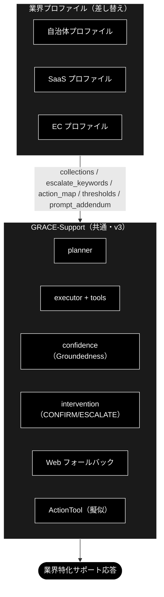

# GRACE-Support 業界特化 設計書（自治体 / SaaS / EC）

**Version 0.8（概要に「業界特化の定義・7 つの機構・成熟度」を明文化）** | 最終更新: 2026-07-02

> 🔍 **仕様レビュー**: 本設計・実装の横断レビューと改善提案は
> [`docs/vertical_spec_review.md`](../../docs/vertical_spec_review.md) を参照
> （残タスク 1・2 は既存コアフックでほぼ実現可能という再見積もりを含む）。

> ✅ **実装状況**: `VerticalProfile` と `--vertical {gov|saas|ec}` は **`agent_support_example.py` に実装済み**（PR #106）。しきい値上書き・エスカレ語（二段判定）・アクション対応（二段判定）・本人確認に加え、`collections`（`allowed_collections` による検索範囲の実限定）と `prompt_addendum`（reasoning プロンプトへの注入）も**フル配線済み**。KPI 評価は `eval/vertical/` を参照。

> **参考ドキュメント**
> - [`grace/doc/agent_support_example.md`](./agent_support_example.md) — GRACE-Support 本体の設計書（v1〜v3）
> - [`docs/migration_and_update.md`](../../docs/migration_and_update.md) — 需要分析・全体ロードマップ（本書はその「業界特化」フェーズの詳細）
> - [`grace/doc/grace_core_flow.md`](./grace_core_flow.md) — 5 段階設計・8 コアモジュール

---

## 目次

- [概要](#概要)
- [1. 業界プロファイル（差し替えの共通枠）](#1-業界プロファイル差し替えの共通枠)
- [2. 業界プロファイルの GRACE-Support への適用](#2-業界プロファイルの-grace-support-への適用)
- [3. 自治体（Local Government）](#3-自治体local-government)
- [4. SaaS](#4-saas)
- [5. EC（Eコマース）](#5-eceコマース)
- [6. 実装への落とし込み（VerticalProfile 案）](#6-実装への落とし込みverticalprofile-案)
- [7. 実行例（コマンド）](#7-実行例コマンド)
- [8. 残タスク（次工程候補）](#8-残タスク次工程候補)
- [9. 変更履歴](#9-変更履歴)

---

## 概要

### 定義: 何をもって「業界特化」と呼ぶか

**「業界特化」＝共通エンジン（GRACE-Support）は 1 つのまま、業界ごとに差し替わる 7 つの機構（VerticalProfile）で挙動を変えること。**
エンジン本体（Plan → 内部 RAG → 根拠検証 → 回答ゲート → Web 裏取り → アクション＋HITL）は
gov / saas / ec で完全に共通であり、業界性はすべて**プロファイルの差分として注入**される。

言い換えると、業界特化の実体は次の 6 軸を業界別に定義したものである:
**「①何を知識源とし、②どこまで自信があれば答え、③何を人間に渡し、④何を実行し、⑤どう語り、⑥何で測るか」**。

### 業界特化を構成する 7 つの機構

| # | 機構 | 何が業界ごとに変わるか | 例 | 実装位置 |
|---|---|---|---|---|
| 1 | **検索スコープ**（`collections` → `config.qdrant.allowed_collections`） | 回答の根拠にしてよいナレッジの範囲。フォールバック連鎖も業界外へ漏れない | gov=FAQ・法令系のみ / ec=規定・注文 FAQ のみ | `RAGSearchTool._apply_allowed_collections` |
| 2 | **回答の厳しさ**（`notify_th` / `confirm_th`） | 「どこまで確信があれば答えてよいか」の基準 | gov は 0.8/0.5（既定 0.7/0.4 より厳格）＝「間違えるくらいなら窓口へ」 | `_answer_gate()` |
| 3 | **強制エスカレ基準**（`escalate_keywords`＋意図分類） | 機械に答えさせてはいけない話題の定義（二段判定で FAQ 質問の誤爆は抑止） | gov=法的判断・減免・個別事情 / saas=障害・課金 / ec=決済・破損 | `_should_force_escalate()` |
| 4 | **アクション語彙**（`action_map`） | 「対応」と見なす意図と、その処理先 | ec「返品したい」→起票 / gov「様式がほしい」→案内返信（申請自体は人間） | `_decide_action()` |
| 5 | **本人確認**（`require_identity`) | 副作用操作の前に本人確認を要するか | EC のみ True（注文情報の操作） | `_perform_action()` |
| 6 | **業務方針**（`prompt_addendum` → `config.llm.prompt_addendum`） | 回答の語り口・禁則 | gov「断定回避・担当課明示・個人情報を尋ねない」/ saas「バージョン明示・再現手順」 | `ReasoningTool._build_prompt()` |
| 7 | **評価基準**（KPI・期待ラベル付きテスト質問） | 何をもって良いサポートとするか | gov「根拠なし回答=0」/ ec「本人確認遵守率=100%」 | `eval/vertical/`（`cases/*.jsonl`・`metrics.py`） |

### 成熟度: 現時点で「特化」と呼べる度合い（正直な評価）

- **厚い部分（実質的な差別化）**: 機構 3・4・5。同種の依頼でも EC では「本人確認 → CONFIRM → 起票」、
  gov では「有人窓口へ」と、**業界の業務設計（誰が何をしてよいか）の違いをコードが実際に分岐**している。
- **薄い部分（まだ枠のみ）**:
  - 機構 1 の**ナレッジが未登録**。業界特化の最大のレバーは「その業界の知識で答えること」だが、
    専用コレクション（`gov_faq_anthropic` 等）は割り当て済みの枠だけで中身が空。gov は暫定代替
    `wikipedia_ja` で動いており、**データ登録が済むまで体感差の大半は出ない**。
  - 機構 2・6 は数値 2 つと日本語 1 文であり、「特化」というより業界別チューニングの置き場。
  - 業界固有ワークフロー（実返品 API・申請システム連携）、業界用語辞書、制度改正追随は**未実装**。
    ActionTool は擬似（ドライラン）。

### 設計理由（トレードオフ）

「業界ごとに別アプリを作る」のではなく「プロファイル差し替え」にしたのは、回答エンジン・出典検証・
HITL という難しい共通部分を 1 回だけ作り、**業界追加を設定の追加に落とす**ため。その代償として、
現段階の「特化」の深さは上記パラメータの深さ＝**投入されたデータの質**に依存する。
次の一手は機能追加ではなく**データ投入**（gov_faq / gov_laws 登録 → `eval/vertical/` で KPI ベースライン計測）である。

---

## 1. 業界プロファイル（差し替えの共通枠）

| 差し替え項目 | 説明 | GRACE-Support 上の反映先 |
|---|---|---|
| `collections` | 検索対象コレクションの許可リスト | planner の `collection` 指定 / tools の検索範囲 |
| `sample_queries` | 代表想定質問（評価・回帰用） | KPI 計測・チューニング |
| `escalate_keywords` | 強制エスカレの語（例: 障害・決済・法的判断） | 回答ゲート前の割り込み判定 |
| `require_identity` | 本人確認が必要な操作か | アクション前 HITL（CONFIRM）強化 |
| `action_map` | 意図 → アクション種別の対応 | `_decide_action()` |
| `thresholds` | notify/confirm の上書き（厳しめ/緩め） | `_answer_gate()` |
| `prompt_addendum` | 業界固有の注意（用語・断定回避 等） | reasoning プロンプトへ追記 |
| `kpi` | 運用指標 | 評価 |

---

## 2. 業界プロファイルの GRACE-Support への適用



---

## 3. 自治体（Local Government）

| 項目 | 内容 |
|------|------|
| **対象コレクション** | `条例・要綱`、`手続き案内`、`窓口FAQ`（住民向け） |
| **代表想定質問** | 「住民票の写しの取り方は？」「国民健康保険の加入手続きは？」「粗大ごみの出し方は？」「保育園の申込期限は？」 |
| **エスカレ基準** | 法的判断・個別事情・出典なしは**必ず有人**。断定を避け、根拠（条例名・案内ページ）を必須にする |
| **アクション** | `send_reply`（担当課・必要書類・窓口時間の案内）。申請受付そのものは人間（`escalate_to_human`） |
| **KPI** | 出典付与率 ≈ 100% / 根拠なし回答 = 0 / 一次解決率 / **誤案内 = 0** |
| **特有の注意** | 正確性最優先・**断定回避**、個人情報を聞かない、高齢者にも平易な表現、最新の制度改正への追随 |

> 自治体は「間違えない・出典を示す・迷ったら窓口へ」を最重視。`thresholds` は厳しめ（confirm/notify を上げる）に設定し、少しでも根拠が弱ければエスカレへ倒す。

---

## 4. SaaS

| 項目 | 内容 |
|------|------|
| **対象コレクション** | `製品ドキュメント`、`APIリファレンス`、`リリースノート`、`既知の不具合` |
| **代表想定質問** | 「API のレート制限は？」「Webhook の設定方法は？」「このエラーコードの意味は？」「v2 への移行手順は？」 |
| **エスカレ基準** | 障害・課金・セキュリティ、再現不能、バージョン不一致は `create_ticket`／`escalate_to_human` |
| **アクション** | `create_ticket`（障害・不具合）、`send_reply`（ドキュメントリンク・ステータスページ案内） |
| **KPI** | 自己解決率（deflection）/ 一次応答時間 / チケット適正振り分け率 / 再現手順取得率 |
| **特有の注意** | **バージョン差の明示**、出典にドキュメント URL、コード例の正確性、Web フォールバックは公式ドキュメント優先 |

> SaaS は「速く・正確に・再現手順つき」。`escalate_keywords` に「障害」「ダウン」「課金」「情報漏えい」等を入れ、即エスカレ。

---

## 5. EC（Eコマース）

| 項目 | 内容 |
|------|------|
| **対象コレクション** | `商品情報`、`返品・交換規定`、`配送・送料`、`注文FAQ` |
| **代表想定質問** | 「返品したい」「配送状況を知りたい」「サイズ交換できる？」「注文をキャンセルしたい」 |
| **エスカレ基準** | 個人注文情報の照会・変更（**本人確認必須**）、決済トラブルは有人／本人確認フロー |
| **アクション** | `create_ticket`（返品受付・要 CONFIRM＋本人確認）、`send_reply`（規定・返信テンプレ）。注文照会は注文 ID 必須 |
| **KPI** | 自己解決率 / 返品処理時間 / **誤操作 = 0（本人確認必須）** / CS 満足度 |
| **特有の注意** | **個人情報・注文権限の確認を必須**（`require_identity=True` → アクション前 HITL を強化）、規定の版管理 |

> EC は「行動（返品・キャンセル）に直結」するため、v3 のアクション＋HITL が本領。副作用のある操作は本人確認 → CONFIRM の二段で守る。

---

## 6. 実装への落とし込み（VerticalProfile 案）

共通コードは変えず、**プロファイルを渡すだけ**で切り替える設計。

```text
VerticalProfile（dataclass 案）
  - name: str                      # "gov" | "saas" | "ec"
  - collections: list[str]         # 検索許可コレクション
  - escalate_keywords: list[str]   # 強制エスカレ語
  - require_identity: bool         # アクション前に本人確認を必須化
  - action_map: dict[str, str]     # 意図キーワード → action_type
  - notify_th / confirm_th: float  # 閾値の上書き（未指定なら config 既定）
  - prompt_addendum: str           # reasoning への業界注意書き
  - sample_queries: list[str]      # 評価用
  - kpi: list[str]
```

**適用ポイント（GRACE-Support への差し込み）**:

| プロファイル項目 | 差し込み先（既存関数) | 状態 |
|---|---|---|
| `escalate_keywords` | **二段判定**: キーワード候補一致（`_match_keyword`）→ 軽量 LLM 意図分類（`create_intent_classifier`・question/request/incident）。question（FAQ質問）は誤爆とみなし通常フロー継続、それ以外・分類失敗は即 `escalate`（Web もスキップ） | ✅ 実装済み（`_should_force_escalate`） |
| `notify_th`/`confirm_th` | `_answer_gate()` のしきい値を上書き | ✅ 実装済み |
| `action_map` | `_decide_action()`（二段判定: キーワード候補 → 意図分類。question は起票せず回答のみ） | ✅ 実装済み |
| `require_identity` | `_perform_action()`（本人確認ステップを前置。起動有無は `SupportResult.identity_checked` に記録） | ✅ 実装済み |
| `collections` | `config.qdrant.allowed_collections` 経由で `RAGSearchTool` の検索候補（明示指定・フォールバック連鎖を含む）を許可リストで限定。実コレクション名（`gov_faq_anthropic` 等）を割り当て済み。未登録なら制限を適用せず従来動作（警告ログ） | ✅ 実装済み（`RAGSearchTool._apply_allowed_collections`） |
| `prompt_addendum` | `config.llm.prompt_addendum` 経由で `ReasoningTool._build_prompt()` のシステム指示直後に「業務方針（遵守）」として注入。executor 経由・Web フォールバック経由の両 reasoning に効く | ✅ 実装済み |
| `sample_queries` / `kpi` | 期待ラベル付きテストケースは `eval/vertical/cases/<vertical>.jsonl` に外部化（dataclass には持たせない）。KPI は `eval/vertical/run.py` で自動計測 | ✅ 実装済み（評価ランナー） |

**CLI**: `python agent_support_example.py --vertical gov "住民票の取り方は？"`（プロファイルを選択）。**実装済み**。

**実装状況**: `VerticalProfile` 導入と gov/saas/ec の 3 プロファイルは実装済み（PR #106）。設計時の実装順（自治体 → SaaS → EC）どおり 3 業界を同時に組み込み済み。残タスクは `collections` の実検索限定・`prompt_addendum` のプロンプト注入・評価スクリプト（KPI 自動計測）。

---

## 7. 実行例（コマンド）

業界別アプリの実行例を示す。`--vertical` フラグは**実装済み**（PR #106）であり、次の 2 段構えで示す。

- **7.1**: 共通コマンド（GRACE-Support v3・プロファイル未適用）で、業界の代表シナリオを試す
- **7.2**: `--vertical` でプロファイルを切り替えて実行する（推奨）

共通の前提: `.env` に `ANTHROPIC_API_KEY` / `GOOGLE_API_KEY`、Qdrant 起動済み＋対象コレクション登録済み。uv 管理環境では `python …` を `uv run python …` に読み替える。

### 7.1 現時点（v3 共通コマンドで業界シナリオを試す）

共通 CLI は `agent_support_example.py`（引数: `query` / `-v` / `--no-web` / `--no-action` / `--dry-run`）。`--vertical` を付けない場合は業界チューニング（エスカレ語・しきい値・アクション対応）が適用されないため、共通挙動の確認用。

**自治体（正確性・出典最優先）**
```bash
python agent_support_example.py "住民票の写しの取り方は？"
python agent_support_example.py -v "国民健康保険の加入手続きは？"   # 支持率の内訳を表示
```

**SaaS（速く・正確・再現手順）**
```bash
python agent_support_example.py "API のレート制限は？"
python agent_support_example.py -v "サービスが落ちています"        # 障害系 → escalate 想定
```

**EC（行動＝返品/キャンセルは HITL）**
```bash
python agent_support_example.py "返品したい"                       # アクション(create_ticket)・CONFIRM＋ドライラン
python agent_support_example.py --no-dry-run "解約したい"          # 擬似実行（実API連携は将来）
python agent_support_example.py --no-web "配送状況を知りたい"      # 内部ナレッジのみ
```

### 7.2 業界プロファイル（VerticalProfile・実装済み）

`--vertical {gov|saas|ec}` でプロファイル（エスカレ語・アクション対応・本人確認・閾値、および表示メタの対象コレクション・方針）を一括切替する。**実装済み**（PR #106）。

**自治体**
```bash
python agent_support_example.py --vertical gov "住民票の写しの取り方は？"
```

**SaaS**
```bash
python agent_support_example.py --vertical saas -v "Webhook の設定方法は？"
```

**EC**
```bash
python agent_support_example.py --vertical ec "返品したい"              # 本人確認 → CONFIRM → ドライラン
python agent_support_example.py --vertical ec --no-dry-run "返品したい"  # 擬似実行
```

> ✅ `--vertical` は実装済み。`escalate_keywords`/しきい値/`action_map`/`require_identity` が有効。`collections`（実検索限定）と `prompt_addendum`（プロンプト注入）は現状**表示のみ**で、フル配線は将来対応（§6 参照）。

---

## 8. 残タスク（次工程候補）

`VerticalProfile`（`--vertical`）は実装済み（PR #106）。その後の進捗は次のとおり。

| # | 残タスク | 内容 | 状態 |
|---|---------|------|------|
| 1 | `collections` の実検索限定 | プロファイルの対象コレクション（実名 `gov_faq_anthropic` 等）で RAG 検索範囲をスコープ制限。フォールバック連鎖にも適用。未登録コレクションのみなら制限なしで従来動作（警告） | ✅ **実装済み**（`config.qdrant.allowed_collections`＋`RAGSearchTool._apply_allowed_collections`・テスト `tests/grace/test_vertical_scope.py`） |
| 2 | `prompt_addendum` のプロンプト注入 | reasoning プロンプトのシステム指示直後へ業界方針（断定回避・出典必須・本人確認等）を「業務方針（遵守）」として追記 | ✅ **実装済み**（`config.llm.prompt_addendum`＋`ReasoningTool._build_prompt`） |
| 3 | KPI 評価スクリプト | 分岐一致率・誤エスカレ率・**強制エスカレ誤発火率（0 目標）**・出典付与率・**根拠なし回答率（0 目標）**・アクション適合率・本人確認遵守率を自動計測 | ✅ **実装済み**（`eval/vertical/run.py`・`eval/vertical/metrics.py`・`cases/{gov,saas,ec}.jsonl` 5 カテゴリ） |
| 4 | 二段判定（キーワード誤爆抑止） | エスカレ語・アクション語の部分一致を候補検出に格下げし、一致時のみ軽量 LLM（`claude-haiku-4-5-20251001`）で意図分類（question/request/incident）。question は強制エスカレ・起票を抑止 | ✅ **実装済み**（`_should_force_escalate` / `_decide_action`・単体テスト `tests/test_agent_support_vertical.py`） |

> #3 の in-scope 精度計測には**業界別 RAG コレクションの整備**が引き続き必要（自治体/SaaS/EC）。
> データ選定の考え方・無料データ候補は [`docs/vertical_test_data.md`](../../docs/vertical_test_data.md) を参照。

---

## 9. 変更履歴

| バージョン | 変更内容 |
|-----------|---------|
| 0.1 | 初版作成（設計フェーズ）。業界プロファイルの共通枠、GRACE-Support への適用図、自治体/SaaS/EC の対象コレクション・想定質問・エスカレ基準・アクション・KPI・注意点、VerticalProfile 実装案と差し込みポイントを定義 |
| 0.2 | §2 適用図を縦並び（`flowchart TB`）に変更。§7「実行例（コマンド）」を追加（7.1 現時点の共通コマンド／7.2 `--vertical` 実装後の想定）。変更履歴を §8 に繰り下げ |
| 0.3 | `VerticalProfile` と `--vertical {gov|saas|ec}` の実装完了（PR #106）に合わせて更新。§6 の適用ポイントに実装状況（escalate_keywords/しきい値/action_map/require_identity=実装済み、collections/prompt_addendum=表示のみ）を追記、§7.2 を「実装済み」へ、ヘッダに実装状況注記を追加 |
| 0.4 | §8「残タスク（次工程候補）」を追加（collections の実検索限定・prompt_addendum のプロンプト注入・KPI 評価スクリプト）。変更履歴を §9 に繰り下げ |
| 0.5 | §7 冒頭・§7.1 に残っていた「`--vertical` 未実装」の旧文言を実装済み前提に修正。ヘッダに仕様レビュー（`docs/vertical_spec_review.md`）への参照を追加 |
| 0.6 | **二段判定（誤爆抑止）**と **KPI 評価ランナー**の実装を反映。§6 適用ポイント表を更新（escalate_keywords/action_map は「キーワード候補検出 → 意図分類」へ、sample_queries/kpi は `eval/vertical/` に外部化）。§8 を進捗表に改め、#3 KPI 評価・#4 二段判定を実装済みに |
| 0.7 | **フル配線完了**: #1 `collections` 実検索限定（`allowed_collections` 許可リスト・実コレクション名 `gov_faq_anthropic` 等を割り当て）と #2 `prompt_addendum` 注入（`config.llm.prompt_addendum` → reasoning システム指示）を実装済みに更新 |
| 0.8 | 概要を全面改訂: **「業界特化」の定義**（共通エンジン×プロファイル差し替え・6 軸）、**構成する 7 つの機構**（実装位置つき）、**成熟度の正直な評価**（厚い部分=エスカレ/アクション/本人確認、薄い部分=ナレッジ未登録・擬似 ActionTool）、**設計理由（トレードオフ）**を明文化。旧「設計フェーズ（未実装）」注記を削除 |
