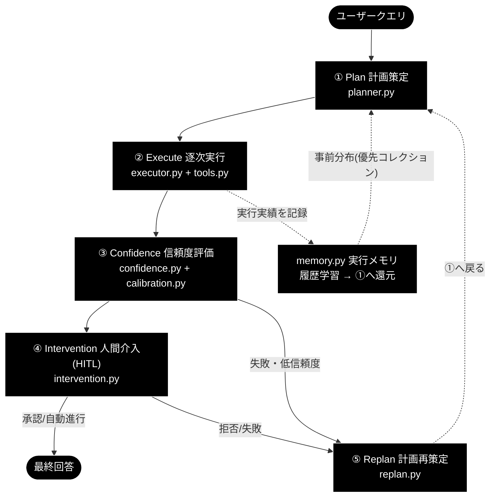
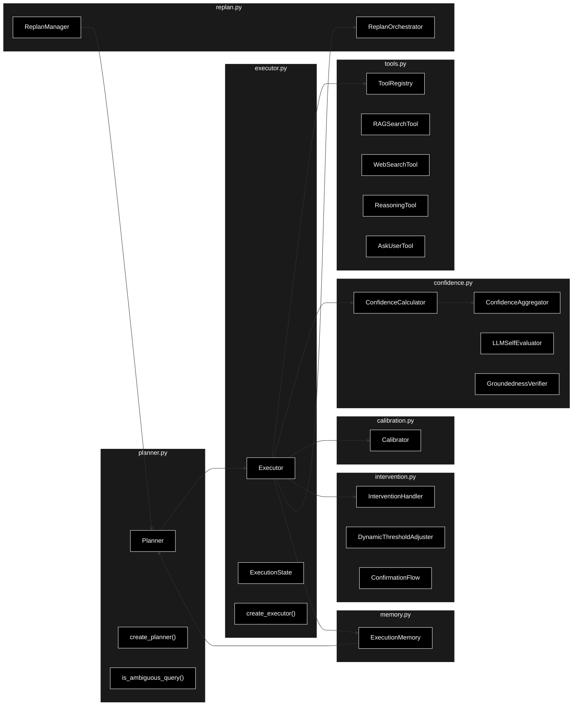
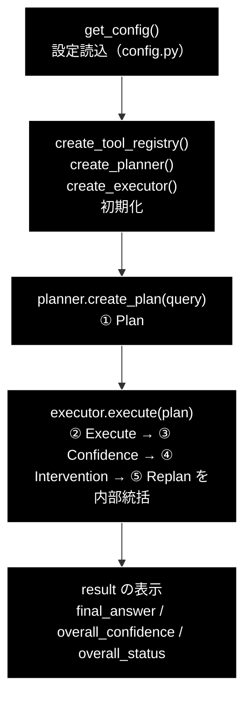

# grace_core_flow.md - GRACE コアの 5 段階設計と最小実行サンプル

**Version 1.0** | 最終更新: 2026-06-28

> **参考ドキュメント**
> - [`grace/doc/grace_core.md`](./grace_core.md) — コアモジュール群（8 モジュール）の横断アーキテクチャ（構成図・データフロー・IPO リンク集）
> - [`grace/doc/grace.md`](./grace.md) — GRACE 自律型エージェントのアーキテクチャ概説（思想・ReAct との関係）

---

## 目次

- [概要](#概要)
- [A. コアの基本構成：自律型 Agent の 5 段階設計](#a-コアの基本構成自律型-agent-の-5-段階設計)
- [B. 実装のコアモジュール構成（8 コアモジュール）](#b-実装のコアモジュール構成8-コアモジュール)
  - [B.1 モジュール構成図](#b1-モジュール構成図)
  - [B.2 モジュール間依存関係テーブル](#b2-モジュール間依存関係テーブル)
- [C. 役割サマリー](#c-役割サマリー)
- [D. 最小実行サンプル agent_example.py](#d-最小実行サンプル-agent_examplepy)
  - [D.1 プログラム全文](#d1-プログラム全文)
  - [D.2 実行フロー（5 段階との対応）](#d2-実行フロー5-段階との対応)
  - [D.3 行ごとの解説](#d3-行ごとの解説)
  - [D.4 実行方法・前提](#d4-実行方法前提)
- [E. 理解のための補足説明](#e-理解のための補足説明)
- [変更履歴](#変更履歴)

---

## 概要

`anthropic_grace_agent_v2` の**自律型エージェント**は、`grace/` パッケージの **8 つのコアモジュール**で構成される。

```
grace/planner.py      grace/executor.py    grace/confidence.py   grace/calibration.py
grace/memory.py       grace/intervention.py grace/replan.py      grace/tools.py
```

本書は、これらコアの **設計思想（5 段階設計）→ 実装構成（モジュール連携）→ 役割サマリー** を俯瞰したうえで、最小実行サンプル `agent_example.py` を題材に「実際にどう動くか」を解説する。各モジュールの IPO 詳細は `grace_core.md` と各個別ドキュメント（`planner.md` 等）に委ねる。

> 📝 **技術スタック**: LLM 用途はすべて **Anthropic Claude**（既定 `claude-sonnet-4-6`、軽量 `claude-haiku-4-5-20251001`、鍵 `ANTHROPIC_API_KEY`）。検索の Embedding のみ **Gemini** `gemini-embedding-001`（3072 次元、鍵 `GOOGLE_API_KEY`）を継続利用する。

---

## A. コアの基本構成：自律型 Agent の 5 段階設計

GRACE は ReAct（Reasoning + Acting）の暗黙的なループを **5 つの明示的フェーズ**へ昇格し、さらに実務向けに **人間介入（HITL）** を正式工程として組み込んだ。

```
① Plan（計画策定）       … ゴールまでの道筋を立てる   ← ReAct の Thought を独立工程化
② Execute（逐次実行）     … ツールを動かし結果を得る   ← ReAct の Action ＋ Observation
③ Confidence（信頼度評価）… 結果が正しいか検証する     ← Self-Reflection 由来
④ Intervention（人間介入）… AI の暴走を防ぐ HITL        ← ★GRACE の新規拡張
⑤ Replan（計画再策定）    … 失敗を踏まえ手を練り直す   ← ReAct の神髄／反省を活用
        ↺（①へ戻る）
```

| フェーズ | ルーツ | 役割 | 主担当モジュール |
|---|---|---|---|
| ① Plan | ReAct: Thought の一部 | 最初に道筋を設計 | `planner.py` |
| ② Execute | ReAct: Action + Observation | ツール実行と結果取得 | `executor.py` + `tools.py` |
| ③ Confidence | Reflection（自己反省） | 正しさ・ゴール達成を検証 | `confidence.py` + `calibration.py` |
| ④ Intervention | **GRACE 新規** | Human-in-the-Loop で暴走防止 | `intervention.py` |
| ⑤ Replan | ReAct の神髄 + 反省 | Thought に戻り次の手を再設計 | `replan.py` |

この 5 段階を 1 枚に表すと次の通り（`memory.py` は履歴を学習して①へ事前分布を還元する横串）。



---

## B. 実装のコアモジュール構成（8 コアモジュール）

5 段階設計は、実装では次の 8 モジュールに対応する。`executor.py` が司令塔となり、各モジュールと往復しながらループを駆動する。

### B.1 モジュール構成図



### B.2 モジュール間依存関係テーブル

| モジュール | 主に呼び出す相手 | 主に呼ばれる相手 |
|-----------|----------------|----------------|
| `planner.py` | `memory`（事前分布）, `llm_compat`, `schemas`, `services.qdrant_service` | `executor`, `replan`, UI |
| `executor.py` | `tools`, `confidence`, `calibration`, `intervention`, `replan`, `memory` | UI, `benchmark` |
| `tools.py` | Qdrant, Gemini Embedding, Web 検索, `llm_compat` | `executor` |
| `confidence.py` | `llm_compat`（Anthropic）, Gemini Embedding | `executor` |
| `calibration.py` | （stdlib のみ） | `executor`, 評価スクリプト |
| `memory.py` | （stdlib のみ・JSONL） | `executor`（書込）, `planner`（読込） |
| `intervention.py` | `confidence`（`InterventionLevel`/`ActionDecision`） | `executor` |
| `replan.py` | `planner`（`create_plan`/委譲） | `executor` |

---

## C. 役割サマリー

自律エージェントを構成する全モジュールの「役割サマリ」を一覧する。**#4〜#11 が 5 段階設計を担う 8 コアモジュール**、**#1〜#3 はそれを下支えする基盤モジュール**（設定・互換層・型契約）である。

| # | ファイル | 1 行サマリ | 区分 |
|---|---|---|---|
| 1 | `config.py` | 全コンポーネントの設定を Pydantic で一元管理（YAML＋環境変数） | 基盤 |
| 2 | `llm_compat.py` | google-genai 互換のまま Anthropic を呼ぶ薄いアダプタ | 基盤 |
| 3 | `schemas.py` | Plan/Step/Result/Scratchpad/Thought のデータ契約（型定義） | 基盤 |
| 4 | `planner.py` | 質問を分析し ExecutionPlan を生成（三層振り分け） | ① Plan |
| 5 | `memory.py` | 実行履歴を学習しコレクション事前分布を計画へ還元 | 横串（①へ還元） |
| 6 | `tools.py` | エージェントの「手足」＝各ツールとレジストリ | ② Execute |
| 7 | `executor.py` | 計画を実行する司令塔（Plan-Execute／ReAct ループ） | ② Execute |
| 8 | `confidence.py` | 多軸＋根拠妥当性で「どれだけ信じられるか」を採点 | ③ Confidence |
| 9 | `calibration.py` | 採点の「甘辛」を実正解率へ較正（温度スケーリング） | ③ Confidence |
| 10 | `intervention.py` | 信頼度に応じて人間に渡す／止める（HITL） | ④ Intervention |
| 11 | `replan.py` | 失敗・低信頼から計画を立て直す | ⑤ Replan |

> 📝 `planner.py` は複雑度・曖昧性に応じて「曖昧クエリの確認（ask_user）／ルールベース 2 ステップ計画／LLM 計画」へ振り分ける（**三層振り分け**）。`memory.py` は 5 段階のいずれにも属さないが、過去実績を①の計画へ還元する**横串の学習機構**である。

---

## D. 最小実行サンプル agent_example.py

上記アーキテクチャを、もっとも簡略化した形で体験できるのがリポジトリ直下の `agent_example.py` である。`planner.create_plan()`（① Plan）と `executor.execute()`（②〜⑤を内部統括）を呼ぶだけで、コア一式が動く。

### D.1 プログラム全文

```python
# agent_example.py
"""GRACE エージェントの最小実行サンプル。

planner（計画生成）→ executor（confidence/calibration/intervention/replan/memory を
内部統括）の一連の流れを 1 クエリで実行する。

前提:
- `.env` に ANTHROPIC_API_KEY（LLM 用）と GOOGLE_API_KEY（Embedding 用）を設定
- Qdrant が起動済み（既定 http://localhost:6333）で RAG コレクションが登録済み

使い方::

    python agent_example.py
    python agent_example.py "東京タワーの高さは？"
"""
from __future__ import annotations

import argparse
import os
import sys

from grace import (
    create_executor,
    create_planner,
    create_tool_registry,
    get_config,
)

# .env から ANTHROPIC_API_KEY / GOOGLE_API_KEY 等を読み込む（未導入でも続行）
try:
    from dotenv import load_dotenv

    load_dotenv()
except ImportError:
    pass

DEFAULT_QUERY = "日本の再生可能エネルギー政策の最新動向を教えて"


def run_agent(query: str = DEFAULT_QUERY):
    # 0. APIキーの存在チェック（未設定だと LLM 呼び出しで失敗する）
    if not os.getenv("ANTHROPIC_API_KEY"):
        print("⚠️ ANTHROPIC_API_KEY が未設定です。.env に設定してください。", file=sys.stderr)
        return None

    # 1. 設定の取得
    config = get_config()

    # 2. ツールレジストリと各エージェントの初期化
    tool_registry = create_tool_registry(config)
    planner = create_planner(config)
    executor = create_executor(config, tool_registry)  # confidence/calibration/intervention/replan/memory を内部初期化

    # 3. 計画の生成（planner.py）
    print(f"❓ 質問: {query}")
    plan = planner.create_plan(query)
    print(f"📋 計画: {len(plan.steps)} ステップ (complexity={plan.complexity:.2f})")

    # 4. 計画の実行（executor.py が全コンポーネントを統括）
    result = executor.execute(plan)

    # 5. 結果の確認
    print("-" * 60)
    print(f"最終回答: {result.final_answer}")
    print(f"全体信頼度（較正済み）: {result.overall_confidence:.2f}")
    print(f"ステータス: {result.overall_status}")
    return result


def main():
    parser = argparse.ArgumentParser(description="GRACE エージェントの最小実行サンプル")
    parser.add_argument(
        "query", nargs="?", default=DEFAULT_QUERY,
        help="エージェントに尋ねる質問（省略時は既定の質問を使用）",
    )
    args = parser.parse_args()

    try:
        run_agent(args.query)
    except Exception as e:  # サービス未起動・鍵未設定などを分かりやすく表示
        print(f"❌ 実行に失敗しました: {type(e).__name__}: {e}", file=sys.stderr)
        print(
            "  ヒント: Qdrant の起動（docker-compose -f docker-compose/docker-compose.yml up -d）"
            "と .env の API キーを確認してください。",
            file=sys.stderr,
        )
        sys.exit(1)


if __name__ == "__main__":
    main()
```

### D.2 実行フロー（5 段階との対応）

このサンプルが呼ぶのは**たった 2 つの公開 API**（`planner.create_plan()` と `executor.execute()`）だが、`executor.execute()` の内部で 5 段階設計の②〜⑤がすべて回る。



| サンプルの処理 | 呼び出す API | 対応するフェーズ |
|---|---|---|
| 1. 設定取得 | `get_config()` | 基盤（`config.py`） |
| 2. 初期化 | `create_tool_registry()` / `create_planner()` / `create_executor()` | 基盤（②の道具立て） |
| 3. 計画生成 | `planner.create_plan(query)` | **① Plan** |
| 4. 計画実行 | `executor.execute(plan)` | **② Execute / ③ Confidence / ④ Intervention / ⑤ Replan** |
| 5. 結果表示 | `result.final_answer` ほか | 出力 |

> 💡 `create_executor()` は引数に `tool_registry` を渡すだけだが、内部で `confidence` / `calibration` / `intervention` / `replan` / `memory` を初期化する（`executor.py` 内）。だからサンプルは 2 API だけでコア全体を動かせる。

### D.3 行ごとの解説

| 箇所 | 内容 | 補足 |
|---|---|---|
| docstring（2–15 行） | 目的・前提・使い方 | 前提は **API キー 2 種**＋**Qdrant 起動＋RAG コレクション登録済み** |
| `from grace import (...)`（22–27 行） | コアのファクトリ関数を取得 | `create_executor` / `create_planner` / `create_tool_registry` / `get_config`（`grace/__init__.py` でエクスポート） |
| `try: load_dotenv()`（30–35 行） | `.env` を読み込み環境変数化 | `python-dotenv` 未導入でも `ImportError` を握りつぶして続行（堅牢化） |
| `DEFAULT_QUERY`（37 行） | 既定の質問文 | CLI 引数省略時に使用 |
| `run_agent()` 0.（41–44 行） | `ANTHROPIC_API_KEY` の存在チェック | 未設定なら LLM 呼び出し前に明示メッセージで早期 return |
| 1.（47 行） | `get_config()` | `config.py` が YAML＋環境変数から `GraceConfig` を構築 |
| 2.（50–52 行） | レジストリ・各エージェント初期化 | `executor` が confidence/calibration/intervention/replan/memory を内包 |
| 3.（55–57 行） | `create_plan(query)` で **① Plan** | `plan.steps`（PlanStep 列）と `plan.complexity` を表示 |
| 4.（60 行） | `executor.execute(plan)` で **②〜⑤** | ブロッキング実行し `ExecutionResult` を返す |
| 5.（63–67 行） | 結果表示 | `final_answer`（Optional[str]）/ `overall_confidence`（較正済み 0.0–1.0）/ `overall_status`（success/partial/failed/cancelled） |
| `main()`（70–87 行） | CLI 化＋例外ハンドリング | 質問は位置引数（任意）。サービス未起動・鍵未設定は `type(e).__name__: e` とヒントを stderr へ |
| `if __name__ == "__main__"`（90–91 行） | エントリーポイント | これが無いと `run_agent()` が呼ばれず「実行しても何も起きない」 |

### D.4 実行方法・前提

```bash
# 1) Qdrant を起動（RAG 検索のため）
docker-compose -f docker-compose/docker-compose.yml up -d

# 2) .env に API キーを設定
#   ANTHROPIC_API_KEY=...   ← LLM（計画・推論・信頼度評価）
#   GOOGLE_API_KEY=...      ← Embedding（RAG 検索のベクトル化）

# 3) 実行（既定の質問 / 任意の質問）
python agent_example.py
python agent_example.py "東京タワーの高さは？"
```

**出力例（イメージ）**:

```
❓ 質問: 日本の再生可能エネルギー政策の最新動向を教えて
📋 計画: 2 ステップ (complexity=0.65)
------------------------------------------------------------
最終回答: 日本の再生可能エネルギー政策は……（以下、生成された回答）
全体信頼度（較正済み）: 0.83
ステータス: success
```

> ⚠️ Qdrant 未起動や API キー未設定の場合は、生のスタックトレースではなく `❌ 実行に失敗しました: ...` とヒントが表示される（`main()` の例外ハンドリング）。

---

## E. 理解のための補足説明

サンプルを読み解くうえで押さえておきたい概念を補足する。

- **ExecutionPlan / PlanStep / StepResult**（`schemas.py`）: 計画は `ExecutionPlan`、その中の 1 手が `PlanStep`、実行結果が `StepResult`。`PlanStep.action` は `ActionType`（`rag_search` / `web_search` / `reasoning` / `ask_user`）を取る。サンプルの `plan.steps` はこの `PlanStep` の並び。
- **① Plan の三層振り分け**（`planner.py`）: ①曖昧クエリは確認（`ask_user`）計画、②複雑度 `< 0.7` はルールベース 2 ステップ計画（`rag_search → reasoning`）、③複雑度 `≥ 0.7` または Web 検索マーカーで LLM 計画。
- **② Execute と動的フォールバック**（`executor.py` + `tools.py`）: ステップを順に実行し、RAG 検索のスコア・適合性に応じて `web_search` → `ask_user` を**動的に挿入／スキップ**する。各ツールは `ToolRegistry.execute(name)` で呼ばれ、結果は `ToolResult` に統一される。
- **③ Confidence（多軸＋較正）**（`confidence.py` + `calibration.py`）: 検索品質・LLM 自己評価・ソース一致・根拠妥当性（groundedness）を統合してスコア化し、`Calibrator` の温度スケーリングで「甘辛」を実正解率へ較正する。閾値は `silent=0.9 / notify=0.7 / confirm=0.4`。サンプルの `overall_confidence` はこの**較正済み**値。
- **④ Intervention（HITL）**（`intervention.py`）: 信頼度に応じて SILENT（自動進行）／NOTIFY（通知）／CONFIRM（確認）／ESCALATE（要ユーザー入力）にゲートする。`agent_example.py` は非対話のブロッキング実行のため、CONFIRM 相当でも自動進行する（UI 連携時は `execute_plan_generator()` を使い逐次イベントを描画する）。
- **⑤ Replan**（`replan.py`）: ステップ失敗・低信頼度・ユーザーフィードバックを契機に、戦略（FULL/PARTIAL/FALLBACK/SKIP/ABORT）を選び `planner.create_plan()` へ委譲して計画を立て直す（既定 `max_replans=3`）。
- **memory（横串の学習）**（`memory.py`）: `executor` が「どのコレクションで・成功したか・どれだけ自信があったか」を JSONL に記録し、`planner` が次回 `best_collection()` で優先コレクションを絞り込む（件数 ≥ 3 かつ score ≥ 0.6 で発火）。詳細は `grace_core.md` の「実行メモリが貯まるまで」章を参照。
- **基盤（config / llm_compat / schemas）**: `get_config()` は `config.py` が YAML＋環境変数から `GraceConfig` を構築。LLM 呼び出しは `llm_compat.create_chat_client()` が **google-genai 互換 IF のまま Anthropic** を呼ぶ。型契約は `schemas.py`。
- **ブロッキング実行とジェネレータ実行**: `executor.execute(plan)` は完了まで待つブロッキング版。Streamlit UI（`agent_rag.py`）では `execute_plan_generator(plan)` を使い、`log` / `tool_call` / `tool_result` / `final_answer` などの中間イベントを逐次表示する。

---

## 変更履歴

| バージョン | 変更内容 |
|-----------|---------|
| 1.0 | 初版作成。参考ドキュメント（`grace_core.md` / `grace.md`）の明示、A: 5 段階設計、B: 8 コアモジュール構成（構成図＋依存テーブル）、C: 役割サマリー、D: `agent_example.py` の全文・実行フロー・行解説・実行方法、E: 補足説明を整備 |
