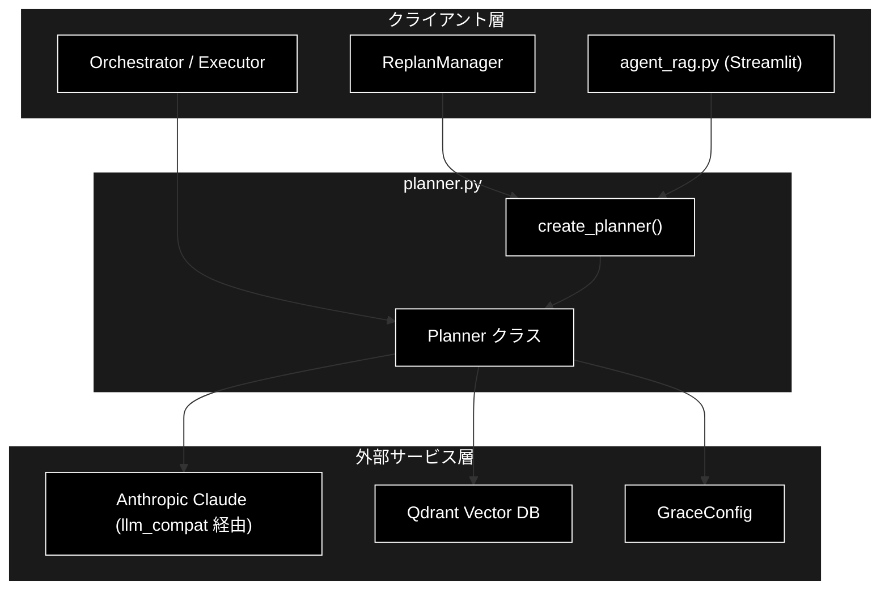
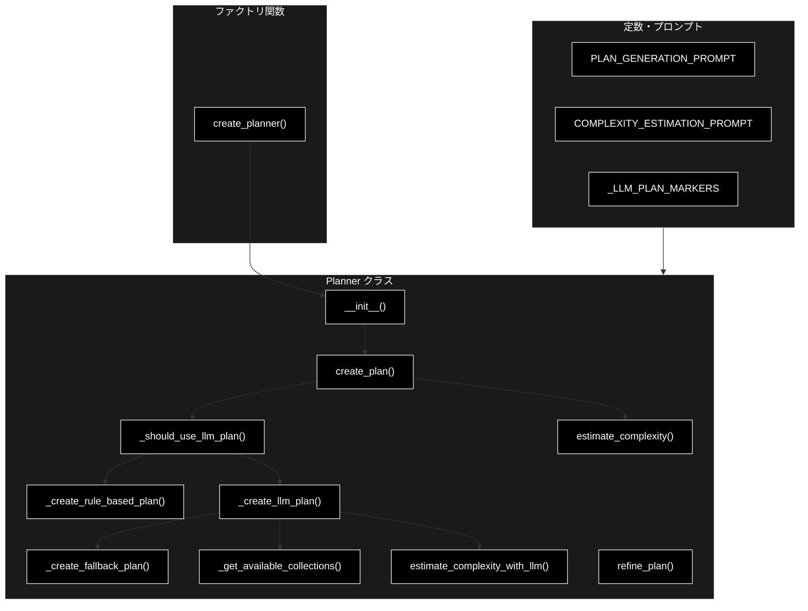
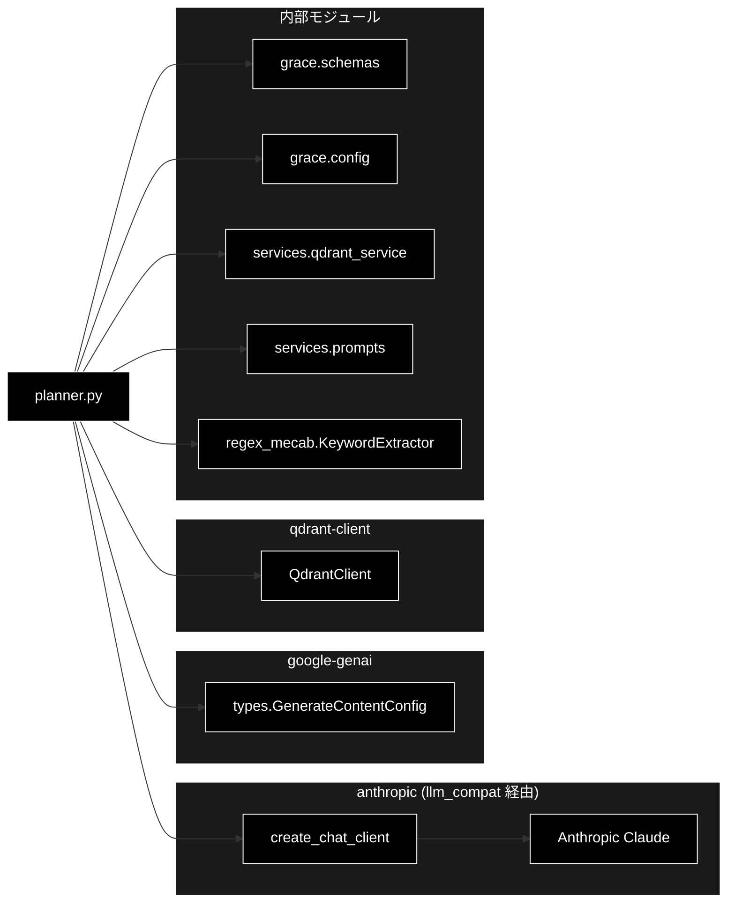

# planner.py - GRACE 計画生成エージェント ドキュメント

**Version 3.1** | 最終更新: 2026-06-16

---

## 目次

1. [概要](#概要)
2. [1. アーキテクチャ構成図](#1-アーキテクチャ構成図)
3. [2. モジュール構成図](#2-モジュール構成図)
4. [3. クラス・関数一覧表](#3-クラス関数一覧表)
5. [4. クラス・関数 IPO詳細](#4-クラス関数-ipo詳細)
6. [5. 設定・定数](#5-設定定数)
7. [6. 使用例](#6-使用例)
8. [7. エクスポート](#7-エクスポート)
9. [8. 変更履歴](#8-変更履歴)
10. [付録: 依存関係図](#付録-依存関係図)

---

## 概要

`planner.py`は、GRACE自律エージェントの「計画生成（Plan）」層を担うモジュールです。ユーザーの質問を分析し、`rag_search` → `reasoning` を中心とした実行計画（`ExecutionPlan`）を生成します。計画生成は二層方式を採用しており、単純なクエリはルールベースで即時に計画を作り（LLM呼び出しなし）、複雑なクエリや明示的なWeb検索指示のあるクエリのみ LLM（Anthropic Claude）で計画を生成します。

LLM 呼び出しは `grace/llm_compat.py` の `create_chat_client()` で生成したクライアント経由で行います。このクライアントは google-genai 互換の `client.models.generate_content(...)` インターフェースを保ったまま、内部では Anthropic Claude（既定 `claude-sonnet-4-6`、軽量用途 `claude-haiku-4-5-20251001`）を呼び出すアダプターです。Embedding（検索）は別途 Gemini `gemini-embedding-001`（3072次元）を使用します。

### 主な責務

- ユーザークエリの複雑度推定（キーワードベース / LLMベース）
- 二層方式による実行計画の生成（ルールベース計画 / LLM計画の振り分け）
- LLM（Anthropic Claude）を用いた実行計画の自動生成
- 利用可能なコレクション（Qdrant）の動的取得
- フィードバックに基づく計画の修正（リファインメント）
- LLMエラー時のフォールバック計画の提供

### 各責務対応のモジュール

| # | 責務 | 対応モジュール | 説明 |
|---|------|--------------|------|
| 1 | ユーザークエリの複雑度推定 | `planner.py` | `estimate_complexity()` / `estimate_complexity_with_llm()` |
| 2 | 二層方式による計画振り分け | `planner.py` | `create_plan()` / `_should_use_llm_plan()` |
| 3 | LLMを用いた実行計画の自動生成 | `planner.py` | `_create_llm_plan()`（Anthropic Claude を compat 経由で呼び出し） |
| 4 | 利用可能なコレクションの動的取得 | `services.qdrant_service` | `get_all_collections()` を `_get_available_collections()` から呼び出し |
| 5 | フィードバックに基づく計画の修正 | `planner.py` | `refine_plan()` |
| 6 | フォールバック計画の提供 | `planner.py` | `_create_fallback_plan()` / `_create_rule_based_plan()` |

### 主要機能一覧

| 機能 | 説明 |
|------|------|
| `Planner` | 計画生成エージェントクラス |
| `Planner.__init__()` | コンストラクタ（設定・モデル名・LLMクライアント・キーワード抽出器の初期化） |
| `Planner.create_plan()` | 二層方式で実行計画を生成（ルールベース / LLM の振り分け） |
| `Planner.estimate_complexity()` | キーワードベースで複雑度を推定 |
| `Planner.estimate_complexity_with_llm()` | LLM（Anthropic Claude）で複雑度を推定 |
| `Planner.refine_plan()` | フィードバックに基づき計画を修正 |
| `Planner._should_use_llm_plan()` | LLM計画生成を使用すべきか判定 |
| `Planner._create_rule_based_plan()` | ルールベースの標準2ステップ計画を生成 |
| `Planner._create_llm_plan()` | LLMによる実行計画を生成（リトライ付き） |
| `Planner._create_fallback_plan()` | LLMエラー時の安全な代替計画を生成 |
| `Planner._get_available_collections()` | 利用可能なQdrantコレクションを取得 |
| `create_planner()` | Plannerインスタンスを作成するファクトリ関数 |
| `PLAN_GENERATION_PROMPT` | LLM計画生成用プロンプトテンプレート |
| `COMPLEXITY_ESTIMATION_PROMPT` | LLM複雑度推定用プロンプトテンプレート |

---

## 1. アーキテクチャ構成図

### 1.1 システム全体構成



### 1.2 データフロー

1. クライアント層（Executor / ReplanManager / UI）が `create_plan(query)` を呼び出す
2. `estimate_complexity()` でヒューリスティック複雑度を算出し、二層判定を行う
3. 単純クエリは `_create_rule_based_plan()` でLLM呼び出しなしの2ステップ計画を即時生成
4. 複雑クエリ・Web検索指示クエリは `_create_llm_plan()` でAnthropic Claudeに計画生成を依頼
5. LLM計画では `_get_available_collections()` でQdrantから利用可能なコレクションを取得しプロンプトに埋め込む
6. レスポンスのJSONを `ExecutionPlan` にパースし、依存関係を検証して返却
7. 失敗時は `_create_fallback_plan()` が安全な代替計画を返す

---

## 2. モジュール構成図

### 2.1 内部モジュール構成



### 2.2 外部依存関係

| ライブラリ | バージョン | 用途 |
|-----------|-----------|------|
| `anthropic` | - | LLM計画生成（`llm_compat` 経由で Claude を呼び出し） |
| `google-genai` | - | `types.GenerateContentConfig` の構築（呼び出しインターフェース互換） |
| `qdrant-client` | >=1.15.1 | 利用可能コレクションの取得 |
| `pydantic` | >=2.0 | `ExecutionPlan` / `PlanStep` のバリデーション |

### 2.3 内部依存モジュール

| モジュール | 用途 |
|-----------|------|
| `grace.schemas` | `ExecutionPlan` / `PlanStep` / `create_plan_id` / `validate_plan_dependencies` |
| `grace.config` | `GraceConfig` / `get_config` |
| `grace.llm_compat` | `create_chat_client`（Anthropic Claude の genai互換クライアント生成） |
| `services.qdrant_service` | `get_all_collections`（コレクション一覧取得） |
| `services.prompts` | `SEARCH_QUERY_INSTRUCTION`（検索クエリ作成指示） |
| `regex_mecab` | `KeywordExtractor`（キーワード抽出） |

---

## 3. クラス・関数一覧表

### 3.1 クラス一覧

#### Planner

| メソッド | 概要 |
|---------|------|
| `__init__(config, model_name)` | 設定・モデル名・LLMクライアント・キーワード抽出器を初期化 |
| `create_plan(query)` | 二層方式で実行計画を生成 |
| `estimate_complexity(query)` | キーワードベースで複雑度を推定 |
| `estimate_complexity_with_llm(query)` | LLMで複雑度を推定 |
| `refine_plan(plan, feedback)` | フィードバックに基づき計画を修正 |
| `_should_use_llm_plan(query, heuristic_complexity)` | LLM計画生成の要否を判定 |
| `_create_rule_based_plan(query, complexity)` | ルールベース2ステップ計画を生成 |
| `_create_llm_plan(query)` | LLMによる計画を生成（リトライ付き） |
| `_create_fallback_plan(query)` | フォールバック計画を生成 |
| `_get_available_collections()` | Qdrantコレクション一覧を取得 |

### 3.2 関数一覧（カテゴリ別）

#### ファクトリ関数

| 関数名 | 概要 |
|-------|------|
| `create_planner(config, model_name)` | Plannerインスタンスを生成 |

---

## 4. クラス・関数 IPO詳細

### 4.1 Planner クラス

ユーザーの質問を分析し、実行計画（`ExecutionPlan`）を生成する計画生成エージェント。二層方式（ルールベース / LLM）を採用する。

#### コンストラクタ: `__init__`

**概要**: 設定・モデル名・LLMクライアント・キーワード抽出器を初期化する。

```python
Planner(
    config: Optional[GraceConfig] = None,
    model_name: Optional[str] = None
)
```

| パラメータ | 型 | デフォルト | 説明 |
|------------|------|-----------|------|
| `config` | Optional[GraceConfig] | None | GRACE設定（Noneの場合は `get_config()` を使用） |
| `model_name` | Optional[str] | None | 使用するモデル名（Noneの場合は `config.llm.model`） |

| 項目 | 内容 |
|------|------|
| **Input** | `config: Optional[GraceConfig] = None`, `model_name: Optional[str] = None` |
| **Process** | 1. `config` を解決（未指定なら `get_config()`）<br>2. `model_name` を解決（未指定なら `config.llm.model`）<br>3. `create_chat_client(config)` でLLMクライアントを生成<br>4. `KeywordExtractor(prefer_mecab=True)` を初期化（失敗時は None） |
| **Output** | Plannerインスタンス |

**戻り値例**:
```python
# Planner インスタンス（主な属性）
{
    "config": "<GraceConfig>",
    "model_name": "claude-sonnet-4-6",
    "client": "<AnthropicGenaiClient>",
    "keyword_extractor": "<KeywordExtractor or None>"
}
```

```python
# 使用例
from grace.planner import Planner

planner = Planner()
print(planner.model_name)
# 出力: claude-sonnet-4-6
```

#### メソッド: `create_plan`

**概要**: 質問から実行計画を生成する（二層方式）。単純クエリはルールベース、複雑クエリ・Web検索指示はLLMで生成する。

```python
def create_plan(self, query: str) -> ExecutionPlan
```

| パラメータ | 型 | デフォルト | 説明 |
|------------|------|-----------|------|
| `query` | str | - | ユーザーの質問 |

| 項目 | 内容 |
|------|------|
| **Input** | `query: str` |
| **Process** | 1. `estimate_complexity(query)` でヒューリスティック複雑度を算出<br>2. `_should_use_llm_plan()` で二層判定<br>3. 非LLM経路: `_create_rule_based_plan()` を即時返却<br>4. LLM経路: `_create_llm_plan()` を実行 |
| **Output** | `ExecutionPlan`: 生成された実行計画 |

**戻り値例**:
```python
{
    "original_query": "RAGとは何ですか？",
    "complexity": 0.5,
    "estimated_steps": 2,
    "requires_confirmation": False,
    "steps": [
        {"step_id": 1, "action": "rag_search", "fallback": "web_search"},
        {"step_id": 2, "action": "reasoning", "depends_on": [1]}
    ],
    "success_criteria": "ユーザーの質問に適切に回答できている",
    "plan_id": "plan_xxxxxxxx"
}
```

```python
# 使用例
planner = Planner()
plan = planner.create_plan("RAGとは何ですか？")
print(f"ステップ数: {len(plan.steps)}, 複雑度: {plan.complexity}")
# 出力: ステップ数: 2, 複雑度: 0.5
```

#### メソッド: `estimate_complexity`

**概要**: キーワードと質問長に基づき複雑度を簡易推定する（LLM呼び出しなし）。

```python
def estimate_complexity(self, query: str) -> float
```

| パラメータ | 型 | デフォルト | 説明 |
|------------|------|-----------|------|
| `query` | str | - | ユーザーの質問 |

| 項目 | 内容 |
|------|------|
| **Input** | `query: str` |
| **Process** | 1. ベーススコア 0.5 から開始<br>2. 「比較」「違い」「複数」等のキーワード一致で加点<br>3. 質問長が100/200文字超で加点<br>4. 上限を1.0にクリップ |
| **Output** | `float`: 複雑度スコア（0.0-1.0） |

**戻り値例**:
```python
0.65
```

```python
# 使用例
planner = Planner()
score = planner.estimate_complexity("AとBの違いを複数の観点で比較してください")
print(score)
# 出力: 1.0
```

#### メソッド: `estimate_complexity_with_llm`

**概要**: LLM（Anthropic Claude）を使用して質問の複雑度を推定する。失敗・空レスポンス時はキーワードベース推定にフォールバックする。

```python
def estimate_complexity_with_llm(self, query: str) -> float
```

| パラメータ | 型 | デフォルト | 説明 |
|------------|------|-----------|------|
| `query` | str | - | ユーザーの質問 |

| 項目 | 内容 |
|------|------|
| **Input** | `query: str` |
| **Process** | 1. `COMPLEXITY_ESTIMATION_PROMPT` を構築<br>2. `client.models.generate_content()` で複雑度を取得（`temperature=0.1`, `max_output_tokens=10`）<br>3. 空レスポンス時は `estimate_complexity()` にフォールバック<br>4. 数値をパースし0.0-1.0にクリップ |
| **Output** | `float`: 複雑度スコア（0.0-1.0） |

**戻り値例**:
```python
0.7
```

```python
# 使用例
planner = Planner()
score = planner.estimate_complexity_with_llm("量子コンピュータの誤り訂正手法を比較して")
print(score)
# 出力: 0.8
```

#### メソッド: `refine_plan`

**概要**: ユーザーフィードバックに基づき既存の計画をLLMで修正する。失敗時は元の計画を返す。

```python
def refine_plan(self, plan: ExecutionPlan, feedback: str) -> ExecutionPlan
```

| パラメータ | 型 | デフォルト | 説明 |
|------------|------|-----------|------|
| `plan` | ExecutionPlan | - | 元の計画 |
| `feedback` | str | - | ユーザーからのフィードバック |

| 項目 | 内容 |
|------|------|
| **Input** | `plan: ExecutionPlan`, `feedback: str` |
| **Process** | 1. 元計画とフィードバックから修正用プロンプトを構築<br>2. `client.models.generate_content()` でJSON出力を取得<br>3. `ExecutionPlan.model_validate_json()` でパース<br>4. 新しい `plan_id` を採番<br>5. 例外時は元の計画を返却 |
| **Output** | `ExecutionPlan`: 修正された計画（失敗時は元の計画） |

**戻り値例**:
```python
{
    "original_query": "RAGとは何ですか？",
    "complexity": 0.5,
    "estimated_steps": 3,
    "requires_confirmation": False,
    "steps": ["..."],
    "plan_id": "plan_yyyyyyyy"
}
```

```python
# 使用例
planner = Planner()
plan = planner.create_plan("RAGとは何ですか？")
refined = planner.refine_plan(plan, "もっと詳しく、最新事例も含めてください")
print(refined.plan_id != plan.plan_id)
# 出力: True
```

#### メソッド: `_should_use_llm_plan`

**概要**: LLM計画生成を使用すべきか判定する（強制フラグ・Web検索マーカー・複雑度閾値）。

```python
def _should_use_llm_plan(self, query: str, heuristic_complexity: float) -> bool
```

| パラメータ | 型 | デフォルト | 説明 |
|------------|------|-----------|------|
| `query` | str | - | ユーザーの質問 |
| `heuristic_complexity` | float | - | ヒューリスティック複雑度 |

| 項目 | 内容 |
|------|------|
| **Input** | `query: str`, `heuristic_complexity: float` |
| **Process** | 1. `config.planner.force_llm_plan` が真なら True<br>2. `_LLM_PLAN_MARKERS` のいずれかを含めば True<br>3. `heuristic_complexity >= config.planner.llm_plan_complexity_threshold` を返却 |
| **Output** | `bool`: LLM計画生成を使うべきか |

**戻り値例**:
```python
True
```

```python
# 使用例
planner = Planner()
use_llm = planner._should_use_llm_plan("最新ニュースを検索して", 0.3)
print(use_llm)
# 出力: True
```

#### メソッド: `_create_rule_based_plan`

**概要**: LLM呼び出しなしで標準2ステップ計画（rag_search → reasoning）を生成する。

```python
def _create_rule_based_plan(self, query: str, complexity: float) -> ExecutionPlan
```

| パラメータ | 型 | デフォルト | 説明 |
|------------|------|-----------|------|
| `query` | str | - | ユーザーの質問 |
| `complexity` | float | - | ヒューリスティック複雑度 |

| 項目 | 内容 |
|------|------|
| **Input** | `query: str`, `complexity: float` |
| **Process** | 1. step1=rag_search（`collection=None`, `fallback="web_search"`, `timeout_seconds=30`）を作成<br>2. step2=reasoning（`depends_on=[1]`）を作成<br>3. `ExecutionPlan` を構築し `plan_id` を採番 |
| **Output** | `ExecutionPlan`: 標準2ステップ計画 |

**戻り値例**:
```python
{
    "estimated_steps": 2,
    "requires_confirmation": False,
    "steps": [
        {"step_id": 1, "action": "rag_search", "collection": None, "fallback": "web_search"},
        {"step_id": 2, "action": "reasoning", "depends_on": [1]}
    ]
}
```

```python
# 使用例
planner = Planner()
plan = planner._create_rule_based_plan("RAGとは？", 0.5)
print(plan.steps[0].action, plan.steps[1].action)
# 出力: rag_search reasoning
```

#### メソッド: `_create_llm_plan`

**概要**: LLM（Anthropic Claude）を使用して計画を生成する。空レスポンス/不完全JSONをリトライ（最大2回）し、失敗時はフォールバック計画を返す。

```python
def _create_llm_plan(self, query: str) -> ExecutionPlan
```

| パラメータ | 型 | デフォルト | 説明 |
|------------|------|-----------|------|
| `query` | str | - | ユーザーの質問 |

| 項目 | 内容 |
|------|------|
| **Input** | `query: str` |
| **Process** | 1. `_get_available_collections()` でコレクション一覧を取得<br>2. `estimate_complexity_with_llm()` で複雑度を推定<br>3. `PLAN_GENERATION_PROMPT` を構築<br>4. `generate_content()` を最大2回リトライ（空/JSON不完全をガード）<br>5. `ExecutionPlan.model_validate_json()` でパース<br>6. 複雑度・`plan_id` を適用し `validate_plan_dependencies()` で検証<br>7. 例外時は `_create_fallback_plan()` |
| **Output** | `ExecutionPlan`: LLM生成計画（失敗時はフォールバック計画） |

**戻り値例**:
```python
{
    "original_query": "量子コンピュータと従来型の違いを複数観点で詳しく",
    "complexity": 0.85,
    "estimated_steps": 2,
    "steps": ["..."],
    "plan_id": "plan_zzzzzzzz"
}
```

```python
# 使用例
planner = Planner()
plan = planner._create_llm_plan("最新ニュースを検索して教えて")
print(plan.complexity)
# 出力: 0.6
```

#### メソッド: `_create_fallback_plan`

**概要**: LLMエラー時の安全な代替2ステップ計画を生成する。wikipedia系コレクションがあればそれを使用する。

```python
def _create_fallback_plan(self, query: str) -> ExecutionPlan
```

| パラメータ | 型 | デフォルト | 説明 |
|------------|------|-----------|------|
| `query` | str | - | ユーザーの質問 |

| 項目 | 内容 |
|------|------|
| **Input** | `query: str` |
| **Process** | 1. `_get_available_collections()` から wikipedia 系コレクションを選択（無ければ None）<br>2. rag_search（`fallback="web_search"`）→ reasoning の2ステップを構築<br>3. `complexity=0.5` で `ExecutionPlan` を生成 |
| **Output** | `ExecutionPlan`: フォールバック2ステップ計画 |

**戻り値例**:
```python
{
    "complexity": 0.5,
    "estimated_steps": 2,
    "steps": [
        {"step_id": 1, "action": "rag_search", "collection": "wikipedia_ja", "fallback": "web_search"},
        {"step_id": 2, "action": "reasoning", "depends_on": [1]}
    ]
}
```

```python
# 使用例
planner = Planner()
plan = planner._create_fallback_plan("RAGとは？")
print(plan.complexity)
# 出力: 0.5
```

#### メソッド: `_get_available_collections`

**概要**: Qdrantから利用可能なコレクション名リストを取得する。失敗時は `config.qdrant.search_priority` を返す。

```python
def _get_available_collections(self) -> list
```

| パラメータ | 型 | デフォルト | 説明 |
|------------|------|-----------|------|
| なし（selfのみ） | - | - | - |

| 項目 | 内容 |
|------|------|
| **Input** | なし（selfのみ） |
| **Process** | 1. `QdrantClient(url=config.qdrant.url)` を生成<br>2. `get_all_collections(client)` を呼び出し<br>3. 各要素の `name` を抽出<br>4. 例外時は `config.qdrant.search_priority` を返却 |
| **Output** | `list`: コレクション名のリスト |

**戻り値例**:
```python
["wikipedia_ja", "livedoor", "cc_news", "japanese_text"]
```

```python
# 使用例
planner = Planner()
cols = planner._get_available_collections()
print(cols)
# 出力: ["wikipedia_ja", "livedoor", ...]
```

### 4.2 ファクトリ関数

#### `create_planner`

**概要**: Plannerインスタンスを生成するファクトリ関数。

```python
def create_planner(
    config: Optional[GraceConfig] = None,
    model_name: Optional[str] = None
) -> Planner
```

| パラメータ | 型 | デフォルト | 説明 |
|------------|------|-----------|------|
| `config` | Optional[GraceConfig] | None | GRACE設定 |
| `model_name` | Optional[str] | None | 使用するモデル名 |

| 項目 | 内容 |
|------|------|
| **Input** | `config: Optional[GraceConfig] = None`, `model_name: Optional[str] = None` |
| **Process** | `Planner(config=config, model_name=model_name)` を生成して返す |
| **Output** | `Planner`: Plannerインスタンス |

**戻り値例**:
```python
# <grace.planner.Planner object at 0x...>
```

```python
# 使用例
from grace.planner import create_planner

planner = create_planner(model_name="claude-sonnet-4-6")
plan = planner.create_plan("RAGとは何ですか？")
print(len(plan.steps))
# 出力: 2
```

---

## 5. 設定・定数

### 5.1 PlannerConfig（grace.config）

二層計画生成の振り分けを制御する設定。

```python
class PlannerConfig(BaseModel):
    llm_plan_complexity_threshold: float = 0.7
    force_llm_plan: bool = False
```

| キー | デフォルト値 | 説明 |
|-----|-------------|------|
| `llm_plan_complexity_threshold` | 0.7 | この複雑度未満はルールベース計画で即時生成 |
| `force_llm_plan` | False | True の場合、複雑度に関わらず常にLLM計画生成を使用 |

### 5.2 LLM関連設定（grace.config の LLMConfig）

| キー | デフォルト値 | 説明 |
|-----|-------------|------|
| `provider` | "anthropic" | LLMプロバイダー |
| `model` | "claude-sonnet-4-6" | 既定モデル（軽量用途は `claude-haiku-4-5-20251001`） |
| `temperature` | 0.7 | 計画生成時の温度 |
| `max_tokens` | 4096 | 最大トークン数 |

### 5.3 プロンプト・マーカー定数

| 定数名 | 説明 |
|-------|------|
| `PLAN_GENERATION_PROMPT` | LLM計画生成用テンプレート。`available_collections` / `query` を埋め込み、`SEARCH_QUERY_INSTRUCTION` を含む |
| `COMPLEXITY_ESTIMATION_PROMPT` | LLM複雑度推定用テンプレート（0.0-1.0の数値のみを要求） |
| `Planner._LLM_PLAN_MARKERS` | LLM計画生成を強制するマーカー（"最新ニュース", "ニュースを検索", "web検索", "ウェブ検索", "webで検索"） |

---

## 6. 使用例

### 6.1 基本的なワークフロー

```python
from grace.planner import create_planner

# 1. Planner を生成
planner = create_planner()

# 2. 実行計画を生成
plan = planner.create_plan("日本の人口について教えて")

# 3. 計画内容を確認
print(f"複雑度: {plan.complexity}")
for step in plan.steps:
    print(f"  step{step.step_id}: {step.action} - {step.description}")

# 4. 必要なら複雑度をLLMで推定
score = planner.estimate_complexity_with_llm("複数の事象を比較して")
print(f"LLM複雑度: {score}")
```

### 6.2 応用ワークフロー（リファインメント）

```python
from grace.config import get_config
from grace.planner import create_planner

config = get_config()
config.planner.force_llm_plan = True  # 常にLLM計画を使用

planner = create_planner(config=config)
plan = planner.create_plan("生成AIの最新動向を詳しく")

# フィードバックに基づき計画を修正
refined = planner.refine_plan(plan, "もっとステップを分けて、最新事例を含めて")
print(f"修正後ステップ数: {len(refined.steps)}")
```

---

## 7. エクスポート

`planner.py` の `__all__`:

```python
__all__ = [
    # クラス
    "Planner",
    # 関数
    "create_planner",
    # 定数
    "PLAN_GENERATION_PROMPT",
]
```

`grace/__init__.py` 経由でも `Planner` / `create_planner` がエクスポートされます。

---

## 8. 変更履歴

| バージョン | 変更内容 |
|-----------|---------|
| 1.0 | 初版作成（LLM計画生成のみ） |
| 2.0 | 二層方式（ルールベース / LLM）の振り分け、フォールバック計画を追加 |
| 3.0 | IPO形式に全面再構成 |
| 3.1 | 2026-06-16: 実装に合わせて改訂。LLMを Anthropic Claude（`llm_compat.create_chat_client` 経由）に統一、`_should_use_llm_plan` / `_create_rule_based_plan` / `_create_llm_plan` / `_get_available_collections` を反映、Mermaid を黒背景・白文字スタイルに統一 |

---

## 付録: 依存関係図


