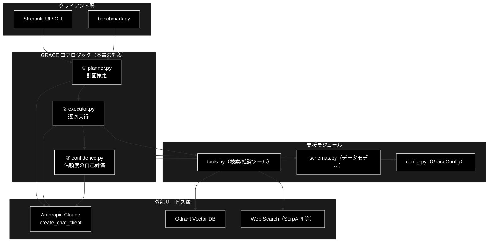
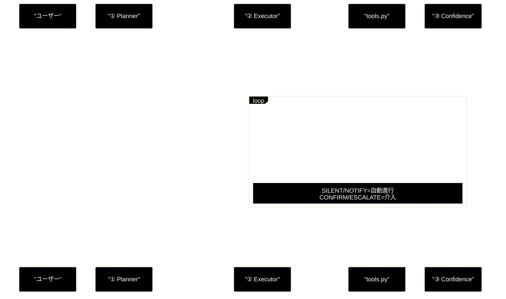
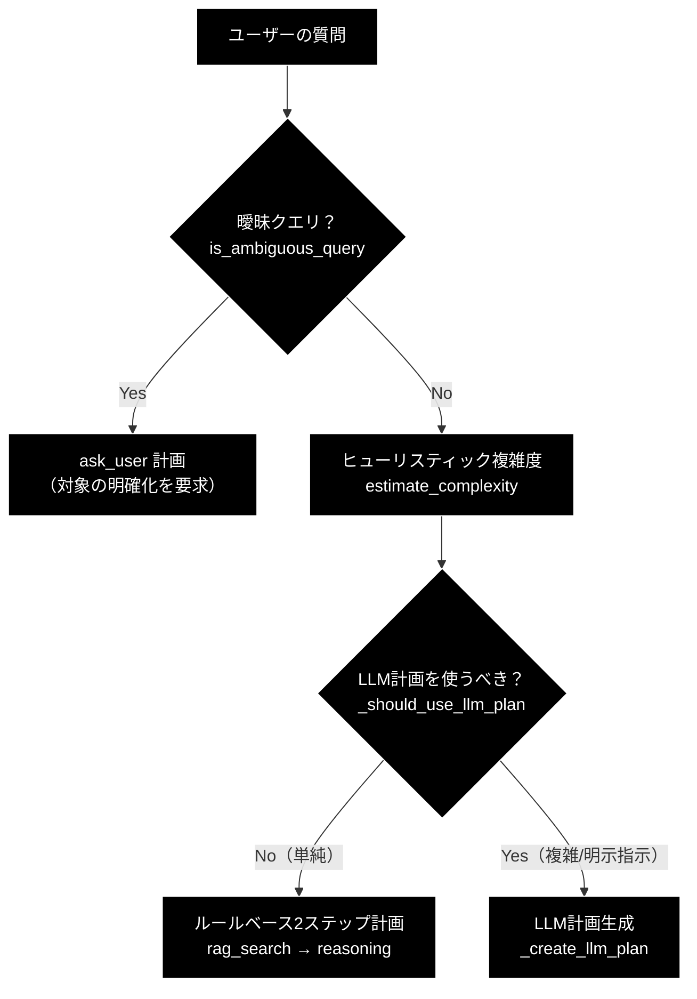
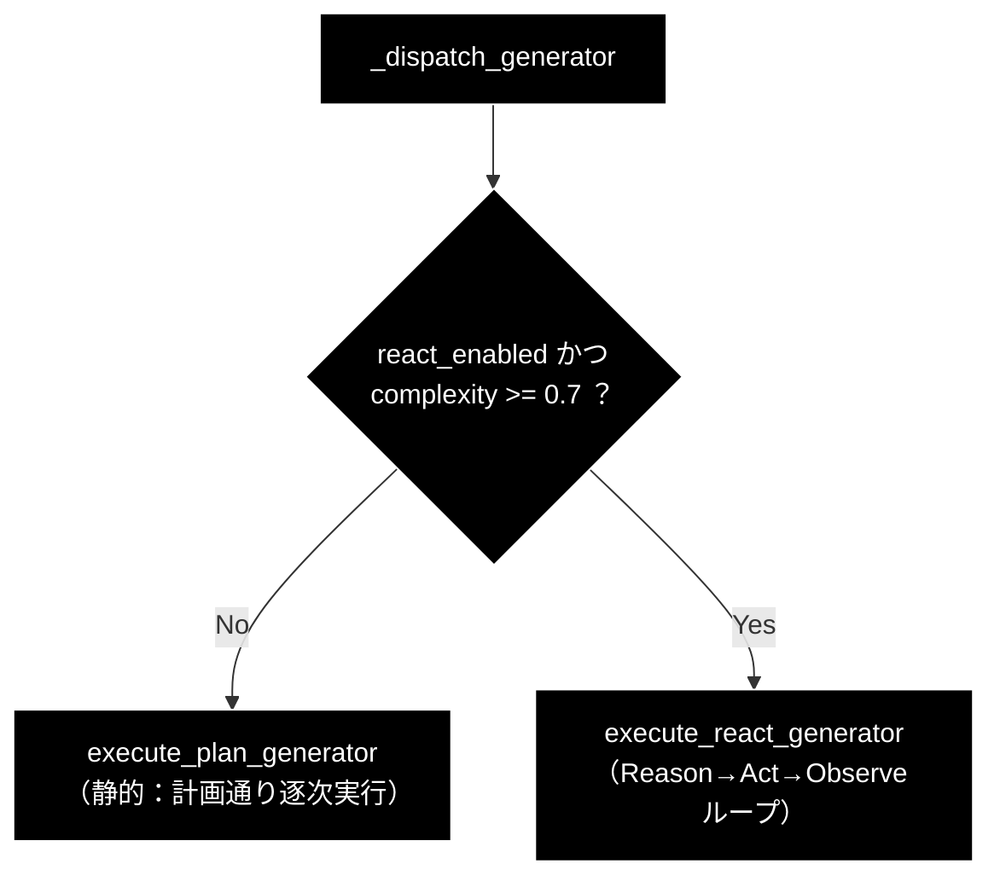
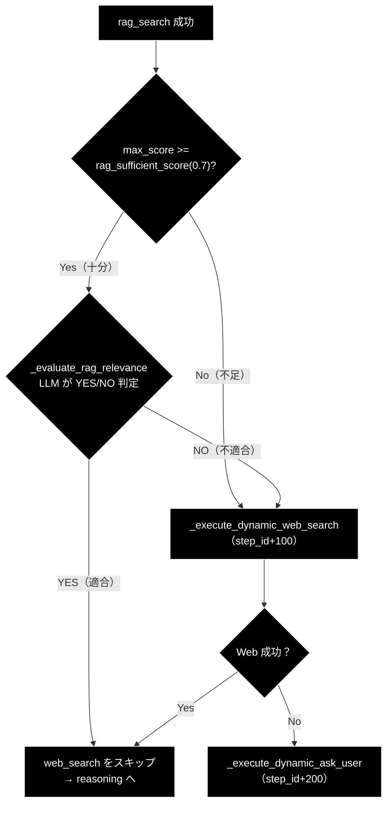
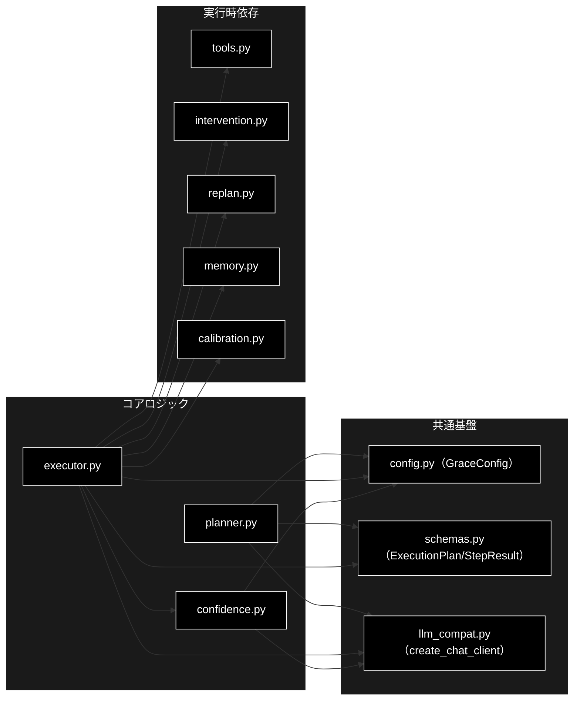

# planner / executor / confidence - GRACE 基本ロジック（Plan→Execute→Confidence）ドキュメント

**Version 1.0** | 最終更新: 2026-06-26

---

## 目次

1. [概要](#概要)
2. [アーキテクチャ構成図](#1-アーキテクチャ構成図)
3. [3フェーズ連携フロー](#2-3フェーズ連携フロー)
4. [① Plan（計画策定）](#3--plan計画策定)
5. [② Execute（逐次実行）](#4--execute逐次実行)
6. [③ Confidence（信頼度を自己評価）](#5--confidence信頼度を自己評価)
7. [典型シーケンス](#6-典型シーケンス)
8. [関連ドキュメント](#7-関連ドキュメント)
9. [変更履歴](#8-変更履歴)
10. [付録: 依存関係図](#付録-依存関係図)

---

## 概要

本ドキュメントは、GRACE エージェントの中核ロジックである
**① Plan（計画策定） → ② Execute（逐次実行） → ③ Confidence（信頼度の自己評価）**
の3フェーズを、3つのモジュール（`planner.py` / `executor.py` / `confidence.py`）の
連携として横断的にまとめたものです。各クラス・関数の IPO 詳細は個別ドキュメント
（[関連ドキュメント](#7-関連ドキュメント)）に委ね、本書はフェーズ間のデータの流れと
責務分担に焦点を当てます。

GRACE は **Guided Reasoning with Adaptive Confidence Execution** の略で、
ユーザーの質問に対し「計画を立て → 実行し → 自信の度合いを自己評価する」ループを
基本サイクルとする自律型エージェントです。本書が扱う①〜③はこのサイクルの中核であり、
信頼度が低い場合の人間介入（Intervention）・再計画（Replan）は後続フェーズとして
別ドキュメントで詳述します。

### 主な責務

- ユーザーの質問を分析し、実行計画（`ExecutionPlan`）を生成する（① Plan）
- 計画の各ステップ（検索・推論など）を順次実行し、結果を集約する（② Execute）
- 各ステップと最終回答の信頼度を多軸で算出し、次アクションを決定する（③ Confidence）
- 信頼度に基づき、自動進行・通知・確認・エスカレーションの介入レベルを判定する
- LLM 呼び出しは統一クライアント（`create_chat_client`）経由で Anthropic Claude を利用する

### 各責務対応のモジュール

| # | 責務 | 対応モジュール | 説明 |
|---|------|--------------|------|
| 1 | 質問分析・実行計画の生成 | `planner.py` | 複雑度推定 → 二層方式（ルールベース / LLM）で `ExecutionPlan` を生成 |
| 2 | 計画の逐次実行・結果集約 | `executor.py` | ステップ実行・動的フォールバック・ReAct ループ・全体集約 |
| 3 | 信頼度の多軸算出 | `confidence.py` | 検索品質・ソース一致度・LLM自己評価・網羅度・根拠妥当性を統合 |
| 4 | 介入レベルの判定 | `confidence.py` | `decide_action()` がスコアを SILENT/NOTIFY/CONFIRM/ESCALATE に写像 |

### 主要機能一覧

| 機能 | 説明 |
|------|------|
| `Planner.create_plan()` | 質問から実行計画を生成（二層方式の入口） |
| `Planner.estimate_complexity()` | キーワードベースで複雑度を推定（非LLM） |
| `Planner.estimate_complexity_with_llm()` | LLM で複雑度を推定 |
| `Executor.execute_plan()` | 計画をブロッキング実行し `ExecutionResult` を返す |
| `Executor.execute_plan_generator()` | 計画をステップ単位で実行（UI 進捗表示向け） |
| `Executor.execute_react_generator()` | 複雑質問向けの観測駆動 ReAct ループ |
| `ConfidenceCalculator.calculate()` | 重み付き平均＋ペナルティで信頼度を算出 |
| `ConfidenceCalculator.decide_action()` | 信頼度から介入レベルを決定 |
| `LLMSelfEvaluator.evaluate_final()` | 最終回答の確信度＋網羅度を1呼び出しで評価 |
| `GroundednessVerifier.verify()` | 回答の各主張が引用ソースに支持されるか判定 |

---

## 1. アーキテクチャ構成図



### データフロー

1. クライアント層（UI / CLI / benchmark）が質問を `Planner.create_plan()` に渡す
2. ① Plan が `ExecutionPlan` を生成し ② Execute へ受け渡す
3. ② Execute が各ステップで `tools.py` のツールを実行する
4. 各ステップ実行直後に ③ Confidence が信頼度を算出し、介入レベルを判定する
5. ② Execute が全ステップの信頼度を集約し `ExecutionResult` を返す

---

## 2. 3フェーズ連携フロー



---

## 3. ① Plan（計画策定）

**担当**: `planner.py` / `Planner.create_plan()`

ユーザーの質問を分析し、実行計画 `ExecutionPlan`（`PlanStep` のリスト）を生成します。
不要な LLM 呼び出しを避けるため、**二層方式**で計画生成経路を切り替えます。

### 3.1 二層方式の判定



| 経路 | 発火条件 | 生成内容 |
|------|---------|---------|
| 明確化（ask_user） | 指示語のみで対象不明（例「あの件について」） | 単一 `ask_user` ステップ・`requires_confirmation=True` |
| ルールベース | 複雑度 < `llm_plan_complexity_threshold`（既定 0.7）かつ明示的Web指示なし | `rag_search`（fallback=web_search）→ `reasoning` の標準2ステップ（LLM呼び出しなし） |
| LLM計画 | 複雑度 >= 0.7／「最新ニュース」等の明示指示／`force_llm_plan` | LLM が JSON 構造化出力で `ExecutionPlan` を生成（最大2回リトライ） |

### 3.2 複雑度推定

| メソッド | 方式 | 用途 |
|---------|------|------|
| `estimate_complexity()` | キーワード重み（「比較」「違い」「複数」等）＋質問長 | 二層判定の即時スコア（非LLM） |
| `estimate_complexity_with_llm()` | LLM で 0.0–1.0 を推定（空応答時はキーワード版にフォールバック） | LLM計画時の正確な複雑度 |

### 3.3 計画生成ルール（プロンプトで強制）

- `rag_search` の `query` はユーザーの質問文を**完全一致でコピー**（要約・キーワード化・分割は禁止）
- 計画は原則 `rag_search → reasoning` の2ステップ。`web_search` は計画に含めない
- `web_search` は Executor が RAG 結果不足時に**動的実行**する（`rag_search` の `fallback="web_search"`）
- 最後のステップは必ず `reasoning`

**出力**: `ExecutionPlan`（`steps[]`, `complexity`, `requires_confirmation`, `plan_id`）

---

## 4. ② Execute（逐次実行）

**担当**: `executor.py` / `Executor`

`ExecutionPlan` を受け取り、各ステップを順次実行して `ExecutionResult` を返します。

### 4.1 実行エントリーポイント

| メソッド | 用途 |
|---------|------|
| `execute_plan(plan)` | ブロッキング実行。ジェネレータを内部でドレインする薄いラッパー（非対話） |
| `execute_plan_generator(plan)` | ステップ単位で `ExecutionState` を yield（UI のリアルタイム進捗表示向け） |
| `execute_react_generator(plan)` | 観測駆動 ReAct ループ（複雑質問向け） |

`execute_plan()` は内部の `_dispatch_generator()` で、複雑度に応じて
**静的 Plan-Execute** か **ReAct ループ** を振り分けます。



### 4.2 ステップ実行ループ（静的パス）

各ステップで以下を順に処理します。

1. **依存関係チェック** (`_check_dependencies`)：`depends_on` の全ステップが成功済みか確認
2. **並列プリフェッチ** (`_prefetch_parallel_searches`)：依存のない後続検索ステップを先行実行（任意）
3. **ツール実行** (`_execute_step`)：`_prepare_tool_kwargs` で引数を組み立て `tool.execute()`
   - `rag_search`: `query`, `collection`
   - `web_search`: `query`, `num_results`, `language`
   - `reasoning`: `query`(元の質問)＋全成功ステップの出力を `context` / `sources` に集約
   - `ask_user`: `question`, `reason`, `urgency`
4. **信頼度計算** (`_llm_calculate_step_confidence`)：③ Confidence を呼び出す
5. **RAG 動的分岐**（`rag_search` 成功時）：下記 4.3
6. **介入判定**：`ConfidenceScore` → `decide_action` の結果で自動進行 or 一時停止
7. **リプラン判定** (`_should_trigger_replan`)：失敗時は常に／低信頼度は検索ステップ限定

### 4.3 RAG 結果の動的フォールバック連鎖

`rag_search` 成功後、検索スコアと意味的適合性に応じて後続を動的に切り替えます。



スコアが閾値以上でも、コサイン類似度では拾えない**主題のズレ（偽陽性）**を
`_evaluate_rag_relevance()` の LLM 判定（YES/NO）で検知し、必要なら Web 検索へ切り替えます。

**出力**: `ExecutionResult`（`final_answer`, `overall_confidence`, `step_results[]`, `replan_count`）

---

## 5. ③ Confidence（信頼度を自己評価）

**担当**: `confidence.py`

各ステップ実行直後と計画全体に対して、信頼度を多軸で算出します。
ここで得たスコアが、②の動的分岐・介入・リプランの判断材料になります。

### 5.1 信頼度を構成する要素（`ConfidenceFactors`）

| 要素 | 説明 | 既定重み |
|------|------|:---:|
| `search_max_score` / `search_avg_score` | RAG 検索品質 | 0.25 |
| `source_agreement` | 複数ソース間の一致度（Embedding コサイン類似度） | 0.20 |
| `llm_self_confidence` | LLM の自己評価 | 0.25 |
| `tool_success_rate` | ツール成功率 | 0.15 |
| `query_coverage` | クエリ網羅度 | 0.15 |
| `groundedness` | 回答の各主張が引用ソースに支持される割合（S1） | ※主成分として加味 |

### 5.2 主要コンポーネント

| クラス | 役割 |
|--------|------|
| `ConfidenceCalculator` | 重み付き平均＋ペナルティのハイブリッド計算。検索ステップと推論ステップで計算を分離 |
| `LLMSelfEvaluator` | `evaluate_final()` で確信度＋網羅度を1呼び出しで取得。`evaluate_with_factors()` で統計値込みの総合評価 |
| `SourceAgreementCalculator` | 複数回答を Embedding 化しコサイン類似度で一致度を算出 |
| `QueryCoverageCalculator` | 最終回答が質問の全要素をカバーしているか LLM 評価 |
| `GroundednessVerifier` | 回答を主張へ分解し supported/contradicted/neutral を判定（支持率を信頼度の主成分に） |
| `ConfidenceAggregator` | 複数ステップを mean / min / weighted で集約 |

### 5.3 介入レベル判定（`decide_action`）

`ConfidenceCalculator.decide_action()` がスコアを4段階の介入レベルへ写像します。

| レベル | 信頼度（既定閾値） | 動作 |
|--------|:---:|------|
| `SILENT` | >= 0.9 | バックグラウンドで自動進行 |
| `NOTIFY` | >= 0.7 | ステータス表示しつつ進行 |
| `CONFIRM` | >= 0.4 | ユーザー確認を推奨（対話モードで一時停止） |
| `ESCALATE` | < 0.4 | ユーザー入力を要求（常に一時停止） |

> 📝 **注意**: ブロッキング実行（非対話）では `CONFIRM` は自動進行し、`ESCALATE` のみ停止します。
> 介入の具体的なハンドリングは `intervention.py`、低信頼度時の再計画は `replan.py` を参照してください。

---

## 6. 典型シーケンス

### 6.1 正常系（RAG 検索が十分かつ適合）

```
1. User → "金色夜叉の著者は誰ですか？"
2. ① Planner.create_plan() → 複雑度 < 0.7 → ルールベース2ステップ
3. ② Step1 rag_search → max_score=0.92 → _evaluate_rag_relevance="YES"
   → web_search スキップ
4. ③ confidence=0.85（NOTIFY）→ 自動進行
5. ② Step2 reasoning → Step1 をコンテキストに回答生成
6. ③ overall_confidence=0.87 → ExecutionResult
```

### 6.2 偽陽性検知（RAG 不適合 → 動的 Web 検索）

```
1. ② Step1 rag_search → max_score=0.75（>=0.7 で閾値クリア）
2. ③ _evaluate_rag_relevance="NO"（文構造は類似だが主題不一致）
3. ② _execute_dynamic_web_search()（step_id+100）→ Web 結果取得
4. ② Step2 reasoning → RAG + Web 両方をコンテキストに回答生成
```

### 6.3 複雑質問（ReAct ループ）

```
1. ① 複雑度 >= 0.7 → LLM計画
2. ② _dispatch_generator → execute_react_generator
3. Reason→Act→Observe を最大8反復、各ターンで ③ confidence を評価
4. 十分な根拠が揃ったら reasoning で最終回答 → finish
```

---

## 7. 関連ドキュメント

| ドキュメント | 内容 |
|------|------|
| [`planner.md`](./planner.md) | `Planner` の全クラス・関数の IPO 詳細 |
| [`executor.md`](./executor.md) | `Executor` の全メソッドの IPO 詳細 |
| [`confidence.md`](./confidence.md) | `ConfidenceCalculator` ほか信頼度コンポーネントの IPO 詳細 |
| [`planner_executor.md`](./planner_executor.md) | Plan→Execute を中心とした処理フロー仕様 |
| [`step_process.md`](./step_process.md) | 1クエリを端から端まで追った実行トレース |
| [`intervention.md`](./intervention.md) | HITL 介入（④ Intervention）の詳細 |
| [`replan.md`](./replan.md) | 動的リプラン（⑤ Replan）の詳細 |
| [`grace_process.md`](./grace_process.md) | GRACE 全体プロセスの俯瞰 |

---

## 8. 変更履歴

| バージョン | 変更内容 |
|-----------|---------|
| 1.0 | 初版作成（Plan→Execute→Confidence の3フェーズ横断まとめ） |

---

## 付録: 依存関係図


