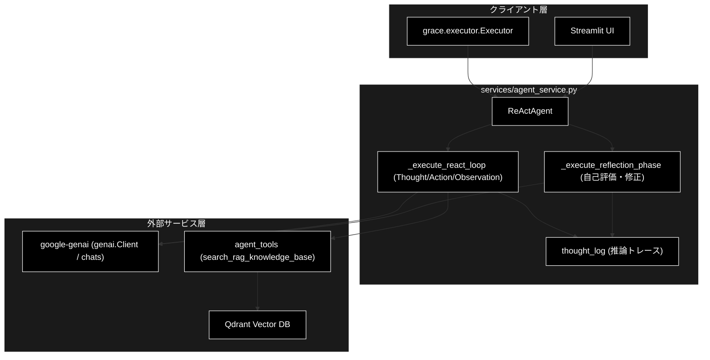
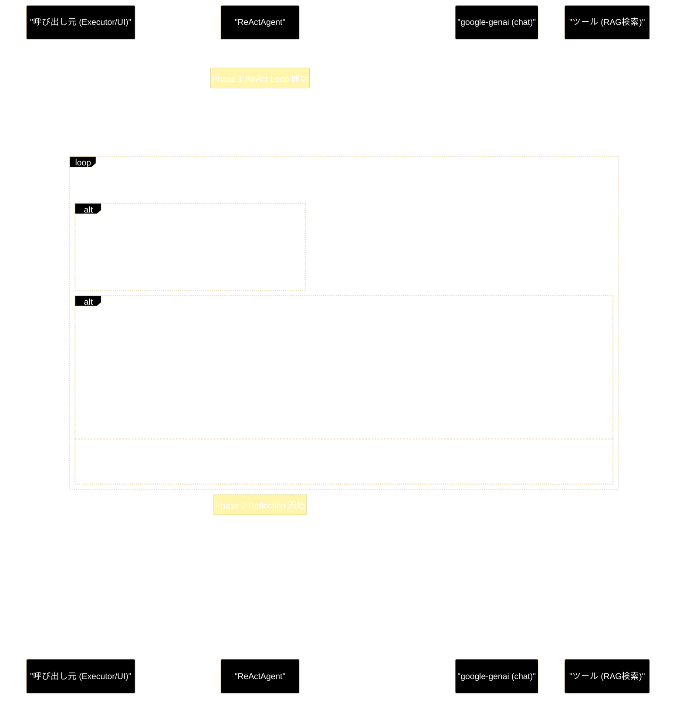
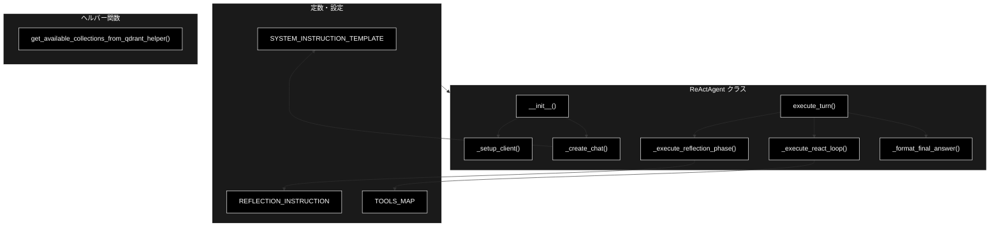
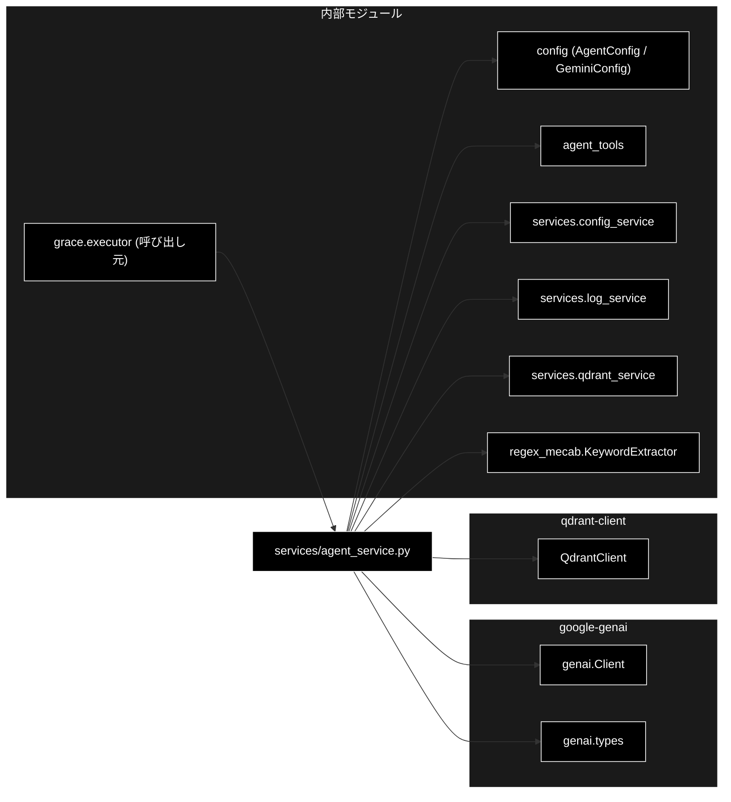

# react_reasoning - ReAct推論（Thought-Action-Observation + Reflection）ドキュメント

**Version 1.0** | 最終更新: 2026-06-16

---

## 目次

1. [概要](#概要)
2. [1. アーキテクチャ構成図](#1-アーキテクチャ構成図)
3. [2. モジュール構成図](#2-モジュール構成図)
4. [3. クラス・関数一覧表](#3-クラス関数一覧表)
5. [4. クラス・関数 IPO詳細](#4-クラス関数-ipo詳細)
6. [5. 設定・定数](#5-設定定数)
7. [6. 使用例](#6-使用例)
8. [7. エクスポート](#7-エクスポート)
9. [8. 変更履歴](#8-変更履歴)
10. [付録: 依存関係図](#付録-依存関係図)

---

## 概要

`services/agent_service.py` は、GRACE システムにおける **レガシー ReAct エージェント**（`ReActAgent`）を実装するモジュールです。ユーザーの質問に対して **Thought（思考）→ Action（ツール実行）→ Observation（結果観察）** のサイクルを回し、その後に **Reflection（自己評価と修正）** フェーズを通して最終回答を生成します。進捗は、`{"type": ...}` 形式のイベントを `yield` するジェネレータ（`execute_turn`）として外部へストリーミングされます。

GRACE 本体（`grace/`）は、原則として Planner（`grace/planner.py`）＋ Executor（`grace/executor.py`）のネイティブ実行を行いますが、`run_legacy_agent` アクションが計画に含まれる場合、Executor がこの `ReActAgent` を呼び出してターンを実行します。

> 📝 **注意（LLM クライアントの実装）**: プロジェクト標準の LLM は **Anthropic Claude**（既定 `claude-sonnet-4-6`、`grace/config.py` の `LLMConfig`）であり、Planner / Executor は `grace/llm_compat.py` の `create_chat_client()` 経由で LLM を呼び出します。しかし、この **レガシー `ReActAgent` は `grace/llm_compat.py` を経由せず、`google-genai` SDK（`from google import genai` / `genai.Client` / `client.chats.create(...)` / `chat.send_message(...)` / `candidates → content.parts → function_call`）を直接呼び出します**。`ReActAgent` は Gemini ネイティブの function-calling に依存するため、`__init__` で非 Gemini モデル名（例: `claude-sonnet-4-6`）が渡されると警告を出して Gemini 既定モデル（`models.legacy_default`）へ自動回避します。

### 主な責務

- Thought → Action → Observation の ReAct ループ実行
- Gemini ネイティブ function-calling によるツール呼び出し（`search_rag_knowledge_base` 等）の処理
- Reflection（自己評価・修正）フェーズによる回答案の推敲
- 推論トレース（`thought_log`）の蓄積
- 進捗イベントのジェネレータによるストリーミング
- 非 Gemini モデル指定時の安全な Gemini 既定モデルへのデカップル回避

### 各責務対応のモジュール

| # | 責務 | 対応モジュール | 説明 |
|---|------|--------------|------|
| 1 | Thought→Action→Observation の ReAct ループ実行 | `services/agent_service.py` | `ReActAgent._execute_react_loop()` |
| 2 | Gemini function-calling のツール呼び出し処理 | `services/agent_service.py` | `TOOLS_MAP` と `search_rag_knowledge_base_cached()` の呼び出し |
| 3 | Reflection（自己評価・修正）フェーズ | `services/agent_service.py` | `ReActAgent._execute_reflection_phase()` + `REFLECTION_INSTRUCTION` |
| 4 | 推論トレース（`thought_log`）の蓄積 | `services/agent_service.py` | `ReActAgent.thought_log` |
| 5 | 進捗イベントのストリーミング | `services/agent_service.py` | `ReActAgent.execute_turn()`（ジェネレータ） |
| 6 | GRACE からのレガシー ReAct 呼び出し | `grace/executor.py` | `Executor._execute_legacy_agent_step()` |
| 7 | `run_legacy_agent` ステップの計画生成 | `grace/planner.py` | `Planner._create_plan_legacy()`（バックアップ用） |

### 主要機能一覧

| 機能 | 説明 |
|------|------|
| `ReActAgent` | ReAct + Reflection を実装するレガシーエージェントクラス |
| `ReActAgent.__init__()` | コレクション・モデル名・セッション・ハイブリッド検索を初期化 |
| `ReActAgent._setup_client()` | google-genai の `genai.Client` を生成 |
| `ReActAgent._create_chat()` | system_instruction とツール付きチャットセッションを作成 |
| `ReActAgent.execute_turn()` | ReAct → Reflection を順に実行するジェネレータ |
| `ReActAgent._execute_react_loop()` | Thought/Action/Observation ループ本体（ジェネレータ） |
| `ReActAgent._execute_reflection_phase()` | 回答案を自己評価・修正するジェネレータ |
| `ReActAgent._format_final_answer()` | `Answer:` / `Thought:` プレフィックスを整形 |
| `get_available_collections_from_qdrant_helper()` | Qdrant からコレクション名一覧を取得 |
| `SYSTEM_INSTRUCTION_TEMPLATE` | ReAct プロセスを規定するシステムプロンプト |
| `REFLECTION_INSTRUCTION` | Reflection フェーズのプロンプト |
| `TOOLS_MAP` | ツール名 → 関数のマッピング |

---

## 1. アーキテクチャ構成図

### 1.1 システム全体構成



### 1.2 データフロー（ReAct ループ + Reflection）

1. `Executor._execute_legacy_agent_step()`（または UI）が `ReActAgent.execute_turn(user_input)` を呼び出す。
2. **Phase 1 (ReAct)**: `_execute_react_loop()` が、`KeywordExtractor` でキーワードを抽出してプロンプトを拡張し、`chat.send_message()` で Gemini に送信する。
3. レスポンスの `candidates[0].content.parts` を走査し、`text` に `Thought:` を含めば `thought_log` に追記しイベントを `yield` する。
4. `function_call` があれば `TOOLS_MAP` のツール（`search_rag_knowledge_base_cached`）を実行し（Action）、結果（Observation）を `types.Part.from_function_response()` で Gemini に返す。
5. `function_call` がなくなるまで最大 `agent.max_turns` 回ループし、最終テキストを `final_text` イベントとして `yield` する。
6. **Phase 2 (Reflection)**: 回答案がある場合、`_execute_reflection_phase()` が `REFLECTION_INSTRUCTION` を付与して再評価し、`Final Answer:` を抽出して修正後の回答を返す。
7. `_format_final_answer()` で整形し、`final_answer` イベントとして `yield` する。

### 1.3 ReAct ループのシーケンス



---

## 2. モジュール構成図

### 2.1 内部モジュール構成



### 2.2 外部依存関係

| ライブラリ | バージョン | 用途 |
|-----------|-----------|------|
| `google-genai` | - | `genai.Client` / `chats.create` / function-calling（LLM 呼び出し本体） |
| `qdrant-client` | >=1.15.1 | コレクション一覧取得（ヘルパー関数） |

### 2.3 内部依存モジュール

| モジュール | 用途 |
|-----------|------|
| `config` (`AgentConfig`, `GeminiConfig`) | 設定・モデル名の定義 |
| `agent_tools` | `search_rag_knowledge_base` / `list_rag_collections` / `search_rag_knowledge_base_cached` / `RAGToolError` |
| `qdrant_client_wrapper.get_qdrant_client` | シングルトン Qdrant クライアント |
| `services.qdrant_service.get_all_collections` | コレクション取得 |
| `services.log_service.log_unanswered_question` | 未回答質問のロギング |
| `services.config_service` | `config` / `logger` / `get_config` |
| `regex_mecab.KeywordExtractor` | キーワード抽出（オプション） |
| `agent_cache.collection_cache` | コレクションキャッシュ |
| `agent_parallel_search.parallel_search_engine` | 並列検索エンジン |

---

## 3. クラス・関数一覧表

### 3.1 クラス一覧

#### ReActAgent

| メソッド | 概要 |
|---------|------|
| `__init__(selected_collections, model_name, session_id, use_hybrid_search)` | エージェントの初期化（クライアント・チャット・キーワード抽出器の準備） |
| `_setup_client()` | google-genai の `genai.Client` を生成 |
| `_create_chat()` | system_instruction とツール付きのチャットセッションを作成 |
| `execute_turn(user_input)` | ReAct → Reflection を順に実行する進捗ジェネレータ |
| `_execute_react_loop(user_input)` | Thought/Action/Observation ループ本体（ジェネレータ） |
| `_execute_reflection_phase(draft_answer)` | 回答案を自己評価・修正するジェネレータ |
| `_format_final_answer(raw_answer)` | 最終回答の整形 |

### 3.2 関数一覧（カテゴリ別）

#### ヘルパー関数

| 関数名 | 概要 |
|-------|------|
| `get_available_collections_from_qdrant_helper()` | Qdrant から利用可能なコレクション名のリストを取得 |

---

## 4. クラス・関数 IPO詳細

### 4.1 ReActAgent クラス

Thought→Action→Observation の ReAct ループと Reflection フェーズを実装するレガシーエージェント。google-genai のチャットセッションを保持し、function-calling でツールを実行する。

#### コンストラクタ: `__init__`

**概要**: コレクション・モデル名・セッションID・ハイブリッド検索フラグを受け取り、google-genai クライアントとチャットセッション、キーワード抽出器を初期化する。

```python
def __init__(
    self,
    selected_collections: List[str],
    model_name: str = None,
    session_id: Optional[str] = None,
    use_hybrid_search: bool = True
)
```

| パラメータ | 型 | デフォルト | 説明 |
|------------|------|-----------|------|
| `selected_collections` | List[str] | - | 検索対象として system_instruction に提示するコレクション名 |
| `model_name` | str | None | 使用モデル名。None なら `models.default`（既定 `gemini-2.5-flash`） |
| `session_id` | Optional[str] | None | セッションID。None なら `uuid4()` で生成 |
| `use_hybrid_search` | bool | True | ハイブリッド検索（Sparse + Dense）を有効にするか |

| 項目 | 内容 |
|------|------|
| **Input** | `selected_collections: List[str]`, `model_name: str = None`, `session_id: Optional[str] = None`, `use_hybrid_search: bool = True` |
| **Process** | 1. `model_name` を `get_config("models.default", "gemini-2.5-flash")` で解決<br>2. **非 Gemini モデル名なら警告を出し `models.legacy_default`（既定 `gemini-2.5-flash`）へ自動回避**<br>3. `session_id` を確定（None なら uuid4）<br>4. `_setup_client()` でクライアント生成、`_create_chat()` でチャット作成<br>5. `thought_log` を空リストで初期化<br>6. `KeywordExtractor` を初期化（利用不可なら None） |
| **Output** | `ReActAgent` インスタンス |

**戻り値例**:
```python
# ReActAgent インスタンス（属性）
{
    "model_name": "gemini-2.5-flash",
    "session_id": "3f2c...-uuid",
    "use_hybrid_search": True,
    "thought_log": []
}
```

```python
# 使用例
from services.agent_service import ReActAgent

agent = ReActAgent(
    selected_collections=["wikipedia_ja", "livedoor"],
    use_hybrid_search=True
)
print(agent.session_id)
# 出力: 自動生成された UUID
```

#### メソッド: `_setup_client`

**概要**: `config_service` または環境変数から API キーを取得し、google-genai の `genai.Client` を生成する。

```python
def _setup_client(self) -> genai.Client
```

| パラメータ | 型 | デフォルト | 説明 |
|------------|------|-----------|------|
| なし（self のみ） | - | - | - |

| 項目 | 内容 |
|------|------|
| **Input** | なし（self のみ） |
| **Process** | 1. `get_config("api.google_api_key")` を取得<br>2. 無ければ `GEMINI_API_KEY` / `GOOGLE_API_KEY` 環境変数を参照<br>3. キー未設定なら `ValueError` を送出<br>4. `genai.Client(api_key=...)` を返す |
| **Output** | `genai.Client`: google-genai クライアント |

**戻り値例**:
```python
# google-genai の Client インスタンス
genai.Client(api_key="AIza...")
```

```python
# 使用例（内部呼び出し）
client = self._setup_client()
```

#### メソッド: `_create_chat`

**概要**: `SYSTEM_INSTRUCTION_TEMPLATE` にコレクション一覧を埋め込み、ツール付きのチャットセッションを作成する。

```python
def _create_chat(self)
```

| パラメータ | 型 | デフォルト | 説明 |
|------------|------|-----------|------|
| なし（self のみ） | - | - | - |

| 項目 | 内容 |
|------|------|
| **Input** | なし（self のみ） |
| **Process** | 1. `selected_collections` をカンマ連結して system_instruction を生成<br>2. `tools_list = [search_rag_knowledge_base, list_rag_collections]`<br>3. `client.chats.create(model, config=types.GenerateContentConfig(system_instruction, tools))` を実行 |
| **Output** | google-genai のチャットセッションオブジェクト |

**戻り値例**:
```python
# google-genai のチャットセッション
chat  # client.chats.create(...) の戻り値
```

```python
# 使用例（内部呼び出し）
self.chat = self._create_chat()
response = self.chat.send_message(message="質問文")
```

#### メソッド: `execute_turn`

**概要**: ReAct ループ → Reflection の順にエージェントの 1 ターンを実行し、進捗イベントを `yield` するジェネレータ。

```python
def execute_turn(self, user_input: str) -> Generator[Dict[str, Any], None, None]
```

| パラメータ | 型 | デフォルト | 説明 |
|------------|------|-----------|------|
| `user_input` | str | - | ユーザーの質問文 |

| 項目 | 内容 |
|------|------|
| **Input** | `user_input: str` |
| **Process** | 1. `thought_log` をリセット<br>2. ReAct Phase 開始ログを `yield`<br>3. `_execute_react_loop()` のイベントを中継し、`final_text` を回答案として保持<br>4. 回答案があれば Reflection Phase 開始ログを `yield` し、`_execute_reflection_phase()` を `yield from`<br>5. `_format_final_answer()` で整形し `final_answer` を `yield` |
| **Output** | `Generator[Dict[str, Any], None, None]`: `{"type": "log"/"tool_call"/"tool_result"/"final_text"/"final_answer", ...}` イベント列 |

**戻り値例**:
```python
# yield されるイベントの例
{"type": "log", "content": "🤖 **ReAct Phase Start** ..."}
{"type": "tool_call", "name": "search_rag_knowledge_base", "args": {"query": "..."}}
{"type": "tool_result", "content": "検索結果..."}
{"type": "final_text", "content": "Answer: ..."}
{"type": "final_answer", "content": "最終的な回答文"}
```

```python
# 使用例
agent = ReActAgent(selected_collections=["wikipedia_ja"])
for event in agent.execute_turn("AさんとBさんの違いは？"):
    if event["type"] == "final_answer":
        print(event["content"])
# 出力: 整形済みの最終回答
```

#### メソッド: `_execute_react_loop`

**概要**: Thought/Action/Observation のサイクルを最大 `max_turns` 回まわし、ツール呼び出しと結果観察を処理するジェネレータ。

```python
def _execute_react_loop(self, user_input: str) -> Generator[Dict[str, Any], None, None]
```

| パラメータ | 型 | デフォルト | 説明 |
|------------|------|-----------|------|
| `user_input` | str | - | ユーザーの質問文 |

| 項目 | 内容 |
|------|------|
| **Input** | `user_input: str` |
| **Process** | 1. `KeywordExtractor` でキーワード抽出（top_n=5）しプロンプトを拡張・ログ `yield`<br>2. `chat.send_message()` で送信<br>3. `candidates[0].content.parts` を走査: `text` に `Thought:` を含めば `thought_log` 追記＋`log` イベント `yield`<br>4. `function_call` があれば `TOOLS_MAP` のツール（RAG はキャッシュ版 `search_rag_knowledge_base_cached`）を実行し `tool_call`/`tool_result` を `yield`<br>5. `[[NO_RAG_RESULT` 検出時は `log_unanswered_question()`<br>6. `types.Part.from_function_response()` で結果を返送<br>7. `function_call` が無くなれば `final_text` を `yield` |
| **Output** | `Generator[Dict[str, Any], None, None]`: ループ中の各イベント＋末尾の `final_text` |

**戻り値例**:
```python
{"type": "log", "content": "🔑 **Extracted Keywords:** 多義性, 言語, ..."}
{"type": "tool_call", "name": "search_rag_knowledge_base", "args": {"query": "..."}}
{"type": "tool_result", "content": "Source: wikipedia_ja.csv ..."}
{"type": "final_text", "content": "Answer: ..."}
```

```python
# 使用例（execute_turn 内部から）
for event in self._execute_react_loop(user_input):
    yield event
    if event["type"] == "final_text":
        draft_answer = event["content"]
```

#### メソッド: `_execute_reflection_phase`

**概要**: 回答案に `REFLECTION_INSTRUCTION` を付与して LLM に再評価させ、`Final Answer:` を抽出して修正後の回答を返すジェネレータ（return 値で最終文字列を返す）。

```python
def _execute_reflection_phase(self, draft_answer: str) -> Generator[Dict[str, Any], None, str]
```

| パラメータ | 型 | デフォルト | 説明 |
|------------|------|-----------|------|
| `draft_answer` | str | - | ReAct ループで得た回答案 |

| 項目 | 内容 |
|------|------|
| **Input** | `draft_answer: str` |
| **Process** | 1. `REFLECTION_INSTRUCTION` + 回答案を `chat.send_message()`<br>2. レスポンスの `parts.text` を連結（function_call は無視・警告）<br>3. `Final Answer:` で分割し、`Thought` 部分を `thought_log` 追記＋`log` イベント `yield`<br>4. 例外時は元の回答案を維持しエラーログを `yield`<br>5. 修正後の回答文字列を return |
| **Output** | `Generator[..., str]`: 中間 `log` イベント＋return で修正後回答（str） |

**戻り値例**:
```python
# yield されるイベント
{"type": "log", "content": "🤔 **Reflection Thought:** ..."}
# generator の return 値（yield from で取得）
"修正後の最終回答文"
```

```python
# 使用例（execute_turn 内部から）
final_after_reflection = yield from self._execute_reflection_phase(draft_answer)
```

#### メソッド: `_format_final_answer`

**概要**: 回答文の `Answer:` / `Thought:` / `考え:` プレフィックスを除去して整形する。

```python
def _format_final_answer(self, raw_answer: str) -> str
```

| パラメータ | 型 | デフォルト | 説明 |
|------------|------|-----------|------|
| `raw_answer` | str | - | 整形前の回答文字列 |

| 項目 | 内容 |
|------|------|
| **Input** | `raw_answer: str` |
| **Process** | 1. `Answer:` を含めばその後ろを返す<br>2. `Thought:` 始まりならそれを除去<br>3. `考え:` 始まりならそれを除去<br>4. いずれにも該当しなければそのまま返す |
| **Output** | `str`: 整形済み最終回答 |

**戻り値例**:
```python
"これはユーザーへの最終的な回答です。"
```

```python
# 使用例
clean = agent._format_final_answer("Answer: これが回答です")
print(clean)
# 出力: これが回答です
```

### 4.2 ヘルパー関数

#### `get_available_collections_from_qdrant_helper`

**概要**: シングルトン Qdrant クライアントから、利用可能なコレクション名のリストを取得する。

```python
def get_available_collections_from_qdrant_helper() -> List[str]
```

| パラメータ | 型 | デフォルト | 説明 |
|------------|------|-----------|------|
| なし | - | - | - |

| 項目 | 内容 |
|------|------|
| **Input** | なし |
| **Process** | 1. `get_qdrant_client()` でシングルトンを取得<br>2. `client.get_collections()` を実行<br>3. 各コレクションの `name` を抽出して返す<br>4. 例外時はエラーログを出力し空リストを返す |
| **Output** | `List[str]`: コレクション名のリスト（失敗時は `[]`） |

**戻り値例**:
```python
["wikipedia_ja", "livedoor", "cc_news", "japanese_text"]
```

```python
# 使用例
from services.agent_service import get_available_collections_from_qdrant_helper

collections = get_available_collections_from_qdrant_helper()
print(collections)
# 出力: ["wikipedia_ja", "livedoor", ...]
```

---

## 5. 設定・定数

### 5.1 SYSTEM_INSTRUCTION_TEMPLATE

ReAct プロセス（Thought / Action / Observation）と出力フォーマット、ルーターガイドライン（専門知識検索・自動コレクション選択・正直さ）を規定するシステムプロンプト。`{available_collections}` が `_create_chat()` で埋め込まれる。

```python
SYSTEM_INSTRUCTION_TEMPLATE = """
あなたは ... 「ハイブリッド・ナレッジ・エージェント」です。
## ReAct プロセスと出力フォーマット (厳守)
... Thought (思考)、Action (ツール実行)、Observation (結果観察) ...
利用可能なコレクション: {available_collections}
"""
```

| プレースホルダ | 説明 |
|-----|------|
| `{available_collections}` | `selected_collections` をカンマ連結した文字列 |

### 5.2 REFLECTION_INSTRUCTION

Reflection フェーズで回答案を「正確性・回答の適切性・スタイル」の観点で自己評価・修正させるプロンプト。出力は `Thought:` と `Final Answer:` の形式を要求する。

```python
REFLECTION_INSTRUCTION = """
## Reflection (自己評価と修正)
**チェックリスト:** 1. 正確性 / 2. 回答の適切性 / 3. スタイル
**出力フォーマット:**
Thought: [評価と修正の思考プロセス]
Final Answer: [最終的な回答]
"""
```

### 5.3 TOOLS_MAP

ツール名から実装関数へのマッピング。`_execute_react_loop()` で function_call の名前解決に使用される。

```python
TOOLS_MAP: Dict[str, Any] = {
    'search_rag_knowledge_base': search_rag_knowledge_base,
    'list_rag_collections'     : list_rag_collections,
}
```

| キー | 説明 |
|-----|------|
| `search_rag_knowledge_base` | RAG ナレッジ検索（実行時はキャッシュ版 `search_rag_knowledge_base_cached` を使用） |
| `list_rag_collections` | コレクション一覧取得 |

### 5.4 関連する config キー

| キー | デフォルト値 | 説明 |
|-----|-------------|------|
| `models.default` | `gemini-2.5-flash` | `__init__` の `model_name` 未指定時の既定モデル |
| `models.legacy_default` | `gemini-2.5-flash` | 非 Gemini モデル指定時の自動回避先 |
| `agent.max_turns` | `10` | ReAct ループの最大反復回数 |
| `api.google_api_key` | - | google-genai 用 API キー（環境変数 `GEMINI_API_KEY`/`GOOGLE_API_KEY` でフォールバック） |

> 📝 **注意**: GRACE 本体の既定 LLM は Anthropic Claude（`grace/config.py` の `LLMConfig.model = "claude-sonnet-4-6"`）だが、`Executor._execute_legacy_agent_step()` はこのモデル名を `ReActAgent(model_name=self.config.llm.model)` に渡すため、レガシー側で Gemini 既定モデルへ自動回避される。

---

## 6. 使用例

### 6.1 基本的なワークフロー（ReActAgent 単体実行）

```python
from services.agent_service import (
    ReActAgent,
    get_available_collections_from_qdrant_helper,
)

# 1. コレクション準備
collections = get_available_collections_from_qdrant_helper()

# 2. エージェント初期化（ハイブリッド検索有効）
agent = ReActAgent(
    selected_collections=collections,
    use_hybrid_search=True,
)

# 3. ターン実行（ReAct → Reflection）
final = ""
for event in agent.execute_turn("カリン・フォン・アロルディンゲンとは誰ですか？"):
    if event["type"] == "log":
        print(event["content"])          # Thought / Reflection の表示
    elif event["type"] == "tool_call":
        print(f"Action: {event['name']}({event['args']})")
    elif event["type"] == "tool_result":
        print(f"Observation: {event['content']}")
    elif event["type"] == "final_answer":
        final = event["content"]

# 4. 結果確認
print(f"最終回答: {final}")
print(f"推論トレース: {len(agent.thought_log)} 件")
```

### 6.2 応用ワークフロー（GRACE Executor 経由のレガシー ReAct 実行）

`run_legacy_agent` アクションを含む計画を Executor が実行すると、`_execute_legacy_agent_step()` が `ReActAgent` を生成し、`execute_turn()` のイベントを上位へ中継する。

```python
from grace import create_executor, ExecutionPlan, PlanStep, create_plan_id

# run_legacy_agent ステップを含む計画（Planner._create_plan_legacy 相当）
plan = ExecutionPlan(
    original_query="社内規定について教えて",
    complexity=0.1,
    estimated_steps=1,
    requires_confirmation=False,
    steps=[
        PlanStep(
            step_id=1,
            action="run_legacy_agent",
            description="Legacy Agent (ReAct) を実行して回答を生成",
            query="社内規定について教えて",
            expected_output="ユーザーへの回答",
        )
    ],
    success_criteria="ユーザーの質問に適切に回答できている",
    plan_id=create_plan_id(),
)

executor = create_executor()
# Executor が内部で ReActAgent(selected_collections=..., model_name=config.llm.model) を生成
# → model_name が "claude-sonnet-4-6" の場合は Gemini 既定モデルへ自動回避
result = executor.execute_plan(plan)
print(result.final_answer)
```

---

## 7. エクスポート

`services/agent_service.py` は `__all__` を定義していないが、外部（`grace/executor.py`）から以下を import して使用する。

```python
# grace/executor.py より
from services.agent_service import (
    ReActAgent,
    get_available_collections_from_qdrant_helper,
)

# モジュールレベルで参照可能な主な要素
# クラス
ReActAgent
# 関数
get_available_collections_from_qdrant_helper
# 定数
SYSTEM_INSTRUCTION_TEMPLATE
REFLECTION_INSTRUCTION
TOOLS_MAP
```

---

## 8. 変更履歴

| バージョン | 変更内容 |
|-----------|---------|
| 1.0 | 初版作成（2026-06-16）。改訂後の ReAct ロジック（execute_turn による ReAct→Reflection ジェネレータ、`use_hybrid_search` フラグ、非 Gemini モデルの Gemini 既定モデルへの自動回避デカップル）を反映。 |

---

## 付録: 依存関係図


