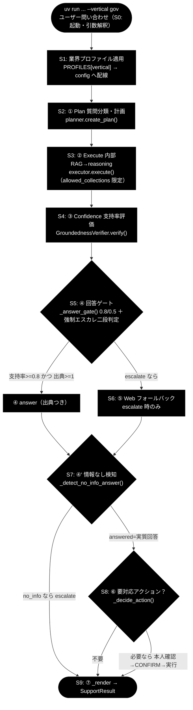
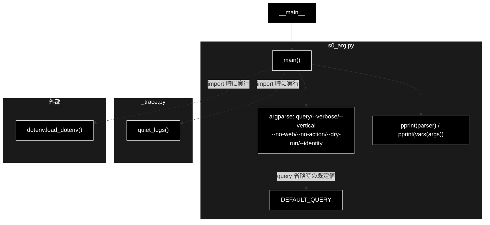

# s0_arg.py - S0. 起動・引数解釈（argparse 入口スタブ） ドキュメント
**Version 1.1** | 最終更新: 2026-07-09

## 目次
- [概要](#概要)
- [責務](#責務)
- [1. アーキテクチャ構成図（回答判定フロー）](#1-アーキテクチャ構成図回答判定フロー)
  - [1.1 ソース構成図（本モジュールの呼び出し構造）](#11-ソース構成図本モジュールの呼び出し構造)
- [2. 回答ポリシー（groundedness ゲート）](#2-回答ポリシーgroundedness-ゲート)
- [7. プログラム構成（実装済み関数 ＋ IPO 詳細）](#7-プログラム構成実装済み関数--ipo-詳細)
  - [7.6 クラス・関数 IPO 詳細](#76-クラス関数-ipo-詳細)
- [8. CLI 仕様](#8-cli-仕様)
- [依存関係](#依存関係)
- [変更履歴](#変更履歴)

## 概要

`s0_arg.py` は、GRACE-Support のトレース用スタブ群（`grace/step_trace/s0_arg.py` 〜 `s9_*.py`）の
**入口**であり、`agent_support_example.py` の `main()` のうち **「S0＝起動・引数解釈」だけ**を
取り出したスタブである。実際の回答生成（RAG・reasoning・支持率評価・ゲート判定など）は行わず、
`argparse` がコマンドライン引数からどのような `args`（`Namespace`）を組み立てるかを
標準出力に示すことに特化している。

- 各 `sN_*.py` は先頭で `_trace` を import し、その副作用として `quiet_logs()` が実行される。
  `s0_arg.py` も import 直後に `quiet_logs()` を明示的に呼び、実行基盤（`grace.config` /
  `httpx` 等）の初期化 INFO ログを WARNING へ引き上げて、トレース出力を見やすくする。
- ログ抑制を無効化して従来どおり INFO を見たいときは、環境変数 `GRACE_TRACE_VERBOSE=1` を
  設定する（`_trace.quiet_logs()` が先頭で return し、抑制をスキップする）。
- **s0 自体は LLM を一切呼ばない。** 後続ステップが用いる LLM は Anthropic Claude
  （既定 `claude-sonnet-4-6`、軽量 `claude-haiku-4-5-20251001`、鍵 `ANTHROPIC_API_KEY`）、
  Embedding は Gemini `gemini-embedding-001`（3072 次元、鍵 `GOOGLE_API_KEY`）だが、
  s0 の責務は引数解釈のみで、これらの鍵が無くても動作する。

## 責務

- `argparse.ArgumentParser` を構築し、位置引数 `query` と各オプション
  （`--verbose` / `--vertical` / `--no-web` / `--no-action` / `--dry-run` / `--identity`）を定義する。
- `--identity KEY=VALUE`（`append`）や `--dry-run`（`BooleanOptionalAction`、既定 ON）など、
  本人確認・実行制御に関わる引数の解釈を、後続 `sN` と**同一の引数体系**として提示する。
- 解釈結果（`parser` と `vars(args)`）を `pprint` で表示し、後続ステップへ渡る `Namespace` の
  形を確認できるようにする。
- import 時に `_trace.quiet_logs()` を通じて実行基盤の INFO ログを抑制する（`GRACE_TRACE_VERBOSE=1` で復帰）。
- `.env` からの環境変数読み込み（`load_dotenv()`、`python-dotenv` 未導入でも継続）。

## 1. アーキテクチャ構成図（回答判定フロー）



**本モジュールの位置づけ**: `s0_arg.py` は上図の起点 `Q（uv run 起動）` に対応する。
すなわち S0＝ユーザーが `uv run` でコマンドを起動した直後の「起動・引数解釈」だけを担い、
以降の `PROF`（S1）以降のステップは行わない。s0 の出力（`args`）が後続フローの入力となる。

### 1.1 ソース構成図（本モジュールの呼び出し構造）

上図が S0〜S9 全体の共通フローであるのに対し、本節は `grace/step_trace/s0_arg.py`
**そのもの**の呼び出し構造を示す。s0 は import 時に `_trace.quiet_logs()` と
`dotenv.load_dotenv()` を実行し、`main()` では `argparse` で `args` を組み立てて
`pprint` するだけで、`grace` 本体や LLM は一切呼ばない。



> `QL`（`quiet_logs()`）と `ENV`（`load_dotenv()`）はモジュール import 時点で実行される
> トップレベル副作用であり、`main()` の実行フローとは厳密には独立している（図では点線＋
> 「import 時に実行」ラベルで表現）。`main()` 本体が能動的に呼ぶのは `argparse` と `pprint` のみ。

## 2. 回答ポリシー（groundedness ゲート）

`GroundednessVerifier` の支持率(support_rate)と出典数で分岐する。gov プロファイルのしきい値は
`notify_th=0.8 / confirm_th=0.5`（業種で最も厳格）。

| 状態 | 条件 | decision | 振る舞い |
|------|------|----------|---------|
| 自信あり | verified かつ 出典≥1 かつ 支持率≥notify_th（gov=0.8） | `answer` | 出典つきで自動回答 |
| 要注意 | confirm_th≤支持率<notify_th（gov=0.5〜0.8） | `answer`（warning=True） | 「未確認の注意書き」つきで回答 |
| わからない | 支持率<confirm_th または 出典0／verified=False | `escalate` | Web フォールバック→なお不足なら有人エスカレ |

> 設計意図: 「根拠のない断定を構造的に出さない」。支持率が低い＝出典で裏付けられない回答は自動的に“わからない”へ倒す。強制エスカレ（S5）・情報なし検知（S7）は二段判定で追加の安全弁を成す。

> **s0 の位置づけ（注記）**: s0 自体はこの groundedness ゲートには関与しない。ここでは全体像として
> ポリシーを掲載しているが、s0 は上表の判定へ入る**前段の入口**（引数解釈）であり、支持率・出典・
> decision といったゲート判定は S4〜S5 以降のステップが担う。

## 7. プログラム構成（実装済み関数 ＋ IPO 詳細）

| 種別 | 名前 | 概要 |
|------|------|------|
| 定数 | `DEFAULT_QUERY` | 位置引数 `query` 省略時の既定質問（`"パスワードを忘れました"`） |
| 関数 | `main()` | `argparse` を構築して `argv` を解釈し、`parser` と `vars(args)` を `pprint` 表示する |

### 7.6 クラス・関数 IPO 詳細

#### `main()`

**概要**: `argparse.ArgumentParser` を組み立てて `argv` を解釈し、後続 `sN` と同じ引数体系の
`Namespace` を作る。解釈した `parser` と `vars(args)` を `pprint` で表示するだけで、
LLM 呼び出しや RAG は行わない。

**シグネチャ**:
```python
def main() -> None
```

**パラメータ（argparse 引数）**:

| 引数 | 型・action | 既定 | 説明 |
|------|-----------|------|------|
| `query` | 位置引数（`nargs="?"`, str） | `DEFAULT_QUERY`（`"パスワードを忘れました"`） | 問い合わせ内容（省略時は既定の質問を使用） |
| `-v`, `--verbose` | `store_true`（bool） | `False` | 支持率の内訳（supported/total/矛盾）など詳細を表示する |
| `--vertical` | `choices=["gov","saas","ec"]` | `None` | 業界プロファイルを適用（gov=自治体 / saas / ec） |
| `--no-web` | `store_false`（dest=`use_web`） | `use_web=True` | Web フォールバックを無効化する（内部RAGのみ） |
| `--no-action` | `store_false`（dest=`do_action`） | `do_action=True` | アクション（v3）を無効化する |
| `--dry-run` | `BooleanOptionalAction`（dest=`dry_run`） | `True` | アクションを実行せずログのみ（既定 ON。`--no-dry-run` で実連携/擬似実行） |
| `--identity` | `append`（`metavar="KEY=VALUE"`） | `None` | 本人確認の識別子（例: `--identity order_id=1001`。`--no-dry-run` 時に `SUPPORT_IDENTITY_FILE` の台帳と照合） |

**IPO テーブル**:

| 段 | 内容 |
|----|------|
| **Input** | `argv`（コマンドライン引数。例: `["--vertical", "gov", "住民票の写しの取り方は？"]`） |
| **Process** | `argparse.ArgumentParser` を構築 → `parser.parse_args()` で `argv` を解釈。import 時に `quiet_logs()` 済み（`GRACE_TRACE_VERBOSE=1` で INFO 復帰）。`--identity` 未指定なら `identity=None`、`--dry-run` 未指定なら `dry_run=True` |
| **Output** | 標準出力に `parser` と `vars(args)`（`Namespace` を dict 化）を `pprint` 表示。戻り値は `None` |

**戻り値例**（`vars(args)` の pprint 出力イメージ）:
```python
args=:
{'query': '住民票の写しの取り方は？',
 'verbose': False,
 'vertical': 'gov',
 'use_web': True,
 'do_action': True,
 'dry_run': True,
 'identity': None}
```

**使用例**:
```bash
uv run python grace/step_trace/s0_arg.py --vertical gov "住民票の写しの取り方は？"
```

## 8. CLI 仕様

| 引数 | 型・action | 既定 | 説明 |
|------|-----------|------|------|
| `query` | 位置引数（`nargs="?"`） | `DEFAULT_QUERY`（`"パスワードを忘れました"`） | 問い合わせ内容 |
| `-v`, `--verbose` | `store_true` | `False` | 詳細（支持率の内訳など）を表示 |
| `--vertical {gov,saas,ec}` | `choices` | `None` | 業界プロファイルを適用 |
| `--no-web` | `store_false`（`use_web`） | `use_web=True` | Web フォールバックを無効化 |
| `--no-action` | `store_false`（`do_action`） | `do_action=True` | アクション（v3）を無効化 |
| `--dry-run` / `--no-dry-run` | `BooleanOptionalAction`（`dry_run`） | `True` | 既定は dry-run。`--no-dry-run` で実連携/擬似実行 |
| `--identity KEY=VALUE` | `append` | `None` | 本人確認の識別子（複数指定可） |

**実行例（uv run）**:
```bash
# gov（自治体）
uv run python grace/step_trace/s0_arg.py --vertical gov "住民票の写しの取り方は？"

# saas（Web フォールバック無効）
uv run python grace/step_trace/s0_arg.py --vertical saas "APIのレート制限は？" --no-web

# ec（本人確認の識別子つき）
uv run python grace/step_trace/s0_arg.py --vertical ec "返品したい" --identity order_id=1001
```

## 依存関係

| 種別 | 対象 | 用途 |
|------|------|------|
| 内部 | `_trace`（`grace/step_trace/_trace.py`） | `quiet_logs()` で実行基盤 INFO ログを抑制（`GRACE_TRACE_VERBOSE=1` で復帰） |
| 標準ライブラリ | `argparse` | 引数パーサの構築・解釈 |
| 標準ライブラリ | `pprint` | `parser` / `vars(args)` の整形表示 |
| 外部（任意） | `python-dotenv`（`load_dotenv`） | `.env` からの環境変数読み込み（未導入でも継続） |

## 変更履歴

| バージョン | 日付 | 変更内容 |
|-----------|------|---------|
| 1.1 | 2026-07-09 | 「1.1 ソース構成図」（本モジュールの呼び出し構造の Mermaid）を追加 |
| 1.0 | 2026-07-09 | 初版。`s0_arg.py`（S0＝起動・引数解釈スタブ）の概要・責務・共通フロー図・回答ポリシー・`main()` の IPO 詳細・CLI 仕様・依存関係を実装（`argparse` 引数定義・`quiet_logs()`・`DEFAULT_QUERY`）と突合して記述 |
