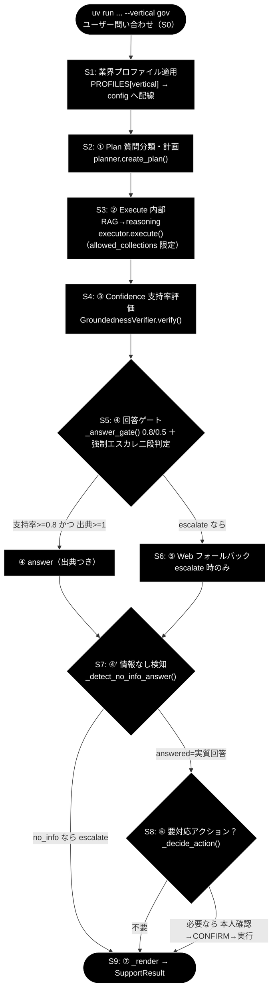
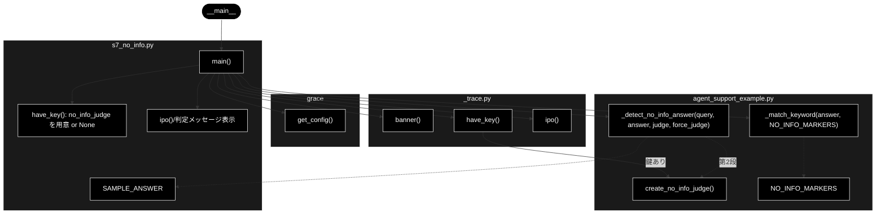

# s7_no_info.py - S7. ④' 情報なし回答検知（トレース用スタブ）ドキュメント

**Version 1.1** | 最終更新: 2026-07-09

## 目次

1. [概要](#概要)
2. [責務](#責務)
3. [1. アーキテクチャ構成図（回答判定フロー）](#1-アーキテクチャ構成図回答判定フロー)
   - [1.1 ソース構成図（本モジュールの呼び出し構造）](#11-ソース構成図本モジュールの呼び出し構造)
4. [2. 回答ポリシー（groundedness ゲート）](#2-回答ポリシーgroundedness-ゲート)
5. [7. プログラム構成（実装済み関数 ＋ IPO 詳細）](#7-プログラム構成実装済み関数--ipo-詳細)
6. [7.6 クラス・関数 IPO 詳細](#76-クラス関数-ipo-詳細)
7. [8. CLI 仕様](#8-cli-仕様)
8. [依存関係](#依存関係)
9. [変更履歴](#変更履歴)

---

## 概要

`s7_no_info.py` は、`agent_support_example.py` の `run_support_agent()` から
**S7「④' 情報なし回答検知」** の 1 ステップだけを取り出したトレース用スタブである。
`grace/step_trace/_trace.py` の共通ヘルパ（`banner` / `ipo` / `have_key`）を用いて、
`_detect_no_info_answer(query, answer, judge, force_judge=web_only)` の
**IN → Process → OUT** を標準出力に示す。

回答ゲート（S5）を通過して `answer` として整った回答であっても、その中身が
「質問された事柄そのものには答えず、確認方法の案内・他窓口への誘導だけ」で
構成されていることがある。S7 はこの **情報なし回答（no_info）** を answer 後に
検知するための追加安全弁であり、二段判定で構成される。

- **第 1 段（候補検出・LLM 不要）**: `_match_keyword(answer, NO_INFO_MARKERS)` で
  定型句（「見当たりません」等）を部分一致で探す。
- **第 2 段（軽量 LLM 判定）**: 軽量 Anthropic Claude（`claude-haiku-4-5-20251001`）で
  回答が `answered`（実質回答）か `no_info`（情報なし）かを判定する。

出典が **Web のみ**（社内根拠ゼロ）の回答は、候補句が一致しなくても
`force_judge=True` として第 2 段の LLM 判定を必須で実施する（`--web-only`）。

- LLM = Anthropic Claude。既定 `claude-sonnet-4-6`、no_info 判定器は軽量
  `claude-haiku-4-5-20251001`（`ANTHROPIC_API_KEY`）。
- Embedding = Gemini `gemini-embedding-001`（3072次元、`GOOGLE_API_KEY`）。
  本 S7 スタブは検索を行わないため直接は用いない。

---

## 責務

- `_detect_no_info_answer` の二段判定（候補検出 → 軽量 LLM 判定）を単独で実行し、
  IN/Process/OUT の構造を可視化する。
- 第 1 段の候補句（`NO_INFO_MARKERS` に一致する marker）を明示的に取り出して見せる。
- `--web-only`（`force_judge=True`）指定時に、候補句が無くても LLM 判定が必須になる
  挙動をトレースする。
- 判定結果 `(no_info, marker)` に応じてゲートの帰結（`answer` 維持／有人対応へ
  エスカレーション）を標準出力に示す。
- `ANTHROPIC_API_KEY` が無い環境では判定器（`create_no_info_judge`）を生成せず、
  第 1 段の構造のみで動作させる（`have_key()` で分岐）。

> 本スタブは検知ロジックそのものを持たず、実体はすべて
> `agent_support_example.py`（`_detect_no_info_answer` / `NO_INFO_MARKERS` /
> `_match_keyword` / `create_no_info_judge`）を呼び出す。

---

## 1. アーキテクチャ構成図（回答判定フロー）

`run_support_agent()` の S0〜S9 共通フロー。**本モジュールは `NOINFO`（S7）に対応**し、
S5 ゲートを通過した `answer`（および S6 Web フォールバック結果）を入力に、
情報なし回答を検知して `answer` 維持か escalate かを分岐させる。



---

### 1.1 ソース構成図（本モジュールの呼び出し構造）

上図は `run_support_agent()` の共通フロー上での位置づけを示すものだが、
以下は **本スタブ `s7_no_info.py` そのものの呼び出し構造**である。
`main()` が `_trace.py`（`banner` / `have_key` / `ipo`）・`grace`（`get_config`）・
`agent_support_example.py`（`create_no_info_judge` / `_match_keyword` /
`NO_INFO_MARKERS` / `_detect_no_info_answer`）をどう呼び分けるかを表す。
第 1 段は `_match_keyword` による候補検出（LLM 不要）、第 2 段は
`_detect_no_info_answer` 内部で軽量 Claude 判定器（`create_no_info_judge`）を呼ぶ。



---

## 2. 回答ポリシー（groundedness ゲート）

gov のしきい値は `notify_th=0.8 / confirm_th=0.5`。

| 状態 | 条件 | decision | 振る舞い |
|------|------|----------|---------|
| 自信あり | verified かつ 出典≥1 かつ 支持率≥notify_th（gov=0.8） | `answer` | 出典つきで自動回答 |
| 要注意 | confirm_th≤支持率<notify_th（gov=0.5〜0.8） | `answer`（warning=True） | 「未確認の注意書き」つきで回答 |
| わからない | 支持率<confirm_th または 出典0／verified=False | `escalate` | Web フォールバック→なお不足なら有人 |

> 設計意図: 根拠のない断定を構造的に出さない。S7 は「実質回答か／確認方法の案内だけか」を判定し、情報なし回答を no_info として escalate へ倒す（Web のみ出典の answer 化対策）。

S7 は S5 の回答ポリシーを通過した **answer の後段に置かれる追加安全弁**である。
S5 は「支持率・出典数」という定量ゲートで根拠の薄い回答を落とすが、
定量的には合格でも中身が情報なし回答となるケース（特に **出典が Web のみ** で
社内根拠ゼロの回答）は残る。S7 はこれを `force_judge=True` で必須判定し、
`no_info` と判定された回答を escalate（有人対応）へ倒す。

---

## 7. プログラム構成（実装済み関数 ＋ IPO 詳細）

### 関数一覧

| 関数 | 定義元 | 役割 |
|------|--------|------|
| `main()` | 本モジュール | CLI 引数（`query` / `--answer` / `--web-only`）を解釈し、S7 検知を 1 回トレース実行する |

### 参照する定数・関数（`agent_support_example` 由来）

| 名前 | 定義元 | 内容 |
|------|--------|------|
| `SAMPLE_ANSWER` | 本モジュール | gov 代表例の回答本文（実質回答・[社内] 出典あり）。`--answer` の既定値 |
| `NO_INFO_MARKERS` | `agent_support_example` | 情報なし回答の候補検出パターン（「見当たりません」等の語幹 6 種） |
| `_match_keyword(query, keywords)` | `agent_support_example` | 候補語の部分一致（第 1 段）。最初に一致した語を返す |
| `_detect_no_info_answer(query, answer, judge, force_judge)` | `agent_support_example` | 二段判定本体。戻り値 `(no_info, matched_marker)` |
| `create_no_info_judge(config)` | `agent_support_example` | 軽量 Claude（`claude-haiku-4-5-20251001`）による `answered/no_info` 判定器を返す |

> `SAMPLE_ANSWER` のみ本モジュールで定義される。`NO_INFO_MARKERS` /
> `_detect_no_info_answer` / `create_no_info_judge` / `_match_keyword` はいずれも
> `agent_support_example` 由来であり、本スタブはそれらを呼び出すだけである。

---

### 7.6 クラス・関数 IPO 詳細

#### `main()`

**概要**: CLI 引数を解釈し、`_detect_no_info_answer` の二段判定を 1 回トレース実行する。
`ANTHROPIC_API_KEY` があれば `create_no_info_judge(config)` で軽量 LLM 判定器を生成し、
無ければ判定器を `None` として第 1 段の構造のみを示す。`ipo()` で IN/Process/OUT を
表示し、末尾でゲートの帰結（`answer` 維持／エスカレーション）を出力する。

**シグネチャ**:

```python
def main() -> None
```

**パラメータ（CLI 引数）**:

| 引数 | 種類 | 既定値 | 説明 |
|------|------|--------|------|
| `query` | 位置引数（任意） | `"住民票の写しの取り方は？"` | 検証する質問文 |
| `--answer` | オプション | `SAMPLE_ANSWER` | 検証する回答本文 |
| `--web-only` | フラグ（`store_true`） | `False` | 出典が Web のみ（`force_judge=True`）として必須判定させる |

> ⚠️ 本モジュールは **`--vertical` 引数を取らない**（`query` / `--answer` / `--web-only` のみ）。

**IPO テーブル**:

| 区分 | 内容 |
|------|------|
| **Input** | `query`（質問文）、`answer`（検証する回答本文）、`force_judge`（`web_only`＝`--web-only` の有無）、`judge`（`ANTHROPIC_API_KEY` があれば `create_no_info_judge(config)`、無ければ `None`） |
| **Process** | 第 1 段: `_match_keyword(answer, NO_INFO_MARKERS)` で候補句を検出。候補なし かつ not `force_judge` なら `(False, None)` を返し LLM は未実行。／第 2 段: `judge(query, answer)` で `answered`（`False`）か `no_info`／判定失敗（`True`）かを判定（`_detect_no_info_answer` 内部）。判定器が `None` の場合は `(False, marker)` を返す |
| **Output** | `(no_info, matched_marker)`。`no_info=True` なら情報なし回答→有人対応へエスカレーション、`False` なら `decision='answer'` を維持 |

**内部の判定分岐（`_detect_no_info_answer`）**:

- `marker is None` かつ not (`force_judge` and `answer`) → `(False, None)`（LLM 未実行）
- `judge is None` → `(False, marker)`（判定器なしなら従来どおり回答を通す）
- `judge(query, answer) is False`（answered）→ `(False, marker)`
- それ以外（`no_info=True` / 判定失敗 `None`）→ `(True, marker)`（安全側 escalate）

**戻り値例**:

```text
============================================================
S7. ④' 情報なし回答検知（_detect_no_info_answer）
============================================================
IN     : query='住民票の写しの取り方は？', answer[:40]='住民票の写しは、市区町村の窓口（市民課等）・コンビニ交付・郵送で請求できま',
         force_judge(web_only)=False, judge=None
Process: 第1段: _match_keyword(answer, NO_INFO_MARKERS) で候補句を検出
           → 候補なし かつ not force_judge なら (False, None)（LLM 未実行）
         第2段: judge(query, answer) で answered/no_info を判定
           → answered なら (False, marker)、no_info/判定失敗なら (True, marker)（安全側 escalate）
OUT    : 第1段の候補句 marker=None
         (no_info, matched_marker) = (False, None)

  [gate] 実質回答（answered）→ decision='answer' を維持
```

**使用例**:

```bash
# gov 代表例（[社内] 出典あり・候補句なし → LLM 未実行・no_info=False）
uv run python grace/step_trace/s7_no_info.py "住民票の写しの取り方は？"

# 候補句を含む回答を明示指定（第1段で候補検出 → 第2段 LLM 判定へ）
uv run python grace/step_trace/s7_no_info.py --answer "該当する情報が見当たりません" "在庫は？"

# 出典が Web のみ（force_judge=True）として候補句なしでも必須判定
uv run python grace/step_trace/s7_no_info.py --web-only "この商品の入荷予定日は？"
```

---

## 8. CLI 仕様

### 引数表

| 引数 | 形式 | 既定値 | 説明 |
|------|------|--------|------|
| `query` | 位置引数（任意・`nargs="?"`） | `"住民票の写しの取り方は？"` | 検証する質問文 |
| `--answer` | オプション（値あり） | `SAMPLE_ANSWER` | 検証する回答本文 |
| `--web-only` | フラグ（`store_true`） | `False` | 出典が Web のみ＝`force_judge=True` として必須判定させる |

> ⚠️ 他の `sN_*.py` スタブと異なり、本モジュールに **`--vertical` 引数は存在しない**。
> 業界（gov/saas/ec）は下記のように **query 例** として与える。

### 実行例（uv run）

```bash
# gov: 行政の問い合わせ（query 例）
uv run python grace/step_trace/s7_no_info.py "住民票の写しの取り方は？"

# saas: SaaS の問い合わせ（query 例）
uv run python grace/step_trace/s7_no_info.py "APIのレート制限は？"

# ec: EC の問い合わせ（Web 出典のみ → --web-only で必須判定）
uv run python grace/step_trace/s7_no_info.py --web-only "この商品の入荷予定日は？"

# 候補句を含む回答を直接検証
uv run python grace/step_trace/s7_no_info.py --answer "該当する情報が見当たりません" "在庫は？"
```

---

## 依存関係

| 種別 | 対象 | 用途 |
|------|------|------|
| 内部（共通ヘルパ） | `_trace`（`banner` / `ipo` / `have_key`） | 見出し・IPO 表示・API キー有無の判定 |
| 内部（実体） | `agent_support_example`（`create_no_info_judge` / `_match_keyword` / `NO_INFO_MARKERS` / `_detect_no_info_answer`） | S7 情報なし検知の実ロジック |
| 内部（設定） | `grace`（`get_config`） | 判定器生成に渡す config（LLM クライアント設定） |
| 標準ライブラリ | `argparse` | CLI 引数解釈 |

> 判定器 `create_no_info_judge` は内部で `grace.llm_compat.create_chat_client` を用い、
> 軽量 Claude（`claude-haiku-4-5-20251001`）を `ANTHROPIC_API_KEY` で呼び出す。

---

## 変更履歴

| 版 | 日付 | 内容 |
|----|------|------|
| 1.0 | 2026-07-09 | 初版作成（S7. ④' 情報なし回答検知トレースの IPO／CLI／フロー図を整備） |
| 1.1 | 2026-07-09 | 「1.1 ソース構成図」（本モジュールの呼び出し構造の Mermaid）を追加 |
