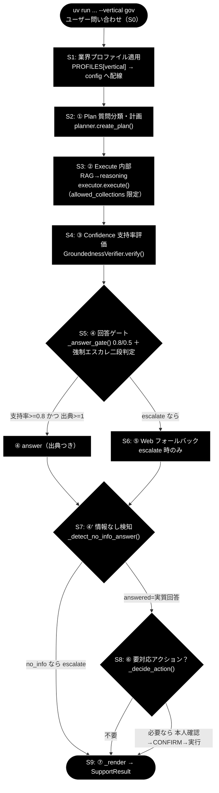
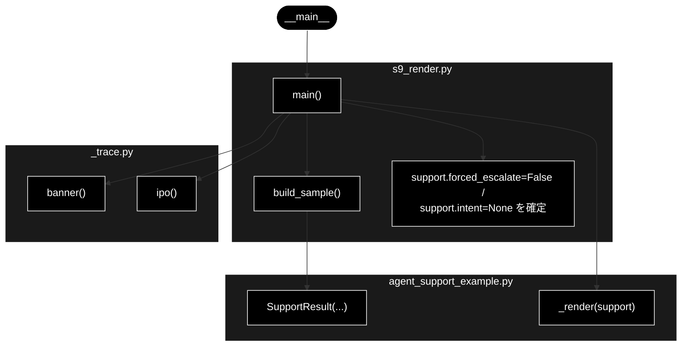
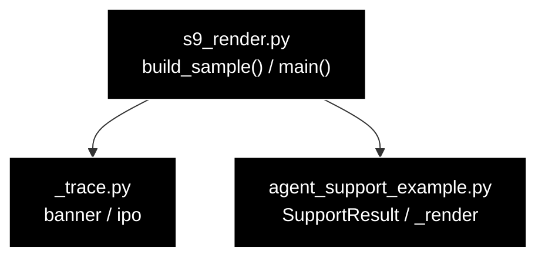

# s9_render.py - S9 ⑦ 応答整形（SupportResult 最終形 → _render 整形表示）ドキュメント

**Version 1.1** | 最終更新: 2026-07-10

---

## 目次

1. [概要](#概要)
2. [責務](#責務)
3. [1. アーキテクチャ構成図（回答判定フロー）](#1-アーキテクチャ構成図回答判定フロー)
   - [1.1 ソース構成図（本モジュールの呼び出し構造）](#11-ソース構成図本モジュールの呼び出し構造)
4. [2. 回答ポリシー（groundedness ゲート）](#2-回答ポリシーgroundedness-ゲート)
5. [7. プログラム構成（実装済み関数 ＋ IPO 詳細）](#7-プログラム構成実装済み関数--ipo-詳細)
6. [8. CLI 仕様](#8-cli-仕様)
7. [依存関係](#依存関係)
8. [変更履歴](#変更履歴)

---

## 概要

`grace/step_trace/s9_render.py` は、サポートエージェント本体 `agent_support_example.py`
の `run_support_agent()` から **S9. ⑦ 応答整形** の 1 ステップだけを取り出したトレース用
スタブである。各ステップ（S3〜S8）で少しずつ埋まった同一 `SupportResult` の**最終形**を、
gov 代表例（「住民票の写しの取り方は？」）の値で `build_sample()` により組み立て、
`support.forced_escalate` / `support.intent` を確定したうえで `ase._render(support)` に渡し、
**回答本文 ＋ 出典一覧 ＋ 根拠メタ行**を整形表示する。

- **引数は取らない**。`build_sample()` が gov 固定の代表 `SupportResult` を返すため、
  LLM（Anthropic Claude）も Qdrant も呼ばず、鍵が無くても動作する（純粋な整形トレース）。
- `_render` と `SupportResult` は本モジュールではなく `agent_support_example.py` 由来である。
  本スタブは「最終形の組み立て」と「確定処理（`forced_escalate` / `intent`）」だけを担い、
  整形処理そのものは実コード `ase._render` をそのまま呼ぶ。
- saas / ec も整形処理（`_render`）は**共通**で、`build_sample()` が返す値
  （`answer` / `citations` / `vertical` 等）が変わるだけである。別業界の表示を見たい場合は
  `build_sample()` の本文と `vertical` を差し替える（本スタブは gov 固定）。

技術スタックは、LLM = Anthropic Claude（汎用既定 `claude-sonnet-4-6`、意図分類の軽量既定
`claude-haiku-4-5-20251001`、鍵 `ANTHROPIC_API_KEY`）、Embedding = Gemini
`gemini-embedding-001`（3072次元、鍵 `GOOGLE_API_KEY`）である。ただし **S9 は応答整形のみ
で LLM・Qdrant を一切使用しない**（上流 S1〜S8 の成果物である `SupportResult` を受けて表示する
だけ）。

---

## 責務

- `build_sample()` で flow.md §3「データの積み上がり（SupportResult 最終形）」の gov 代表例に
  一致する `ase.SupportResult` を組み立てる（`answer` / `citations` / `groundedness` /
  `groundedness_decided` / `decision` / `warning` / `used_web` / `vertical` /
  `overall_confidence`）。
- `run_support_agent()` の末尾と同じ確定処理を再現する：`support.forced_escalate = False`
  （エスカレ語なし）、`support.intent = None`（gov in-scope は意図分類器が未発火）。
- `ase._render(support)` を実コードのまま呼び、`decision` に応じて回答本文＋出典一覧＋
  根拠メタ行（支持率 / 全体信頼度 / decision / web / vertical 等）を整形表示する。
- IN → Process → OUT の 3 段で処理構造を標準出力に示す（LLM・Qdrant は使わない）。

---

## 1. アーキテクチャ構成図（回答判定フロー）

共通フロー（S0〜S9）における本モジュールの位置は **`OUT`（S9）** に対応する。



> **本モジュール ＝ `OUT`（S9）に対応**。S3〜S8 で積み上がった `SupportResult` の最終形を受け、
> `forced_escalate` / `intent` を確定してから `_render` で回答本文＋出典＋根拠メタを表示する
> 「出口」のステップを取り出してトレースする。

### 1.1 ソース構成図（本モジュールの呼び出し構造）

上の共通フロー図が S0〜S9 全体の位置づけを示すのに対し、ここでは **`s9_render.py`
そのもの**の呼び出し構造を示す。`main()` は引数を取らず、`build_sample()` で gov 代表の
`SupportResult` を組み立て、`support.forced_escalate=False` / `support.intent=None` を確定した
うえで、`banner()` / `ipo()`（`_trace.py`）で見出し・IPO を表示し、最後に
`agent_support_example._render(support)` で回答本文＋出典＋根拠メタ行を整形表示する。
`SupportResult` / `_render` は `agent_support_example.py` 由来で、LLM・Qdrant は使用しない。



> `main()` は `banner()`（見出し）→ `build_sample()`（最終形 `SupportResult` の組み立て）→
> 確定処理（`forced_escalate` / `intent`）→ `ipo()`（IN/Process/OUT 表示）→ `_render(support)`
> （整形表示）の順に呼ぶ。本モジュールで定義されるのは `main()` / `build_sample()` のみで、
> `banner` / `ipo` は `_trace`、`SupportResult` / `_render` は `agent_support_example` 由来。

---

## 2. 回答ポリシー（groundedness ゲート）

回答するか有人にエスカレするかは S5 の groundedness ゲートで決まり、gov のしきい値は
`notify_th=0.8 / confirm_th=0.5`。S9 はその確定した `decision` に応じて、回答本文＋根拠メタを
表示するステップである（gov 代表例は `decision="answer"`）。

| 状態 | 条件 | decision | 振る舞い |
|------|------|----------|---------|
| 自信あり | verified かつ 出典≥1 かつ 支持率≥notify_th（gov=0.8） | `answer` | 出典つきで自動回答 |
| 要注意 | confirm_th≤支持率<notify_th（gov=0.5〜0.8） | `answer`（warning=True） | 「未確認の注意書き」つきで回答 |
| わからない | 支持率<confirm_th または 出典0／verified=False | `escalate` | Web フォールバック→なお不足なら有人 |

> 設計意図: 根拠のない断定を構造的に出さない。S9 は根拠メタ（支持率・decision・web・vertical 等）
> を必ず併記し、回答の裏付け状態を可視化する。`decision="answer"` なら本文＋出典を、
> `escalate` なら「有人対応へエスカレーション」を表示する。

---

## 7. プログラム構成（実装済み関数 ＋ IPO 詳細）

### 関数一覧

| 関数 | 定義元 | 役割 |
|------|--------|------|
| `build_sample()` | 本モジュール `s9_render.py` | flow.md §3 の gov 代表例に一致する `ase.SupportResult`（最終形）を組み立てて返す |
| `main()` | 本モジュール `s9_render.py` | S9 トレースのエントリポイント（引数なし）。`build_sample()` → 確定処理 → `ase._render` で整形表示 |
| `ase._render()` | 参照: `agent_support_example.py` | `decision` に応じて回答本文＋出典一覧＋根拠メタ行を整形表示する |
| `ase.SupportResult` | 参照: `agent_support_example.py` | サポート回答の結果を保持する dataclass（S9 が最終形を渡す型） |
| `banner()` / `ipo()` | 参照: `grace/step_trace/_trace.py` | 見出し表示・IN/Process/OUT の 3 段表示 |

> `_render` / `SupportResult` は **`agent_support_example`（`ase`）由来**であり、本モジュールは
> それらを import して使うだけである。`banner` / `ipo` は **`_trace` 由来**。`build_sample` と
> `main` のみが本モジュールで定義される。

### 7.6 クラス・関数 IPO 詳細

#### `build_sample()`

**概要**

flow.md §3「データの積み上がり（SupportResult 最終形）」の gov 代表例と一致する
`ase.SupportResult` を組み立てて返す。S3〜S8 が段階的に埋めた各フィールドを、gov の
最終値でまとめて設定した「完成品」を用意する（LLM・Qdrant 不要）。

**シグネチャ**

```python
def build_sample() -> "ase.SupportResult"
```

**パラメータ**

引数なし（`self` もなし）。

**IPO テーブル**

| 区分 | 内容 |
|------|------|
| **Input** | なし（gov 代表例の固定値を内部に持つ） |
| **Process** | `ase.SupportResult(...)` を生成。`answer`（住民票の取り方の回答本文）、`citations`（社内 gov FAQ 2 件）、`groundedness=0.86`、`groundedness_decided=3`、`decision="answer"`、`warning=False`、`used_web=False`、`vertical="gov"`、`overall_confidence=0.78` を設定 |
| **Output** | `ase.SupportResult`: S9 が受け取る最終形（gov 代表例）。未指定フィールドは dataclass 既定値（`action=None` / `intent=None` / `forced_escalate=False` 等） |

**戻り値例**

```python
SupportResult(
    answer="住民票の写しは、お住まいの市区町村の窓口（市民課等）またはコンビニ交付・郵送で請求できます。…",
    citations=[
        "[社内] gov_faq_anthropic/住民票.md",
        "[社内] gov_faq_anthropic/窓口案内.md",
    ],
    groundedness=0.86,
    groundedness_decided=3,
    decision="answer",
    warning=False,
    used_web=False,
    vertical="gov",
    overall_confidence=0.78,
)
```

**使用例**

```python
# 使用例
import agent_support_example as ase
from s9_render import build_sample

support = build_sample()
print(support.decision, support.vertical, support.groundedness)
# 出力: answer gov 0.86
```

#### `main()`

**概要**

S9 トレースの唯一のエントリポイント。**引数を取らない**（`argparse` は用意するが
`add_argument` はせず `parse_args()` するのみ）。`build_sample()` で最終形の `SupportResult` を
得たあと、`run_support_agent()` 末尾と同じ確定処理（`forced_escalate=False` / `intent=None`）を
施し、`ipo(...)` で IN/Process/OUT を示してから `ase._render(support)` で端末に整形表示する。

**シグネチャ**

```python
def main() -> None
```

**パラメータ（CLI 引数）**

引数なし（下記「8. CLI 仕様」参照）。

**IPO テーブル**

| 区分 | 内容 |
|------|------|
| **Input** | `build_sample()` が返す gov 代表 `SupportResult`（S3〜S8 の積み上がりを再現した最終形） |
| **Process** | 1. `banner("S9. ⑦ 応答整形（_render → SupportResult 返却）")`<br>2. `support = build_sample()`<br>3. 確定処理：`support.forced_escalate = False`（エスカレ語なし）、`support.intent = None`（gov in-scope は意図分類器が未発火）<br>4. `ipo(...)` で IN/Process/OUT を表示<br>5. `ase._render(support)`：`decision="answer"` なので回答本文 → 出典一覧 → 根拠メタ行（支持率 / 全体信頼度 / decision / web / vertical）を整形表示 |
| **Output** | `None`（戻り値なし）。標準出力に IN/Process/OUT ＋ `_render` の整形表示を出す。本スタブは表示のみで、実本体の `run_support_agent()` はこの後 `return support` する |

**戻り値例**

```text
============================================================
S9. ⑦ 応答整形（_render → SupportResult 返却）
============================================================
IN     : support（S3〜S8 で確定した SupportResult）
Process: support.forced_escalate / support.intent を確定した後、
         _render(support) が回答本文＋出典一覧＋根拠メタ行を整形表示し、
         run_support_agent() が support を return
OUT    : decision='answer', groundedness=0.86, vertical='gov', intent=None
         端末表示（下記）＋ 呼び出し元へ SupportResult を返却

============================================================
応答
============================================================
住民票の写しは、お住まいの市区町村の窓口（市民課等）または…（本文）

【出典】
  [1] [社内] gov_faq_anthropic/住民票.md
  [2] [社内] gov_faq_anthropic/窓口案内.md

[根拠] 支持率(groundedness)=0.86 / 全体信頼度=0.78 / decision=answer / web=不使用 / vertical=gov
```

**使用例**

```bash
# 使用例: gov 代表例の SupportResult 最終形を組み立てて _render で整形表示（引数なし）
uv run python grace/step_trace/s9_render.py
```

#### SupportResult 最終形（各フィールド）

`build_sample()` が返し、S9 が受け取る `ase.SupportResult` の最終形。値は gov 代表例、
「埋めたステップ」は上流トレースでの充填元を示す（本スタブでは `build_sample()` が一括設定）。

| フィールド | 型 | 値（gov 代表例） | 埋めたステップ |
|---|---|---|---|
| `answer` | `Optional[str]` | 住民票の取り方の回答本文 | S3（② Execute） |
| `citations` | `List[str]` | `["[社内] gov_faq_anthropic/住民票.md", "[社内] gov_faq_anthropic/窓口案内.md"]` | S3（`_collect_citations`） |
| `groundedness` | `float` | `0.86` | S4（③ Confidence） |
| `groundedness_decided` | `int` | `3` | S4 |
| `decision` | `Decision` | `"answer"` | S5（④ ゲート） |
| `warning` | `bool` | `False` | S5 |
| `used_web` | `bool` | `False` | S3/S6 |
| `web_reused` | `bool` | `False`（既定値） | S6（未発火） |
| `action` | `Optional[ActionRequest]` | `None`（既定値） | S8（未発火） |
| `vertical` | `Optional[str]` | `"gov"` | S1 |
| `intent` | `Optional[Intent]` | `None`（分類器未発火） | S9 確定処理 |
| `forced_escalate` | `bool` | `False` | S9 確定処理 |
| `identity_checked` | `bool` | `False`（既定値） | S8 |
| `no_info_detected` | `bool` | `False`（既定値） | S7 |
| `overall_confidence` | `float` | `0.78` | S3（executor 由来） |

> `web_reused` / `action` / `identity_checked` / `no_info_detected` は `build_sample()` では
> 明示設定せず、dataclass 既定値（それぞれ `False` / `None` / `False` / `False`）のまま S9 に届く。
> `intent` / `forced_escalate` のみ `main()` の確定処理で明示的に上書きする。

---

## 8. CLI 仕様

### 引数

| 引数 | 種別 | 既定値 | 説明 |
|------|------|--------|------|
| （なし） | — | — | **本スタブは引数を取らない**。`argparse.ArgumentParser` を作るが `add_argument` はせず `parse_args()` するのみ（`-h/--help` のみ有効） |

> S8 までのスタブと異なり、S9 は `query` も `--vertical` も `--decision` も受け取らない。
> 表示対象は `build_sample()` が返す gov 固定の `SupportResult` に一本化されている。

### 実行例（uv run）

```bash
# gov 代表例の SupportResult 最終形を _render で整形表示（LLM・Qdrant 不要）
uv run python grace/step_trace/s9_render.py
```

> **saas / ec の表示を見たい場合**: 整形処理（`_render`）は業界共通であり、変わるのは
> `build_sample()` が返す値（`vertical` / 回答本文 / 出典）だけである。別業界の見た目を確認する
> には `build_sample()` 内の `vertical` と `answer` / `citations` を差し替える（本スタブは
> gov 固定のため CLI では切り替えられない）。

---

## 依存関係



| 依存 | 用途 |
|------|------|
| `_trace`（`banner` / `ipo`） | 見出し表示・IN/Process/OUT の 3 段表示 |
| `agent_support_example`（`ase`） | `SupportResult`（最終形の型）・`_render`（回答本文＋出典＋根拠メタ行の整形表示）を提供 |

> 本ステップは **LLM（Anthropic Claude）・Qdrant を一切使用しない**。`build_sample()` が固定の
> `SupportResult` を返すため、`ANTHROPIC_API_KEY` / `GOOGLE_API_KEY` が無くても動作する。

---

## 変更履歴

| バージョン | 日付 | 変更内容 |
|-----------|------|---------|
| 1.0 | 2026-07-09 | 初版作成。S9 ⑦ 応答整形トレーススタブ（`build_sample()` で gov 代表 `SupportResult` 最終形を組み立て → `forced_escalate` / `intent` 確定 → `ase._render` で回答本文＋出典＋根拠メタ行を整形表示）を IPO・CLI・依存関係・SupportResult 最終形フィールド表で記述 |
| 1.1 | 2026-07-10 | 「1.1 ソース構成図（本モジュールの呼び出し構造）」を追加。`s9_render.py` の実際の呼び出し構造（`__main__` → `main()` → `banner`/`build_sample`→`SupportResult`/`forced_escalate`・`intent` 確定/`ipo`/`_render`）をモジュール別サブグラフの Mermaid で図示 |
