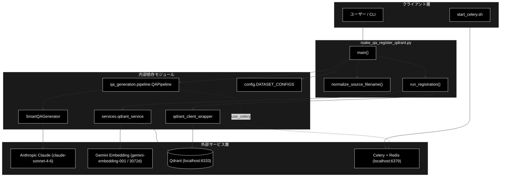
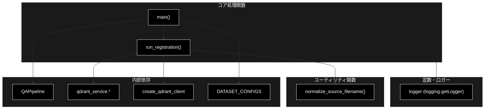
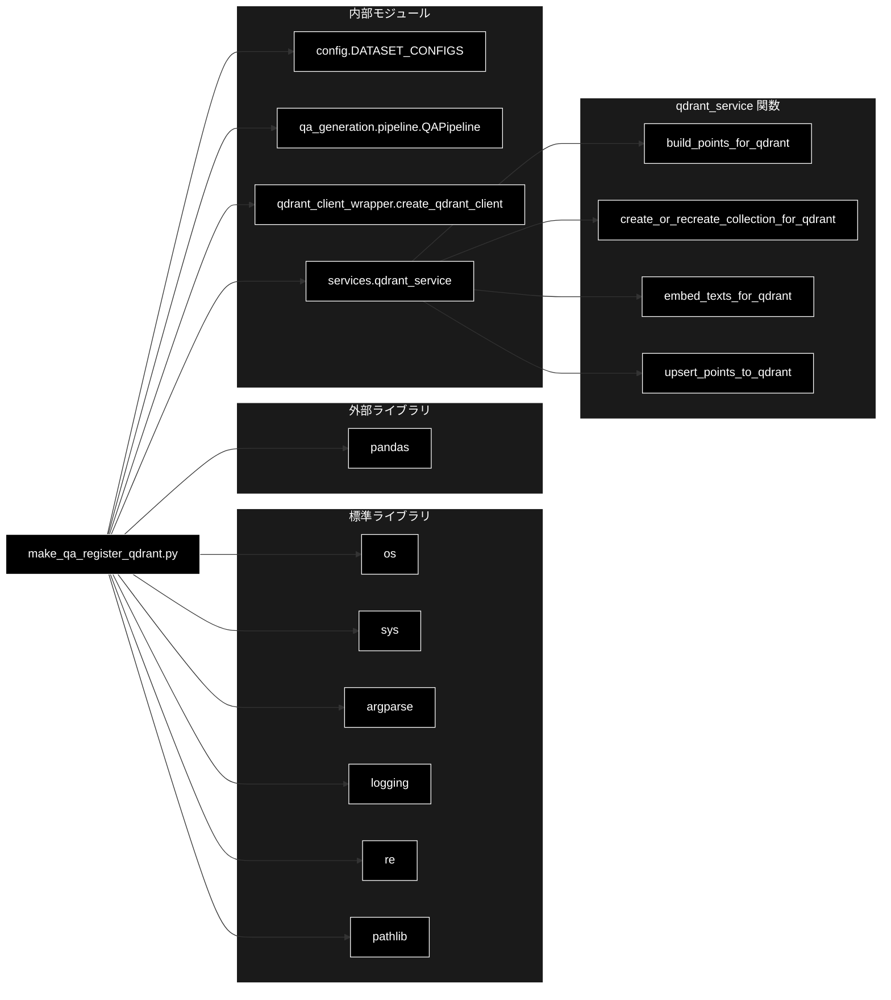

# make_qa_register_qdrant.py - Q/A生成からQdrant登録までを完結する統合CLIツール ドキュメント

**Version 2.0** | 最終更新: 2026-06-17

---

## 目次

1. [概要](#概要)
2. [アーキテクチャ構成図](#1-アーキテクチャ構成図)
3. [モジュール構成図](#2-モジュール構成図)
4. [クラス・関数一覧表](#3-クラス関数一覧表)
5. [クラス・関数 IPO詳細](#4-クラス関数-ipo詳細)
6. [設定・定数](#5-設定定数)
7. [使用例](#6-使用例)
8. [エクスポート](#7-エクスポート)
9. [変更履歴](#8-変更履歴)
10. [付録: 依存関係図](#付録-依存関係図)

---

## 概要

`make_qa_register_qdrant.py`は、チャンク済みCSV（またはテキストファイル/事前定義データセット）から **Q/Aペアを自動生成**（`QAPipeline` 経由・`SmartQAGenerator` の構造化出力1回、Celery 並列対応）し、続けて **Qdrant ベクトルDBへ登録**するまでを一気通貫で実行する統合 CLI ツールです。

LLM は `Anthropic Claude`（`claude-sonnet-4-6`）、Embedding は `Gemini Embedding`（`gemini-embedding-001`、3072次元）を利用し、Celery+Redis による並列タスク実行に対応します。

### 主な責務

- 入力ソース（事前定義データセット / `.txt` / `.csv`）の判定と検証
- ファイル形式・CSV カラム構成に応じた処理分岐（Q/A 生成スキップ判定）
- `QAPipeline` を用いた Q/A ペア生成（Phase 1）
- 生成 Q/A ペアCSVの Qdrant コレクションへの登録（Phase 2）
- ベクトル化対象テキストの正規化（`question` のみベクトル化、検索クエリとの対称性確保）
- UI 参照用の正規化済み Q/A CSV の出力
- Celery 並列処理（`--concurrency`）の制御とログ通知

### 各責務対応のモジュール

| # | 責務 | 対応モジュール | 説明 |
|---|------|--------------|------|
| 1 | 入力ソース判定・検証 | `make_qa_register_qdrant.py`（`main`） | `--dataset` / `--input-file` 排他チェック、APIキー検証 |
| 2 | ファイル形式分岐 | `make_qa_register_qdrant.py`（`main`） | `.txt`/`.csv` 判定、`question`+`answer`/テキストカラム判定 |
| 3 | Q/Aペア生成 | `qa_generation.pipeline.QAPipeline` | スマート生成（構造化出力1回・0〜5個動的決定） |
| 4 | Qdrant登録 | `make_qa_register_qdrant.py`（`run_registration`） | Embedding バッチ生成 → Point 構築 → Upsert |
| 5 | ベクトル化テキスト正規化 | `services.qdrant_service` | `embed_texts_for_qdrant` / `build_points_for_qdrant` |
| 6 | UI 用 CSV 出力 | `make_qa_register_qdrant.py`（`run_registration`） | 正規化ファイル名で `question`/`answer` を保存 |
| 7 | Celery 並列制御 | `qa_generation.pipeline.QAPipeline.run` | `use_celery` / `concurrency` を委譲 |

### 主要機能一覧

| 機能 | 説明 |
|------|------|
| `normalize_source_filename()` | ファイル名から日時サフィックス（`_YYYYMMDD_HHMMSS`）を除去して UI 参照名を安定化 |
| `run_registration()` | Phase 2: Q/A ペアCSV を読み込み Qdrant に Upsert（UI 用 CSV も出力） |
| `main()` | CLI エントリーポイント（引数解析 → Phase 1 → Phase 2 → サマリー） |

---

## 1. アーキテクチャ構成図

### 1.1 システム全体構成



### 1.2 データフロー

1. ユーザーが CLI 引数（`--input-file` または `--dataset`、`--collection` 等）を指定して実行
2. **Phase 1**: 入力ファイル形式を判定し、`QAPipeline.run()` で Q/A ペア CSV を生成（Celery 並列可）
3. **Phase 2**: `run_registration()` が CSV を読み込み、`question` のみを Gemini Embedding でベクトル化
4. `services.qdrant_service` 経由でコレクションを作成（必要なら再作成）し、ポイントを Upsert
5. UI 参照用に正規化ファイル名で `question`/`answer` CSV を `qa_output/` に出力
6. 完了サマリーをログ出力

### 1.3 処理フェーズ

| フェーズ | 処理内容 | 主要モジュール |
|---------|---------|---------------|
| Phase 1 | Q/A 生成（スマート生成・構造化出力1回） | `QAPipeline`, `SmartQAGenerator`, Celery |
| Phase 2 | Embedding 生成・Qdrant Upsert・UI CSV 出力 | `run_registration()`, `services.qdrant_service` |

---

## 2. モジュール構成図

### 2.1 内部モジュール構成



### 2.2 外部依存関係

| ライブラリ | バージョン | 用途 |
|-----------|-----------|------|
| `pandas` | - | CSV 読み込み・DataFrame 操作 |
| `argparse` | 標準 | CLI 引数解析 |
| `logging` | 標準 | ログ出力 |
| `re` | 標準 | ファイル名の日時サフィックス除去 |
| `pathlib` | 標準 | パス操作 |
| `os` / `sys` | 標準 | 環境変数取得・パス追加・終了制御 |

### 2.3 内部依存モジュール

| モジュール | インポート要素 | 用途 |
|-----------|--------------|------|
| `config` | `DATASET_CONFIGS` | 事前定義データセットの選択肢 |
| `qa_generation.pipeline` | `QAPipeline` | Phase 1: Q/A 生成パイプライン |
| `qdrant_client_wrapper` | `create_qdrant_client` | Qdrant クライアント生成 |
| `services.qdrant_service` | `build_points_for_qdrant`, `create_or_recreate_collection_for_qdrant`, `embed_texts_for_qdrant`, `upsert_points_to_qdrant` | コレクション準備・Embedding・Point 構築・Upsert |

---

## 3. クラス・関数一覧表

本モジュールにクラスは定義されていません（CLI スクリプト）。

### 3.1 関数一覧（カテゴリ別）

#### ユーティリティ関数

| 関数名 | 概要 |
|-------|------|
| `normalize_source_filename(filename)` | ファイル名から `_YYYYMMDD_HHMMSS` 形式の日時サフィックスを除去 |

#### コア処理関数

| 関数名 | 概要 |
|-------|------|
| `run_registration(csv_path, collection_name, recreate, batch_size, provider, ui_output_dir)` | Phase 2: Q/A ペアCSV を Qdrant に Upsert し、UI 用 CSV を出力 |
| `main()` | CLI エントリーポイント（Phase 1 + Phase 2 統合実行） |

---

## 4. クラス・関数 IPO詳細

### 4.1 ユーティリティ関数

#### `normalize_source_filename`

**概要**: ファイル名から日時サフィックス（例: `_20251230_232641`）を除去し、UI（`agent_rag.py`）からの参照を安定化する。

```python
def normalize_source_filename(filename: str) -> str
```

| パラメータ | 型 | デフォルト | 説明 |
|------------|------|-----------|------|
| `filename` | str | - | 正規化対象の元ファイル名 |

| 項目 | 内容 |
|------|------|
| **Input** | `filename: str` |
| **Process** | 正規表現 `_\d{8}_\d{6}` にマッチする部分を空文字へ置換 |
| **Output** | `str`: 日時サフィックスを除いた正規化済みファイル名 |

**戻り値例**:
```python
"qa_pairs_cc_news.csv"
```

```python
# 使用例
from qa_qdrant.make_qa_register_qdrant import normalize_source_filename

normalized = normalize_source_filename("qa_pairs_cc_news_20251230_232641.csv")
print(normalized)
# 出力: qa_pairs_cc_news.csv
```

---

### 4.2 コア処理関数

#### `run_registration`

**概要**: Q/A ペア CSV を読み込み、`question` のみを Gemini Embedding でベクトル化して Qdrant に Upsert する。完了後、UI 参照用に正規化名で `question`/`answer` CSV を出力する。

```python
def run_registration(
    csv_path: str,
    collection_name: str,
    recreate: bool,
    batch_size: int,
    provider: str,
    ui_output_dir: str = "qa_output",
) -> bool
```

| パラメータ | 型 | デフォルト | 説明 |
|------------|------|-----------|------|
| `csv_path` | str | - | Q/A ペアCSV のパス（`question`/`answer` カラム必須） |
| `collection_name` | str | - | Qdrant コレクション名 |
| `recreate` | bool | - | True の場合コレクションを再作成 |
| `batch_size` | int | - | Embedding バッチサイズ |
| `provider` | str | - | Embedding プロバイダー識別子（既定 `gemini`） |
| `ui_output_dir` | str | `"qa_output"` | UI 用正規化 CSV の出力先ディレクトリ |

| 項目 | 内容 |
|------|------|
| **Input** | `csv_path`, `collection_name`, `recreate`, `batch_size`, `provider`, `ui_output_dir` |
| **Process** | 1. CSV を読み込み `question`/`answer` カラムを検証<br>2. `question` のみベクトル化対象テキスト化（検索クエリとの対称性確保）<br>3. `create_qdrant_client()` でクライアント生成、`create_or_recreate_collection_for_qdrant` でコレクション準備<br>4. `batch_size` 単位で `embed_texts_for_qdrant` → `build_points_for_qdrant`（`domain=collection_name`, `source_file=正規化名`, `start_index=i`）<br>5. ペイロード `source` を正規化名で再設定し `upsert_points_to_qdrant` で Upsert<br>6. `question`/`answer` のみを `ui_output_dir/<正規化名>` に CSV 出力 |
| **Output** | `bool`: 成功時 `True` / 失敗時 `False`（ファイル不在・カラム不足・例外時） |

**ペイロード（Point.payload）の主なフィールド**:

| フィールド | 説明 |
|-----------|------|
| `source` | 正規化された元ファイル名 |
| `domain` | コレクション名（`collection_name`） |
| `question` | 質問文 |
| `answer` | 回答文 |

**戻り値例**:
```python
True
```

```python
# 使用例
from qa_qdrant.make_qa_register_qdrant import run_registration

ok = run_registration(
    csv_path="qa_output/pipeline/qa_pairs.csv",
    collection_name="cc_news_1per",
    recreate=True,
    batch_size=100,
    provider="gemini",
    ui_output_dir="qa_output",
)
print(ok)
# 出力: True
```

---

#### `main`

**概要**: CLI 引数を解析し、Phase 1（`QAPipeline` による Q/A 生成）と Phase 2（`run_registration` による Qdrant 登録）を統合実行するエントリーポイント。

```python
def main() -> None
```

| 項目 | 内容 |
|------|------|
| **Input** | CLI 引数（`sys.argv` 経由） |
| **Process** | 1. `argparse` で引数解析（入力/CSV/QA/Qdrant/出力の各グループ）<br>2. `--dataset` と `--input-file` の排他性を検証<br>3. `GOOGLE_API_KEY` の存在を検証（未設定なら exit 1）<br>4. Q/A 生成モード（スマート生成）と Celery 並列設定をログ出力<br>5. **Phase 1**: `.txt` ならチャンク+生成、`.csv` なら `question`+`answer` 検出時はスキップ、テキストカラム/`Combined_Text` 検出時は生成、`--dataset` 指定時はデータセット名で `QAPipeline.run()`<br>6. **Phase 2**: 生成された CSV を `run_registration()` に渡し Qdrant 登録<br>7. 完了サマリー（コレクション名・件数・CSV パス・UI CSV パス）をログ出力 |
| **Output** | `None`（成功時 exit 0 / エラー時 exit 1） |

**ファイル形式別の処理分岐**:

| 入力 | 条件 | 処理 |
|------|------|------|
| `--input-file *.txt` | - | `QAPipeline.run()` でチャンク作成 + Q/A 生成 → 登録 |
| `--input-file *.csv` | `question`+`answer` カラム存在 | Phase 1 スキップ → 登録のみ |
| `--input-file *.csv` | `--text-column` または `Combined_Text` カラム存在 | `QAPipeline.run()` で Q/A 生成 → 登録 |
| `--input-file *.csv` | いずれにも該当せず | エラー終了（exit 1） |
| `--input-file *.xxx` | 拡張子が `.txt`/`.csv` 以外 | 未対応形式エラー（exit 1） |
| `--dataset <name>` | - | `QAPipeline(dataset_name=...).run()` → 登録 |

**終了コード**:

| コード | 説明 |
|--------|------|
| `0` | 正常終了 |
| `1` | 入力検証失敗 / APIキー未設定 / ファイル不在 / Q/A 生成失敗 / 登録失敗 / 例外 |

**戻り値例**:
```python
None  # ※ 結果は終了コードで通知
```

```python
# 使用例（CLI）
# $ python qa_qdrant/make_qa_register_qdrant.py \
#     --input-file output_chunked/cc_news_1per_chunks.csv \
#     --collection cc_news_1per \
#     --use-celery -c 8 --recreate
```

---

## 5. 設定・定数

本モジュールには公開定数はありません。CLI 引数で挙動を制御します。

### 5.1 CLI 引数（argparse グループ別）

#### 5.1.1 Input Source Options（いずれか1つ必須）

| 引数 | 型 | デフォルト | 説明 |
|------|------|-----------|------|
| `--dataset` | str | - | 事前定義データセット名（`config.DATASET_CONFIGS` のキーから選択） |
| `--input-file` | str | - | 入力ファイルのパス（`.txt`, `.csv`） |

#### 5.1.2 CSV Processing Options

| 引数 | 型 | デフォルト | 説明 |
|------|------|-----------|------|
| `--text-column` | str | `text` | テキストカラム名（CSV 入力時） |

> 📝 **注意**: チャンキングは専用ツール `chunking/csv_text_to_chunks_text_csv.py` に一本化されています。本ツールではチャンク済み CSV を入力する前提です。

#### 5.1.3 QA Generation Options

| 引数 | 型 | デフォルト | 説明 |
|------|------|-----------|------|
| `--model` | str | `gemini-2.5-flash` | Q/A 生成に使う LLM モデル（コード既定値。プロジェクト規約上は `claude-sonnet-4-6` を推奨） |
| `--max-docs` | int | `None` | 処理する最大文書数 |
| `--use-celery` | flag | `False` | Celery 並列処理を使用 |
| `-c`, `--concurrency` | int | `8` | 並列タスク数（`start_celery.sh -c` と同値を推奨） |
| `--celery-workers` | int | `1` | ⚠️ 非推奨。`--concurrency` を使用 |
| `--batch-chunks` | int | `3` | 1回の API 呼び出しで処理するチャンク数 |

> 📝 **注意**: Q/A 生成は `SmartQAGenerator`（構造化出力1回・0〜5個動的決定）に一本化されています。

#### 5.1.4 Qdrant Registration Options

| 引数 | 型 | デフォルト | 説明 |
|------|------|-----------|------|
| `--collection` | str | **必須** | Qdrant コレクション名 |
| `--recreate` | flag | `False` | コレクションを再作成 |
| `--batch-size` | int | `100` | Embedding バッチサイズ |
| `--provider` | str | `gemini` | Embedding プロバイダー |

#### 5.1.5 Output Options

| 引数 | 型 | デフォルト | 説明 |
|------|------|-----------|------|
| `--output` | str | `qa_output/pipeline` | Q/AペアCSV の出力ディレクトリ |
| `--ui-output` | str | `qa_output` | UI 用正規化 CSV の出力ディレクトリ |

### 5.2 環境変数

| 変数 | 必須 | 用途 |
|------|:----:|------|
| `GOOGLE_API_KEY` | ✅ | Gemini Embedding API キー（`main()` で存在チェック） |
| `ANTHROPIC_API_KEY` | ✅ | Anthropic Claude API キー（`QAPipeline` 内部で使用） |
| `QDRANT_HOST` / `QDRANT_PORT` | - | Qdrant 接続先（既定 `localhost:6333`） |
| `CELERY_BROKER_URL` / `CELERY_RESULT_BACKEND` | - | Celery + Redis 接続先 |

---

## 6. 使用例

### 6.1 基本ワークフロー（Celery 並列・推奨）

```bash
# 1. Celery ワーカー起動（別ターミナル）
./start_celery.sh restart -c 8 --flower

# 2. チャンク済みCSV → Q/A生成 + Qdrant登録
python qa_qdrant/make_qa_register_qdrant.py \
  --input-file output_chunked/cc_news_1per_chunks.csv \
  --collection cc_news_1per \
  --use-celery \
  --concurrency 8 \
  --recreate
```

### 6.2 並列数を 4 に変更

```bash
python qa_qdrant/make_qa_register_qdrant.py \
  --input-file output_chunked/cc_news_5per_chunks.csv \
  --collection cc_news_5per \
  --use-celery \
  -c 4 \
  --recreate
```

### 6.3 Celery 不使用（同期処理）

```bash
python qa_qdrant/make_qa_register_qdrant.py \
  --input-file output_chunked/cc_news_5per_chunks.csv \
  --collection cc_news_5per \
  --recreate
```

### 6.4 テキストファイルから一括（チャンク + 生成 + 登録）

```bash
python qa_qdrant/make_qa_register_qdrant.py \
  --input-file data/document.txt \
  --collection my_collection \
  --use-celery \
  --concurrency 8 \
  --recreate
```

### 6.5 事前定義データセットを利用

```bash
python qa_qdrant/make_qa_register_qdrant.py \
  --dataset wikipedia_ja \
  --collection wikipedia_ja_full \
  --use-celery \
  -c 4 \
  --recreate
```

### 6.6 Q/A ペアCSV を直接登録（Phase 1 スキップ）

```bash
# CSV に question/answer カラムが既に存在する場合
python qa_qdrant/make_qa_register_qdrant.py \
  --input-file qa_output/pipeline/qa_pairs.csv \
  --collection my_qa \
  --recreate
```

---

## 7. エクスポート

本モジュールに `__all__` は未定義です。CLI スクリプトとして実行される前提のため、外部からの import を想定した公開APIは規定されていません（関数 `normalize_source_filename` / `run_registration` / `main` は通常の Python import で参照可能）。

---

## 8. 変更履歴

| バージョン | 日付 | 変更内容 |
|-----------|------|---------|
| 1.0 | 2025-01-29 | 初版作成 |
| 2.0 | 2026-06-17 | 実コードに合わせて全面改訂。廃止された `combine_rows_to_chunks` / `--combine-rows` / `--block-size` / `--merge-chunks` / `--overlap-tokens` / `--use-similarity` / `--similarity-threshold` / `--use-smart-generation` / `--no-smart-generation` を削除。ベクトル化対象を `question` のみに修正（検索対称性）。技術スタックを Anthropic Claude + Gemini Embedding + Qdrant + Celery/Redis に統一。Mermaid を黒背景・白文字スタイルに刷新。 |

---

## 付録: 依存関係図


